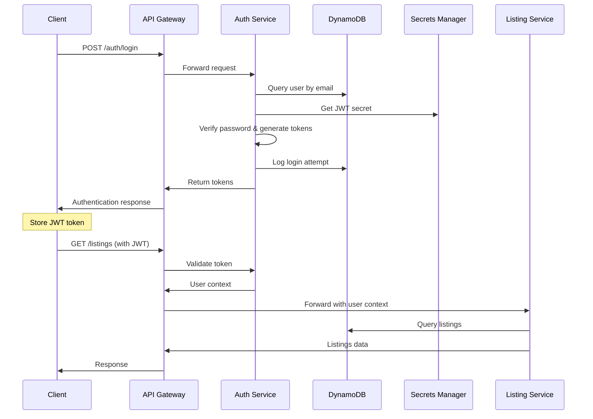

# Backend Architecture

## Overview

The MarineMarket backend is built on a serverless architecture using AWS Lambda functions, providing a scalable, cost-effective, and maintainable solution. The system follows a microservices pattern with dedicated Lambda functions for different business domains, all orchestrated through API Gateway.

**Technology Stack**:
- **AWS Lambda** (Node.js 18.x runtime)
- **API Gateway** for RESTful API management
- **DynamoDB** for NoSQL data persistence
- **S3** for media storage
- **TypeScript** for type safety and developer experience

## Service Architecture

```mermaid
graph TB
    subgraph "API Gateway Layer"
        APIGW[API Gateway REST API]
        CORS[CORS Configuration]
        THROTTLE[Rate Limiting & Throttling]
    end

    subgraph "Lambda Services"
        AUTH[Auth Service]
        LISTING[Listing Service]
        SEARCH[Search Service]
        MEDIA[Media Service]
        EMAIL[Email Service]
        STATS[Stats Service]
        ADMIN[Admin Service]
    end

    subgraph "Shared Libraries"
        MIDDLEWARE[Middleware Layer]
        UTILS[Utility Functions]
        DATABASE[Database Service]
        AUTH_LIB[Authentication Library]
        TYPES[Common Types]
    end

    subgraph "Data Layer"
        USERS[(Users Table)]
        LISTINGS[(Listings Table)]
        AUDIT[(Audit Logs)]
        SESSIONS[(Admin Sessions)]
        ATTEMPTS[(Login Attempts)]
    end

    subgraph "Storage Layer"
        MEDIA_S3[(Media Bucket)]
        FRONTEND_S3[(Frontend Bucket)]
    end

    subgraph "External Services"
        SES[Amazon SES]
        SECRETS[Secrets Manager]
        CLOUDWATCH[CloudWatch]
    end

    APIGW --> AUTH
    APIGW --> LISTING
    APIGW --> SEARCH
    APIGW --> MEDIA
    APIGW --> EMAIL
    APIGW --> STATS
    APIGW --> ADMIN

    AUTH --> MIDDLEWARE
    LISTING --> MIDDLEWARE
    ADMIN --> MIDDLEWARE
    
    MIDDLEWARE --> UTILS
    MIDDLEWARE --> DATABASE
    MIDDLEWARE --> AUTH_LIB
    MIDDLEWARE --> TYPES

    AUTH --> USERS
    AUTH --> SESSIONS
    AUTH --> ATTEMPTS
    AUTH --> AUDIT
    
    LISTING --> LISTINGS
    LISTING --> USERS
    
    SEARCH --> LISTINGS
    
    MEDIA --> MEDIA_S3
    
    ADMIN --> USERS
    ADMIN --> LISTINGS
    ADMIN --> AUDIT
    ADMIN --> SESSIONS
    ADMIN --> ATTEMPTS

    EMAIL --> SES
    AUTH --> SECRETS
    ADMIN --> SECRETS
    
    AUTH --> CLOUDWATCH
    LISTING --> CLOUDWATCH
    ADMIN --> CLOUDWATCH
```



## Lambda Services

### 1. Authentication Service

**File**: [`backend/src/auth-service/index.ts`](frontend/src/../../backend/src/auth-service/index.ts)  
**Runtime**: Node.js 18.x  
**Handler**: `auth-service/index.handler`

#### Responsibilities
- User registration and login
- JWT token generation and validation
- Admin authentication with role-based access
- Multi-factor authentication (MFA)
- Password reset functionality
- Session management
- Security monitoring and audit logging

#### Key Features
- **Secure Authentication**: bcrypt password hashing, JWT tokens
- **Admin RBAC**: Role-based access control with granular permissions
- **Security Monitoring**: Login attempt tracking, IP analysis
- **Session Management**: Secure session handling with automatic expiration
- **Rate Limiting**: Adaptive rate limiting based on user behavior

#### API Endpoints
```typescript
POST /auth/login              // User login
POST /auth/admin/login        // Admin login
POST /auth/register           // User registration
POST /auth/refresh            // Token refresh
POST /auth/logout             // User logout
POST /auth/mfa/setup          // MFA setup
POST /auth/mfa/verify         // MFA verification
POST /auth/password/reset     // Password reset request
```

#### Implementation Example
```typescript
// From backend/src/auth-service/index.ts:30-50
export const handler = async (event: APIGatewayProxyEvent): Promise<APIGatewayProxyResult> => {
  const requestId = event.requestContext.requestId;
  const clientInfo = getClientInfo(event);

  try {
    // Handle CORS preflight requests
    if (event.httpMethod === 'OPTIONS') {
      return createResponse(200, {});
    }

    const path = event.path;
    const method = event.httpMethod;
    
    // Route to appropriate handler based on path and method
    if (path === '/auth/login' && method === 'POST') {
      return await handleLogin(event, requestId, clientInfo);
    }
    // ... additional routing logic
  } catch (error) {
    console.error('Auth service error:', error);
    return createErrorResponse(500, 'INTERNAL_ERROR', 'Authentication service error', requestId);
  }
};
```

#### Configuration
```typescript
// Environment Variables
USERS_TABLE: 'boat-users'
SESSIONS_TABLE: 'boat-sessions'
LOGIN_ATTEMPTS_TABLE: 'boat-login-attempts'
AUDIT_LOGS_TABLE: 'boat-audit-logs'
JWT_SECRET_ARN: 'arn:aws:secretsmanager:...'
```

### 2. Listing Service

**File**: [`backend/src/listing/index.ts`](frontend/src/../../backend/src/listing/index.ts)  
**Runtime**: Node.js 18.x  
**Handler**: `listing/index.handler`

#### Responsibilities
- CRUD operations for boat listings
- Listing validation and sanitization
- Owner authorization checks
- View count tracking
- Status management (active, inactive, sold)

#### Key Features
- **Data Validation**: Comprehensive input validation and sanitization
- **Authorization**: Owner-based access control for modifications
- **Performance**: Optimized DynamoDB queries with pagination
- **Search Integration**: Structured data for search functionality

#### API Endpoints
```typescript
GET /listings                 // Get all listings (paginated)
GET /listings/{id}           // Get specific listing
POST /listings               // Create new listing
PUT /listings/{id}           // Update listing (owner only)
DELETE /listings/{id}        // Delete listing (owner only)
```

#### Implementation Example
```typescript
// From backend/src/listing/index.ts:15-35
export const handler = async (event: APIGatewayProxyEvent): Promise<APIGatewayProxyResult> => {
  const requestId = event.requestContext.requestId;

  try {
    const method = event.httpMethod;
    const pathParameters = event.pathParameters || {};

    switch (method) {
      case 'GET':
        if (pathParameters.id) {
          return await getListing(pathParameters.id, requestId);
        } else {
          return await getListings(event, requestId);
        }

      case 'POST':
        return await createListing(event, requestId);

      case 'PUT':
        if (!pathParameters.id) {
          return createErrorResponse(400, 'MISSING_ID', 'Listing ID is required', requestId);
        }
        return await updateListing(pathParameters.id, event, requestId);
        
      // ... additional cases
    }
  } catch (error) {
    console.error('Listing service error:', error);
    return createErrorResponse(500, 'INTERNAL_ERROR', 'Internal server error', requestId);
  }
};
```

#### Data Flow
1. **Request Validation**: Input sanitization and type checking
2. **Authentication**: JWT token validation
3. **Authorization**: Owner verification for modifications
4. **Business Logic**: Listing processing and validation
5. **Database Operations**: DynamoDB read/write operations
6. **Response**: Formatted JSON response

### 3. Admin Service

**File**: [`backend/src/admin-service/index.ts`](frontend/src/../../backend/src/admin-service/index.ts)  
**Runtime**: Node.js 18.x  
**Handler**: `admin-service/index.handler`  
**Timeout**: 30 seconds  
**Memory**: 512 MB

#### Responsibilities
- Administrative dashboard and analytics
- User management and moderation
- Content moderation and approval
- System monitoring and health checks
- Audit logging and compliance
- Security monitoring and alerting

#### Key Features
- **Role-Based Access Control**: Granular permission system
- **Comprehensive Auditing**: All admin actions logged with context
- **Security Monitoring**: Real-time threat detection and alerting
- **Performance Monitoring**: System health and performance metrics
- **Data Export**: Audit log and analytics data export

#### API Endpoints
```typescript
// Dashboard & Analytics
GET /admin/dashboard          // System overview and metrics
GET /admin/analytics/users    // User analytics
GET /admin/analytics/listings // Listing analytics

// User Management
GET /admin/users             // List users with filtering
GET /admin/users/{id}        // User details
PUT /admin/users/{id}/status // Update user status

// Content Moderation
GET /admin/listings          // Listings for moderation
PUT /admin/listings/{id}/moderate // Moderate listing

// Security & Monitoring
GET /admin/security/suspicious-activity
GET /admin/security/login-attempts
GET /admin/security/alerts

// Audit & Compliance
GET /admin/audit-logs        // Audit log queries
POST /admin/audit-logs/export // Export audit data
GET /admin/audit-logs/stats  // Audit statistics
```

#### Middleware Stack
```typescript
// Example middleware composition
compose(
  withAdaptiveRateLimit(AdminPermission.USER_MANAGEMENT),
  withAdminAuth([AdminPermission.USER_MANAGEMENT]),
  withAuditLog('VIEW_USERS', 'users')
)(handleGetUsers)
```

### 4. Search Service

**File**: [`backend/src/search/index.ts`](frontend/src/../../backend/src/search/index.ts)  
**Runtime**: Node.js 18.x  
**Handler**: `search/index.handler`

#### Responsibilities
- Advanced listing search and filtering
- Geographic search capabilities
- Price and specification filtering
- Full-text search across listing content

#### Key Features
- **Multi-Criteria Search**: Price, location, boat type, year, length
- **Text Search**: Title and description full-text search
- **Geographic Filtering**: State-based location filtering
- **Pagination**: Efficient result pagination
- **Performance**: In-memory filtering for fast response times

#### Search Filters
```typescript
interface SearchFilters {
  query?: string;              // Text search
  priceRange?: { min?: number; max?: number; };
  location?: { state?: string; radius?: number; };
  boatType?: string[];
  yearRange?: { min?: number; max?: number; };
  lengthRange?: { min?: number; max?: number; };
  features?: string[];
}
```

### 5. Media Service

**File**: [`backend/src/media/index.ts`](frontend/src/../../backend/src/media/index.ts)  
**Runtime**: Node.js 18.x  
**Handler**: `media/index.handler`

#### Responsibilities
- Image and video upload handling
- Media processing and optimization
- Thumbnail generation
- Presigned URL generation for direct S3 uploads

#### Key Features
- **Direct S3 Upload**: Presigned URLs for client-side uploads
- **Image Processing**: Sharp.js for image optimization
- **Thumbnail Generation**: Automatic thumbnail creation
- **Security**: User-based access control for uploads

#### Media Processing Pipeline
1. **Upload Request**: Generate presigned S3 URL
2. **Client Upload**: Direct upload to S3 bucket
3. **S3 Event Trigger**: Lambda processes uploaded media
4. **Image Processing**: Resize, optimize, generate thumbnails
5. **Metadata Storage**: Store media metadata in DynamoDB

### 6. Stats Service

**File**: [`backend/src/stats-service/index.ts`](frontend/src/../../backend/src/stats-service/index.ts)  
**Runtime**: Node.js 18.x  
**Handler**: `stats-service/index.handler`

#### Responsibilities
- Platform analytics and metrics
- User engagement statistics
- Listing performance metrics
- Geographic distribution analysis

#### Key Metrics
```typescript
interface PlatformStats {
  totalListings: number;
  activeListings: number;
  totalUsers: number;
  topStates: Array<{ state: string; count: number }>;
  popularBoatTypes: Array<{ type: string; count: number }>;
}
```

### 7. Email Service

**File**: [`backend/src/email/index.ts`](frontend/src/../../backend/src/email/index.ts)  
**Runtime**: Node.js 18.x  
**Handler**: `email/index.handler`

#### Responsibilities
- Transactional email delivery
- Email template management
- Notification system integration
- SES integration and error handling

## Shared Libraries

### 1. Middleware Layer

**File**: [`backend/src/shared/middleware.ts`](frontend/src/../../backend/src/shared/middleware.ts)

#### Core Middleware Functions

##### Authentication Middleware
```typescript
// From backend/src/shared/middleware.ts:25-40
export function withAuth(handler: AuthenticatedHandler) {
  return async (event: APIGatewayProxyEvent, context: any): Promise<APIGatewayProxyResult> => {
    const requestId = event.requestContext.requestId;

    try {
      const user = getUserFromEvent(event);
      const authenticatedEvent = { ...event, user } as AuthenticatedEvent;
      
      return await handler(authenticatedEvent, context);
    } catch (error) {
      console.error('Authentication error:', error);
      return createErrorResponse(401, 'UNAUTHORIZED', 
        error instanceof Error ? error.message : 'Authentication failed', requestId);
    }
  };
}
```

##### Admin Authorization Middleware
```typescript
export function withAdminAuth(requiredPermissions?: AdminPermission[]) {
  return function(handler: AuthenticatedHandler) {
    return withAuth(async (event: AuthenticatedEvent, context: any) => {
      requireAdminRole(event.user, requiredPermissions);
      return await handler(event, context);
    });
  };
}
```

##### Rate Limiting Middleware
```typescript
export function withRateLimit(maxRequests: number, windowMs: number) {
  return function(handler: AuthenticatedHandler) {
    // Implementation with DynamoDB-based rate limiting
  };
}
```

##### Audit Logging Middleware
```typescript
export function withAuditLog(action: string, resource: string) {
  return function(handler: AuthenticatedHandler) {
    return async (event: AuthenticatedEvent, context: any) => {
      const result = await handler(event, context);
      await logAuditEvent(action, resource, event.user, context);
      return result;
    };
  };
}
```

##### Middleware Composition
```typescript
export const compose = (...middlewares: any[]) => (handler: any) => {
  return middlewares.reduceRight((acc, middleware) => middleware(acc), handler);
};
```

### 2. Utility Functions

**File**: [`backend/src/shared/utils.ts`](frontend/src/../../backend/src/shared/utils.ts)

#### Response Utilities
```typescript
export function createResponse<T>(
  statusCode: number,
  data: T,
  headers: Record<string, string> = {}
): APIGatewayProxyResult;

export function createErrorResponse(
  statusCode: number,
  code: string,
  message: string,
  requestId: string
): APIGatewayProxyResult;
```

#### Validation Utilities
```typescript
export function validateRequired(obj: any, fields: string[]): void;
export function sanitizeString(str: string): string;
export function validateEmail(email: string): boolean;
export function validatePrice(price: number): boolean;
export function validateYear(year: number): boolean;
```

### 3. Database Service

**File**: [`backend/src/shared/database.ts`](frontend/src/../../backend/src/shared/database.ts)

#### Database Operations
```typescript
export class DatabaseService {
  // Listing operations
  async createListing(listing: Listing): Promise<void>;
  async getListing(listingId: string): Promise<Listing | null>;
  async updateListing(listingId: string, updates: Partial<Listing>): Promise<void>;
  async deleteListing(listingId: string): Promise<void>;
  async getListings(limit: number, lastKey?: any): Promise<{ listings: Listing[]; lastKey?: any }>;
  
  // User operations
  async createUser(user: any): Promise<void>;
  async getUser(userId: string): Promise<any>;
  async updateUser(userId: string, updates: any): Promise<void>;
}
```

### 4. Authentication Library

**File**: [`backend/src/shared/auth.ts`](frontend/src/../../backend/src/shared/auth.ts)

#### Security Functions
```typescript
// Password Security
export function hashPassword(password: string): Promise<string>;
export function verifyPassword(password: string, hash: string): Promise<boolean>;

// JWT Token Management
export function createAccessToken(user: User, deviceId: string): string;
export function createRefreshToken(userId: string, deviceId: string): string;
export function verifyToken(token: string): JWTPayload;

// Session Management
export function createAuthSession(user: User, deviceId: string): AuthSession;
export function validateSession(sessionId: string): Promise<AuthSession | null>;

// Security Monitoring
export function logLoginAttempt(email: string, clientInfo: ClientInfo, success: boolean): Promise<void>;
export function isAccountLocked(email: string): Promise<boolean>;
export function shouldLockAccount(email: string): Promise<boolean>;
```

### 5. Common Types

**File**: [`backend/src/types/common.ts`](frontend/src/../../backend/src/types/common.ts)

#### Core Data Models
```typescript
export interface User {
  id: string;
  email: string;
  name: string;
  role: UserRole;
  status: UserStatus;
  permissions?: AdminPermission[];
  createdAt: number;
  updatedAt: number;
}

export interface Listing {
  listingId: string;
  ownerId: string;
  title: string;
  description: string;
  price: number;
  location: Location;
  boatDetails: BoatDetails;
  status: 'active' | 'inactive' | 'sold';
  createdAt: number;
  updatedAt: number;
}

export interface AuditLog {
  id: string;
  userId: string;
  action: string;
  resource: string;
  details: any;
  timestamp: string;
  ipAddress: string;
  userAgent: string;
}
```

## API Design Patterns

### 1. RESTful API Structure

```
/auth/*                    // Authentication endpoints
/listings                  // Listing CRUD operations
/listings/{id}            // Individual listing operations
/search                   // Search functionality
/media                    // Media upload and management
/stats/platform           // Platform statistics
/admin/*                  // Administrative endpoints
```

### 2. Request/Response Format

#### Standard Response Format
```typescript
interface ApiResponse<T> {
  data: T;
  meta?: {
    pagination?: {
      page: number;
      limit: number;
      total: number;
    };
  };
}
```

#### Error Response Format
```typescript
interface ErrorResponse {
  error: {
    code: string;
    message: string;
    details?: any[];
    requestId: string;
  };
}
```

### 3. Authentication Flow



## Security Architecture

### 1. Authentication & Authorization

#### JWT Token Structure
```typescript
interface JWTPayload {
  sub: string;              // User ID
  email: string;
  name: string;
  role: UserRole;
  permissions?: AdminPermission[];
  deviceId: string;
  sessionId: string;
  iat: number;              // Issued at
  exp: number;              // Expiration
}
```

#### Permission System
```typescript
enum AdminPermission {
  USER_MANAGEMENT = 'user_management',
  CONTENT_MODERATION = 'content_moderation',
  FINANCIAL_ACCESS = 'financial_access',
  SYSTEM_CONFIG = 'system_config',
  ANALYTICS_VIEW = 'analytics_view',
  AUDIT_LOG_VIEW = 'audit_log_view'
}
```

### 2. Security Monitoring

#### Audit Logging
- All administrative actions logged with full context
- User authentication events tracked
- Security violations recorded and alerted
- Compliance-ready audit trails

#### Rate Limiting
- Adaptive rate limiting based on user roles
- IP-based and user-based rate limiting
- Automatic lockout for suspicious activity
- DynamoDB-based rate limit storage

#### Security Alerts
- Failed login attempt monitoring
- Suspicious IP address detection
- Privilege escalation attempts
- Data access pattern analysis

### 3. Data Protection

#### Encryption
- Data encrypted at rest in DynamoDB
- Data encrypted in transit via HTTPS
- JWT tokens signed with rotating secrets
- Sensitive data stored in AWS Secrets Manager

#### Input Validation
- Comprehensive input sanitization
- Type checking with TypeScript
- SQL injection prevention (NoSQL context)
- XSS prevention through output encoding

## Performance Optimization

### 1. Lambda Optimization

#### Cold Start Mitigation
- Minimal dependencies in Lambda packages
- Connection pooling for DynamoDB
- Shared libraries for common functionality
- Provisioned concurrency for critical functions

#### Memory and Timeout Configuration
```typescript
// Function configurations
const authFunction = new lambda.Function(this, 'AuthFunction', {
  runtime: lambda.Runtime.NODEJS_18_X,
  timeout: cdk.Duration.seconds(30),
  memorySize: 512,
  // ...
});
```

### 2. Database Optimization

#### DynamoDB Best Practices
- Single-table design where appropriate
- Efficient partition key distribution
- Global Secondary Indexes for query patterns
- On-demand billing for automatic scaling

#### Query Optimization
```typescript
// Efficient pagination with LastEvaluatedKey
const result = await docClient.send(new ScanCommand({
  TableName: LISTINGS_TABLE,
  Limit: limit,
  ExclusiveStartKey: lastKey,
}));
```

### 3. Caching Strategy

#### API Gateway Caching
- Response caching for frequently accessed data
- Cache invalidation on data updates
- TTL-based cache expiration

#### Application-Level Caching
- In-memory caching for static data
- Redis integration for shared cache (future)
- CDN caching for media assets

## Error Handling and Monitoring

### 1. Error Handling Patterns

#### Centralized Error Handling
```typescript
try {
  // Business logic
} catch (error) {
  console.error('Service error:', error);
  await logAuditEvent('ERROR', 'service', { error: error.message });
  return createErrorResponse(500, 'INTERNAL_ERROR', 'Service error', requestId);
}
```

#### Graceful Degradation
- Fallback mechanisms for service failures
- Circuit breaker patterns for external services
- Retry logic with exponential backoff

### 2. Monitoring and Observability

#### CloudWatch Integration
- Custom metrics for business KPIs
- Error rate and latency monitoring
- Automated alerting for anomalies
- Dashboard for real-time monitoring

#### Structured Logging
```typescript
console.log(JSON.stringify({
  level: 'INFO',
  message: 'User login successful',
  userId: user.id,
  timestamp: new Date().toISOString(),
  requestId: event.requestContext.requestId
}));
```

## Deployment and Infrastructure

### 1. Infrastructure as Code

**CDK Configuration**: [`infrastructure/lib/boat-listing-stack.ts`](frontend/src/../../infrastructure/lib/boat-listing-stack.ts)

#### Lambda Function Deployment
```typescript
const authFunction = new lambda.Function(this, 'AuthFunction', {
  runtime: lambda.Runtime.NODEJS_18_X,
  handler: 'auth-service/index.handler',
  code: lambda.Code.fromAsset('../backend/dist/packages/auth-service.zip'),
  environment: {
    USERS_TABLE: usersTable.tableName,
    JWT_SECRET_ARN: jwtSecret.secretArn,
  },
});
```

#### API Gateway Integration
```typescript
const api = new apigateway.RestApi(this, 'BoatListingApi', {
  restApiName: 'Boat Listing API',
  defaultCorsPreflightOptions: {
    allowOrigins: ['*'],
    allowMethods: ['GET', 'POST', 'PUT', 'DELETE', 'OPTIONS'],
  },
});
```

### 2. Build and Package Process

**Build Script**: [`backend/package.json`](frontend/src/../../backend/package.json)
```bash
npm run build    # TypeScript compilation
npm run package  # Create Lambda deployment packages
```

#### Package Structure
```
dist/
├── packages/
│   ├── auth-service.zip
│   ├── listing.zip
│   ├── admin-service.zip
│   └── ...
└── compiled TypeScript files
```

### 3. Environment Configuration

#### Development Environment
- Relaxed rate limiting
- Debug logging enabled
- Development-specific configurations

#### Production Environment
- Strict security policies
- Performance optimizations
- Comprehensive monitoring

## Testing Strategy

### 1. Unit Testing

**Test Configuration**: [`backend/jest.config.js`](frontend/src/../../backend/jest.config.js)
```typescript
// Example unit test
describe('AuthService', () => {
  test('should validate email format', () => {
    expect(validateEmail('test@example.com')).toBe(true);
    expect(validateEmail('invalid-email')).toBe(false);
  });
});
```

### 2. Integration Testing

#### API Testing
- End-to-end API workflow testing
- Database integration testing
- Authentication flow testing

#### Service Integration
- Inter-service communication testing
- External service integration testing
- Error handling and recovery testing

### 3. Security Testing

#### Penetration Testing
- Authentication bypass attempts
- Authorization escalation testing
- Input validation testing
- Rate limiting validation

## Future Enhancements

### 1. Performance Improvements

- **OpenSearch Integration**: Advanced search capabilities
- **Caching Layer**: Redis for improved performance
- **GraphQL API**: More efficient data fetching

### 2. Security Enhancements

- **OAuth Integration**: Social login capabilities
- **Advanced MFA**: Hardware token support
- **Zero Trust Architecture**: Enhanced security model

### 3. Scalability Improvements

- **Event-Driven Architecture**: Asynchronous processing
- **Microservices Decomposition**: Further service separation
- **Multi-Region Deployment**: Global availability

## Related Documentation

- [System Architecture Overview](overview.md) - High-level system architecture
- [Frontend Architecture](frontend-architecture.md) - React application structure
- [Data Models](data-models.md) - Database schemas and relationships
- [API Design](api-design.md) - RESTful API patterns and documentation
- [Security Guide](security/security-overview.md) - Comprehensive security documentation