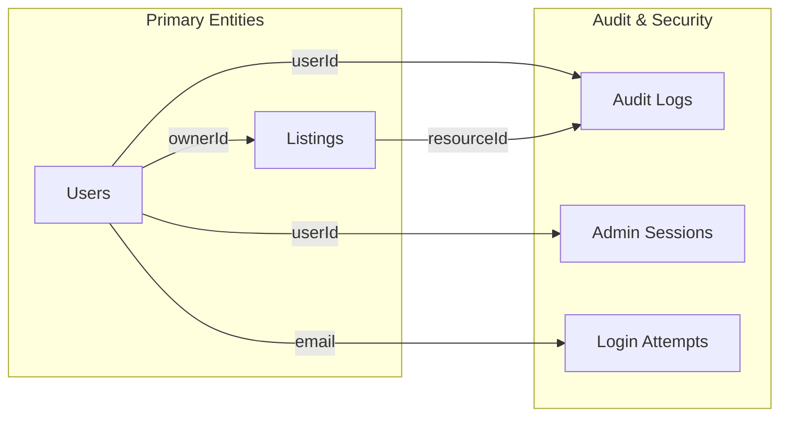

# Data Models Documentation

## Overview

The MarineMarket platform uses DynamoDB as its primary database, following a NoSQL document-based approach with carefully designed schemas to support efficient queries and scalability. This document details all data models, their relationships, and query patterns.

**Database Technology**: Amazon DynamoDB  
**Data Format**: JSON documents with strong typing via TypeScript interfaces  
**Indexing Strategy**: Primary keys with Global Secondary Indexes (GSIs) for query optimization

## Database Schema Overview

```mermaid
erDiagram
    USERS ||--o{ LISTINGS : owns
    USERS ||--o{ AUDIT_LOGS : generates
    USERS ||--o{ LOGIN_ATTEMPTS : makes
    USERS ||--o{ ADMIN_SESSIONS : has
    LISTINGS ||--o{ AUDIT_LOGS : references
    
    USERS {
        string id PK
        string email
        string name
        string role
        string status
        array permissions
        boolean emailVerified
        boolean mfaEnabled
        number loginAttempts
        string createdAt
        string updatedAt
    }
    
    LISTINGS {
        string id PK
        string listingId
        string ownerId FK
        string title
        string description
        number price
        object location
        object boatDetails
        array features
        array images
        string status
        number views
        number createdAt
        number updatedAt
    }
    
    AUDIT_LOGS {
        string id PK
        string timestamp SK
        string userId FK
        string action
        string resource
        object details
        string ipAddress
        string sessionId
    }
    
    ADMIN_SESSIONS {
        string sessionId PK
        string userId FK
        string deviceId
        string ipAddress
        string issuedAt
        string expiresAt
        string lastActivity
        boolean isActive
    }
    
    LOGIN_ATTEMPTS {
        string id PK
        string timestamp SK
        string email
        string ipAddress
        boolean success
        string failureReason
    }
```

## Core Data Models

### 1. User Model

**Table**: `boat-users`  
**TypeScript Interface**: [`backend/src/types/common.ts:L67-L95`](../backend/src/types/common.ts#L67-L95)

```typescript
interface User {
  id: string;                           // Primary Key (UUID)
  email: string;                        // Unique email address
  name: string;                         // Full name
  phone?: string;                       // Optional phone number
  location?: string;                    // User location (city, state)
  role: UserRole;                       // User role enum
  status: UserStatus;                   // Account status enum
  permissions?: AdminPermission[];      // Admin permissions array
  emailVerified: boolean;               // Email verification status
  phoneVerified: boolean;               // Phone verification status
  mfaEnabled: boolean;                  // Multi-factor auth status
  mfaSecret?: string;                   // MFA secret (encrypted)
  password?: string;                    // Hashed password
  lastLogin?: string;                   // Last login timestamp
  loginAttempts: number;                // Failed login counter
  lockedUntil?: string;                 // Account lock expiration
  passwordResetToken?: string;          // Password reset token
  passwordResetExpires?: string;        // Reset token expiration
  emailVerificationToken?: string;      // Email verification token
  emailVerificationExpires?: string;    // Verification token expiration
  createdAt: string;                    // Creation timestamp
  updatedAt: string;                    // Last update timestamp
}
```

#### User Role Enumeration
```typescript
enum UserRole {
  USER = 'user',                        // Regular platform user
  ADMIN = 'admin',                      // Administrator
  SUPER_ADMIN = 'super_admin',          // Super administrator
  MODERATOR = 'moderator',              // Content moderator
  SUPPORT = 'support'                   // Support team member
}
```

#### User Status Enumeration
```typescript
enum UserStatus {
  ACTIVE = 'active',                    // Active account
  SUSPENDED = 'suspended',              // Temporarily suspended
  BANNED = 'banned',                    // Permanently banned
  PENDING_VERIFICATION = 'pending_verification'  // Awaiting email verification
}
```

#### Admin Permission System
```typescript
enum AdminPermission {
  USER_MANAGEMENT = 'user_management',          // Manage users
  CONTENT_MODERATION = 'content_moderation',   // Moderate listings
  FINANCIAL_ACCESS = 'financial_access',       // Access financial data
  SYSTEM_CONFIG = 'system_config',             // System configuration
  ANALYTICS_VIEW = 'analytics_view',           // View analytics
  AUDIT_LOG_VIEW = 'audit_log_view'           // View audit logs
}
```

#### DynamoDB Configuration
**Table Name**: `boat-users`  
**Primary Key**: `id` (String)  
**Global Secondary Index**: `email-index`
- **Partition Key**: `email` (String)
- **Purpose**: Email-based user lookups

**CDK Configuration**: [`infrastructure/lib/boat-listing-stack.ts:L35-L45`](../infrastructure/lib/boat-listing-stack.ts#L35-L45)

#### Query Patterns
```typescript
// Get user by ID (Primary Key)
const user = await docClient.send(new GetCommand({
  TableName: 'boat-users',
  Key: { id: userId }
}));

// Get user by email (GSI)
const userByEmail = await docClient.send(new QueryCommand({
  TableName: 'boat-users',
  IndexName: 'email-index',
  KeyConditionExpression: 'email = :email',
  ExpressionAttributeValues: { ':email': email }
}));
```

### 2. Listing Model

**Table**: `boat-listings`  
**TypeScript Interface**: [`backend/src/types/common.ts:L19-L40`](../backend/src/types/common.ts#L19-L40)

```typescript
interface Listing {
  listingId: string;                    // Business identifier
  id: string;                           // DynamoDB Primary Key (same as listingId)
  ownerId: string;                      // Foreign key to Users table
  title: string;                        // Listing title
  description: string;                  // Detailed description
  price: number;                        // Price in USD cents
  location: Location;                   // Location object
  boatDetails: BoatDetails;             // Boat specifications
  features: string[];                   // Feature list
  images: string[];                     // Image URLs
  videos?: string[];                    // Video URLs (optional)
  thumbnails: string[];                 // Thumbnail URLs
  status: 'active' | 'inactive' | 'sold';  // Listing status
  views?: number;                       // View count
  createdAt: number;                    // Creation timestamp (Unix)
  updatedAt: number;                    // Last update timestamp (Unix)
}
```

#### Location Sub-Model
```typescript
interface Location {
  city: string;                         // City name
  state: string;                        // State abbreviation
  zipCode?: string;                     // ZIP code (optional)
  coordinates?: {                       // GPS coordinates (optional)
    lat: number;                        // Latitude
    lon: number;                        // Longitude
  };
}
```

#### Boat Details Sub-Model
```typescript
interface BoatDetails {
  type: string;                         // Boat type (sailboat, motorboat, etc.)
  manufacturer?: string;                // Manufacturer name
  model?: string;                       // Model name
  year: number;                         // Manufacturing year
  length: number;                       // Length in feet
  beam?: number;                        // Beam width in feet
  draft?: number;                       // Draft depth in feet
  engine?: string;                      // Engine description
  hours?: number;                       // Engine hours
  condition: 'Excellent' | 'Good' | 'Fair' | 'Needs Work';  // Condition rating
}
```

#### DynamoDB Configuration
**Table Name**: `boat-listings`  
**Primary Key**: `id` (String)  
**Global Secondary Index**: `location-index`
- **Partition Key**: `location` (String) - State abbreviation
- **Sort Key**: `createdAt` (String)
- **Purpose**: Location-based queries with chronological sorting

**CDK Configuration**: [`infrastructure/lib/boat-listing-stack.ts:L25-L34`](../infrastructure/lib/boat-listing-stack.ts#L25-L34)

#### Query Patterns
```typescript
// Get listing by ID
const listing = await docClient.send(new GetCommand({
  TableName: 'boat-listings',
  Key: { id: listingId }
}));

// Get listings by location (GSI)
const listingsByLocation = await docClient.send(new QueryCommand({
  TableName: 'boat-listings',
  IndexName: 'location-index',
  KeyConditionExpression: 'location = :state',
  ExpressionAttributeValues: { ':state': 'FL' }
}));

// Scan active listings with pagination
const activeListings = await docClient.send(new ScanCommand({
  TableName: 'boat-listings',
  FilterExpression: '#status = :status',
  ExpressionAttributeNames: { '#status': 'status' },
  ExpressionAttributeValues: { ':status': 'active' },
  Limit: 20,
  ExclusiveStartKey: lastKey
}));
```

### 3. Audit Log Model

**Table**: `boat-audit-logs`  
**TypeScript Interface**: [`backend/src/types/common.ts:L125-L136`](../backend/src/types/common.ts#L125-L136)

```typescript
interface AuditLog {
  id: string;                           // Primary Key (UUID)
  timestamp: string;                    // Sort Key (ISO timestamp)
  userId: string;                       // User who performed action
  userEmail: string;                    // User email for reference
  action: string;                       // Action performed
  resource: string;                     // Resource type affected
  resourceId?: string;                  // Specific resource ID
  details: Record<string, any>;        // Action details and context
  ipAddress: string;                    // Client IP address
  userAgent: string;                    // Client user agent
  sessionId: string;                    // Session identifier
}
```

#### DynamoDB Configuration
**Table Name**: `boat-audit-logs`  
**Primary Key**: `id` (String)  
**Sort Key**: `timestamp` (String)  
**TTL Attribute**: `ttl` - Automatic cleanup of old logs

**Global Secondary Indexes**:
1. **user-index**
   - **Partition Key**: `userId` (String)
   - **Sort Key**: `timestamp` (String)
   - **Purpose**: User-specific audit queries

2. **action-index**
   - **Partition Key**: `action` (String)
   - **Sort Key**: `timestamp` (String)
   - **Purpose**: Action-specific audit queries

3. **resource-index**
   - **Partition Key**: `resource` (String)
   - **Sort Key**: `timestamp` (String)
   - **Purpose**: Resource-specific audit queries

**CDK Configuration**: [`infrastructure/lib/boat-listing-stack.ts:L47-L80`](../infrastructure/lib/boat-listing-stack.ts#L47-L80)

#### Common Audit Actions
```typescript
// Authentication actions
'USER_LOGIN', 'USER_LOGOUT', 'ADMIN_LOGIN', 'ADMIN_LOGOUT'

// User management actions
'USER_CREATED', 'USER_UPDATED', 'USER_STATUS_CHANGED', 'USER_DELETED'

// Listing actions
'LISTING_CREATED', 'LISTING_UPDATED', 'LISTING_DELETED', 'LISTING_MODERATED'

// Admin actions
'ADMIN_ACCESS', 'ADMIN_ACCESS_DENIED', 'PERMISSION_GRANTED', 'PERMISSION_REVOKED'

// Security actions
'LOGIN_FAILED', 'ACCOUNT_LOCKED', 'PASSWORD_RESET', 'MFA_ENABLED'
```

#### Query Patterns
```typescript
// Get audit logs for specific user
const userAuditLogs = await docClient.send(new QueryCommand({
  TableName: 'boat-audit-logs',
  IndexName: 'user-index',
  KeyConditionExpression: 'userId = :userId',
  ExpressionAttributeValues: { ':userId': userId },
  ScanIndexForward: false,  // Most recent first
  Limit: 50
}));

// Get audit logs for specific action
const actionLogs = await docClient.send(new QueryCommand({
  TableName: 'boat-audit-logs',
  IndexName: 'action-index',
  KeyConditionExpression: 'action = :action AND #timestamp BETWEEN :start AND :end',
  ExpressionAttributeNames: { '#timestamp': 'timestamp' },
  ExpressionAttributeValues: {
    ':action': 'USER_LOGIN',
    ':start': startDate,
    ':end': endDate
  }
}));
```

### 4. Admin Session Model

**Table**: `boat-admin-sessions`  
**TypeScript Interface**: [`backend/src/types/common.ts:L107-L116`](../backend/src/types/common.ts#L107-L116)

```typescript
interface AuthSession {
  sessionId: string;                    // Primary Key (UUID)
  userId: string;                       // Foreign key to Users table
  deviceId: string;                     // Device identifier
  ipAddress: string;                    // Client IP address
  userAgent: string;                    // Client user agent
  issuedAt: string;                     // Session creation time
  expiresAt: string;                    // Session expiration time
  lastActivity: string;                 // Last activity timestamp
  isActive: boolean;                    // Session active status
}
```

#### DynamoDB Configuration
**Table Name**: `boat-admin-sessions`  
**Primary Key**: `sessionId` (String)  
**TTL Attribute**: `expiresAt` - Automatic session cleanup

**Global Secondary Index**: `user-index`
- **Partition Key**: `userId` (String)
- **Sort Key**: `lastActivity` (String)
- **Purpose**: User session management queries

**CDK Configuration**: [`infrastructure/lib/boat-listing-stack.ts:L82-L93`](../infrastructure/lib/boat-listing-stack.ts#L82-L93)

#### Query Patterns
```typescript
// Get active session
const session = await docClient.send(new GetCommand({
  TableName: 'boat-admin-sessions',
  Key: { sessionId: sessionId }
}));

// Get all sessions for user
const userSessions = await docClient.send(new QueryCommand({
  TableName: 'boat-admin-sessions',
  IndexName: 'user-index',
  KeyConditionExpression: 'userId = :userId',
  ExpressionAttributeValues: { ':userId': userId },
  ScanIndexForward: false  // Most recent activity first
}));
```

### 5. Login Attempt Model

**Table**: `boat-login-attempts`  
**TypeScript Interface**: [`backend/src/types/common.ts:L118-L124`](../backend/src/types/common.ts#L118-L124)

```typescript
interface LoginAttempt {
  id: string;                           // Primary Key (UUID)
  timestamp: string;                    // Sort Key (ISO timestamp)
  email: string;                        // Email address attempted
  ipAddress: string;                    // Client IP address
  userAgent: string;                    // Client user agent
  success: boolean;                     // Login success status
  failureReason?: string;               // Failure reason (if applicable)
}
```

#### DynamoDB Configuration
**Table Name**: `boat-login-attempts`  
**Primary Key**: `id` (String)  
**Sort Key**: `timestamp` (String)  
**TTL Attribute**: `ttl` - Automatic cleanup of old attempts

**Global Secondary Indexes**:
1. **email-index**
   - **Partition Key**: `email` (String)
   - **Sort Key**: `timestamp` (String)
   - **Purpose**: Email-based login attempt queries

2. **ip-index**
   - **Partition Key**: `ipAddress` (String)
   - **Sort Key**: `timestamp` (String)
   - **Purpose**: IP-based security monitoring

**CDK Configuration**: [`infrastructure/lib/boat-listing-stack.ts:L95-L115`](../infrastructure/lib/boat-listing-stack.ts#L95-L115)

#### Query Patterns
```typescript
// Get recent login attempts for email
const emailAttempts = await docClient.send(new QueryCommand({
  TableName: 'boat-login-attempts',
  IndexName: 'email-index',
  KeyConditionExpression: 'email = :email AND #timestamp > :since',
  ExpressionAttributeNames: { '#timestamp': 'timestamp' },
  ExpressionAttributeValues: {
    ':email': email,
    ':since': new Date(Date.now() - 15 * 60 * 1000).toISOString()  // Last 15 minutes
  }
}));

// Get login attempts from IP address
const ipAttempts = await docClient.send(new QueryCommand({
  TableName: 'boat-login-attempts',
  IndexName: 'ip-index',
  KeyConditionExpression: 'ipAddress = :ip',
  ExpressionAttributeValues: { ':ip': ipAddress },
  ScanIndexForward: false,
  Limit: 100
}));
```

## Data Relationships and Integrity

### 1. Foreign Key Relationships



#### Referential Integrity Patterns
```typescript
// Listing creation with owner validation
const createListing = async (listing: Listing, ownerId: string) => {
  // Verify owner exists
  const owner = await getUser(ownerId);
  if (!owner) {
    throw new Error('Owner not found');
  }
  
  // Create listing with validated owner
  listing.ownerId = ownerId;
  await docClient.send(new PutCommand({
    TableName: 'boat-listings',
    Item: listing
  }));
};
```

### 2. Data Consistency Patterns

#### Eventual Consistency
- DynamoDB provides eventual consistency for GSI queries
- Strong consistency available for primary key queries
- Application handles consistency through retry logic

#### Optimistic Locking
```typescript
// Update with version checking
const updateListing = async (listingId: string, updates: Partial<Listing>) => {
  const current = await getListing(listingId);
  
  await docClient.send(new UpdateCommand({
    TableName: 'boat-listings',
    Key: { id: listingId },
    UpdateExpression: 'SET #updatedAt = :now, #title = :title',
    ConditionExpression: '#updatedAt = :currentVersion',
    ExpressionAttributeNames: {
      '#updatedAt': 'updatedAt',
      '#title': 'title'
    },
    ExpressionAttributeValues: {
      ':now': Date.now(),
      ':title': updates.title,
      ':currentVersion': current.updatedAt
    }
  }));
};
```

## Search and Query Patterns

### 1. Search Filters Model

**TypeScript Interface**: [`backend/src/types/common.ts:L42-L65`](../backend/src/types/common.ts#L42-L65)

```typescript
interface SearchFilters {
  query?: string;                       // Text search query
  priceRange?: {                        // Price filtering
    min?: number;
    max?: number;
  };
  location?: {                          // Location filtering
    state?: string;
    radius?: number;
    coordinates?: {
      lat: number;
      lon: number;
    };
  };
  boatType?: string[];                  // Boat type filtering
  yearRange?: {                         // Year filtering
    min?: number;
    max?: number;
  };
  lengthRange?: {                       // Length filtering
    min?: number;
    max?: number;
  };
  features?: string[];                  // Feature filtering
}
```

### 2. Query Optimization Strategies

#### Composite Key Patterns
```typescript
// Location-based queries with time sorting
const getListingsByLocation = async (state: string, limit: number = 20) => {
  return await docClient.send(new QueryCommand({
    TableName: 'boat-listings',
    IndexName: 'location-index',
    KeyConditionExpression: 'location = :state',
    ExpressionAttributeValues: { ':state': state },
    ScanIndexForward: false,  // Newest first
    Limit: limit
  }));
};
```

#### Filter Expressions
```typescript
// Complex filtering with multiple conditions
const searchListings = async (filters: SearchFilters) => {
  const filterExpressions = [];
  const attributeValues: any = {};
  
  if (filters.priceRange) {
    if (filters.priceRange.min) {
      filterExpressions.push('price >= :minPrice');
      attributeValues[':minPrice'] = filters.priceRange.min;
    }
    if (filters.priceRange.max) {
      filterExpressions.push('price <= :maxPrice');
      attributeValues[':maxPrice'] = filters.priceRange.max;
    }
  }
  
  return await docClient.send(new ScanCommand({
    TableName: 'boat-listings',
    FilterExpression: filterExpressions.join(' AND '),
    ExpressionAttributeValues: attributeValues
  }));
};
```

## Data Validation and Constraints

### 1. Input Validation Rules

#### User Data Validation
```typescript
const validateUser = (user: Partial<User>): string[] => {
  const errors: string[] = [];
  
  if (!user.email || !validateEmail(user.email)) {
    errors.push('Valid email is required');
  }
  
  if (!user.name || user.name.length < 2) {
    errors.push('Name must be at least 2 characters');
  }
  
  if (user.password && !validatePassword(user.password)) {
    errors.push('Password must meet security requirements');
  }
  
  return errors;
};
```

#### Listing Data Validation
```typescript
const validateListing = (listing: Partial<Listing>): string[] => {
  const errors: string[] = [];
  
  if (!listing.title || listing.title.length < 5) {
    errors.push('Title must be at least 5 characters');
  }
  
  if (!listing.price || listing.price <= 0 || listing.price > 10000000) {
    errors.push('Price must be between $1 and $10,000,000');
  }
  
  if (!listing.boatDetails?.year || 
      listing.boatDetails.year < 1900 || 
      listing.boatDetails.year > new Date().getFullYear() + 1) {
    errors.push('Year must be between 1900 and next year');
  }
  
  return errors;
};
```

### 2. Data Sanitization

#### String Sanitization
```typescript
const sanitizeString = (input: string): string => {
  return input
    .trim()                             // Remove whitespace
    .replace(/[<>]/g, '')              // Remove HTML brackets
    .substring(0, 1000);               // Limit length
};

const sanitizeListing = (listing: Partial<Listing>): Partial<Listing> => {
  return {
    ...listing,
    title: listing.title ? sanitizeString(listing.title) : undefined,
    description: listing.description ? sanitizeString(listing.description) : undefined,
    features: listing.features?.map(f => sanitizeString(f))
  };
};
```

## Performance Considerations

### 1. Query Performance

#### Hot Partition Avoidance
- Use high-cardinality partition keys
- Distribute writes across multiple partitions
- Monitor partition metrics in CloudWatch

#### Read/Write Capacity Planning
```typescript
// On-demand billing mode configuration
const table = new dynamodb.Table(this, 'ListingsTable', {
  billingMode: dynamodb.BillingMode.PAY_PER_REQUEST,
  // Automatic scaling based on demand
});
```

### 2. Data Access Patterns

#### Single-Table Design Considerations
- Current multi-table approach for clear separation
- Future consolidation possible for related entities
- GSI strategy optimized for query patterns

#### Caching Strategy
```typescript
// Application-level caching for frequently accessed data
const cache = new Map<string, { data: any; expires: number }>();

const getCachedListing = async (listingId: string): Promise<Listing | null> => {
  const cached = cache.get(listingId);
  if (cached && cached.expires > Date.now()) {
    return cached.data;
  }
  
  const listing = await getListing(listingId);
  if (listing) {
    cache.set(listingId, {
      data: listing,
      expires: Date.now() + 5 * 60 * 1000  // 5 minutes
    });
  }
  
  return listing;
};
```

## Security and Compliance

### 1. Data Encryption

#### Encryption at Rest
- DynamoDB encryption enabled by default
- AWS managed keys for table encryption
- Customer managed keys for sensitive data

#### Encryption in Transit
- HTTPS/TLS for all API communications
- VPC endpoints for internal AWS communication
- Certificate management via ACM

### 2. Data Privacy

#### PII Handling
```typescript
// Remove sensitive data from responses
const sanitizeUserForResponse = (user: User): Partial<User> => {
  const { password, mfaSecret, passwordResetToken, ...safeUser } = user;
  return safeUser;
};
```

#### Audit Trail Requirements
- All data modifications logged in audit table
- User consent tracking for data processing
- Data retention policies with TTL

### 3. Access Control

#### Row-Level Security
```typescript
// Owner-based access control
const verifyListingOwnership = async (listingId: string, userId: string): Promise<boolean> => {
  const listing = await getListing(listingId);
  return listing?.ownerId === userId;
};
```

## Backup and Recovery

### 1. Backup Strategy

#### Point-in-Time Recovery
- Enabled for all critical tables
- 35-day retention period
- Automated backup scheduling

#### Cross-Region Replication
```typescript
// Global tables for disaster recovery (future enhancement)
const globalTable = new dynamodb.Table(this, 'GlobalUsersTable', {
  replicationRegions: ['us-west-2', 'eu-west-1'],
  // ...
});
```

### 2. Data Migration

#### Schema Evolution
```typescript
// Backward-compatible schema changes
const migrateUserSchema = async (user: any): Promise<User> => {
  // Handle missing fields with defaults
  return {
    ...user,
    emailVerified: user.emailVerified ?? false,
    mfaEnabled: user.mfaEnabled ?? false,
    loginAttempts: user.loginAttempts ?? 0
  };
};
```

## Monitoring and Observability

### 1. CloudWatch Metrics

#### Custom Metrics
```typescript
// Business metrics tracking
const trackListingCreated = async (listing: Listing) => {
  await cloudWatch.putMetricData({
    Namespace: 'MarineMarket/Business',
    MetricData: [{
      MetricName: 'ListingsCreated',
      Value: 1,
      Unit: 'Count',
      Dimensions: [{
        Name: 'BoatType',
        Value: listing.boatDetails.type
      }]
    }]
  }).promise();
};
```

#### Performance Monitoring
- Read/write capacity utilization
- Query latency tracking
- Error rate monitoring
- Throttling alerts

### 2. Data Quality Monitoring

#### Validation Metrics
```typescript
// Track validation failures
const trackValidationError = async (entity: string, field: string) => {
  await cloudWatch.putMetricData({
    Namespace: 'MarineMarket/DataQuality',
    MetricData: [{
      MetricName: 'ValidationErrors',
      Value: 1,
      Unit: 'Count',
      Dimensions: [
        { Name: 'Entity', Value: entity },
        { Name: 'Field', Value: field }
      ]
    }]
  }).promise();
};
```

## Future Enhancements

### 1. Advanced Search

#### OpenSearch Integration
- Full-text search capabilities
- Faceted search and filtering
- Geographic search with radius
- Real-time indexing from DynamoDB streams

### 2. Data Analytics

#### Data Lake Integration
- S3 data lake for historical analysis
- Kinesis Data Firehose for streaming
- Athena for ad-hoc queries
- QuickSight for business intelligence

### 3. Machine Learning

#### Recommendation Engine
- User behavior tracking
- Listing recommendation algorithms
- Price prediction models
- Fraud detection systems

## Related Documentation

- [System Architecture Overview](overview.md) - High-level system architecture
- [Backend Architecture](backend-architecture.md) - Lambda services and APIs
- [Frontend Architecture](frontend-architecture.md) - React application structure
- [API Design](api-design.md) - RESTful API patterns and documentation
- [Security Guide](security/security-overview.md) - Security implementation details