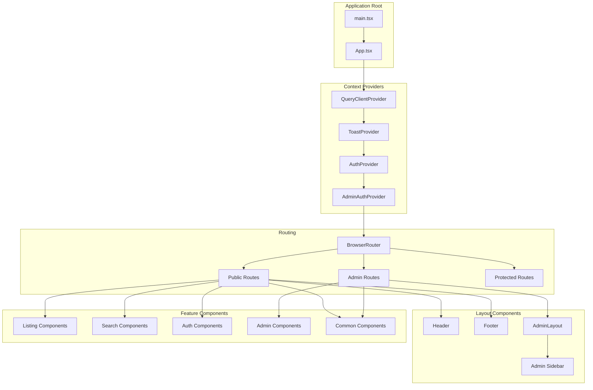

# Frontend Architecture

## Overview

The MarineMarket frontend is a modern React 18 application built with TypeScript, providing a responsive and interactive user interface for both public users and administrators. The application follows a component-based architecture with clear separation of concerns and modern React patterns.

**Technology Stack**:
- **React 18** with TypeScript for type safety
- **Vite** for fast development and optimized builds
- **Tailwind CSS** for utility-first styling
- **TanStack Query** for server state management
- **React Router v6** for client-side routing

## Application Structure



## Core Architecture Patterns

### 1. Component Hierarchy

**Main Application Entry Point**: [`frontend/src/main.tsx`](frontend/../frontend/src/main.tsx)
```typescript
ReactDOM.createRoot(document.getElementById('root')!).render(
  <React.StrictMode>
    <App />
  </React.StrictMode>,
)
```

**Application Root**: [`frontend/src/App.tsx`](frontend/../frontend/src/App.tsx)
- Wraps the entire application with context providers
- Defines routing structure for public and admin areas
- Implements error boundaries and global error handling

### 2. Context Architecture

#### Query Client Provider
- **Purpose**: Global server state management
- **Library**: TanStack Query v4
- **Configuration**: Centralized query client with default options

#### Toast Context
- **File**: [`frontend/src/contexts/ToastContext.tsx`](frontend/../frontend/src/contexts/ToastContext.tsx)
- **Purpose**: Global notification system
- **Features**: Success, error, warning, info notifications with auto-dismiss

#### Authentication Context
- **File**: [`frontend/src/components/auth/AuthProvider.tsx`](frontend/../frontend/src/components/auth/AuthProvider.tsx)
- **Purpose**: User authentication state management
- **Features**: JWT token handling, user session persistence

#### Admin Authentication Context
- **File**: [`frontend/src/components/admin/AdminAuthProvider.tsx`](frontend/../frontend/src/components/admin/AdminAuthProvider.tsx)
- **Purpose**: Administrative user authentication
- **Features**: Role-based access control, admin session management

### 3. Routing Architecture

#### Public Routes
- **Home**: `/` - Landing page with featured listings
- **Search**: `/search` - Listing search and filtering
- **Listing Detail**: `/listing/:id` - Individual boat listing
- **Authentication**: `/login`, `/register` - User authentication
- **Static Pages**: `/about`, `/contact`, `/help`, etc.

#### Protected Routes
- **Create Listing**: `/create` - Requires user authentication
- **Profile**: `/profile` - User profile management

#### Admin Routes
- **Admin Login**: `/admin/login` - Administrative authentication
- **Dashboard**: `/admin` - System overview and metrics
- **User Management**: `/admin/users` - User administration
- **Content Moderation**: `/admin/moderation` - Listing moderation
- **Analytics**: `/admin/analytics` - Platform analytics
- **System Monitoring**: `/admin/monitoring` - System health
- **Settings**: `/admin/settings` - Platform configuration

**Route Configuration**: [`frontend/src/App.tsx:L50-L120`](../frontend/src/App.tsx#L50-L120)

## Component Organization

### 1. Admin Components (`/components/admin/`)

#### Layout Components
- **AdminLayout**: [`AdminLayout.tsx`](frontend/../frontend/src/components/admin/AdminLayout.tsx)
  - Main admin interface layout with sidebar and header
  - Responsive design with mobile menu support
  - Loading states and error handling

- **AdminHeader**: Navigation header with user menu and notifications
- **Sidebar**: Navigation sidebar with role-based menu items

#### Dashboard Components
- **MetricCard**: Displays key performance indicators
- **AnalyticsChart**: Chart.js integration for data visualization
- **HealthCheckCard**: System health status indicators
- **AlertPanel**: System alerts and notifications

#### Management Components
- **ListingModerationQueue**: Content moderation interface
- **UserManagement**: User administration tools
- **DataExport**: Data export functionality
- **ConfirmationDialog**: Action confirmation modals

#### Analytics Components
- **EngagementAnalytics**: User engagement metrics
- **GeographicDistribution**: Geographic data visualization
- **MetricsChart**: Reusable chart components

### 2. Authentication Components (`/components/auth/`)

- **AuthProvider**: Global authentication context
- **ProtectedRoute**: Route protection wrapper
- **LoginForm**: User login interface
- **RegisterForm**: User registration interface
- **AuthModal**: Modal-based authentication

### 3. Common Components (`/components/common/`)

#### UI Components
- **Header**: [`Header.tsx`](frontend/../frontend/src/components/common/Header.tsx)
  - Main navigation with responsive design
  - User authentication status
  - Mobile menu support

- **LoadingSpinner**: Reusable loading indicators
- **ProgressBar**: Progress indication for uploads
- **StarRating**: Rating display component

#### Notification Components
- **ToastNotification**: Individual toast message
- **ToastContainer**: Toast message container with positioning

### 4. Listing Components (`/components/listing/`)

- **ListingCard**: Listing preview cards for search results
- **ListingForm**: Create/edit listing form
- **ImageGallery**: Image carousel and gallery
- **BoatSpecs**: Boat specification display
- **ContactForm**: Seller contact form
- **MediaUpload**: Image and video upload interface

### 5. Search Components (`/components/search/`)

- **SearchFilters**: Advanced search filtering interface

### 6. Layout Components (`/components/layout/`)

- **Layout**: Main application layout wrapper
- **Footer**: Site footer with links and information
- **PageHeader**: Page-specific headers

## State Management

### 1. Server State (TanStack Query)

**API Service**: [`frontend/src/services/api.ts`](frontend/../frontend/src/services/api.ts)
- Centralized API communication
- Automatic request/response handling
- JWT token management
- Error handling and retry logic

**Query Hooks**: Custom hooks for data fetching
- `useListings()` - Fetch and cache listing data
- `useAuth()` - Authentication state management
- `useAdminData()` - Admin-specific data queries

### 2. Client State (React Hooks)

**Authentication Hook**: [`frontend/src/hooks/useAuth.ts`](frontend/../frontend/src/hooks/useAuth.ts)
```typescript
export const useAuth = () => {
  const [user, setUser] = useState<User | null>(null);
  const [loading, setLoading] = useState(true);
  
  // JWT token handling
  // Login/logout functionality
  // User session persistence
};
```

**Admin Hooks**:
- `useAdminAuth()` - Admin authentication state
- `useAdminOperations()` - Admin action handlers
- `useDashboardMetrics()` - Dashboard data management

### 3. Form State

- **React Hook Form**: For complex forms with validation
- **Controlled Components**: For simple form inputs
- **File Upload State**: For media upload management

## Styling Architecture

### 1. Tailwind CSS Configuration

**Config File**: [`frontend/tailwind.config.js`](frontend/../frontend/tailwind.config.js)
- Custom color palette for marine theme
- Responsive breakpoints
- Component-specific utilities

### 2. Global Styles

**Global CSS**: [`frontend/src/styles/globals.css`](../frontend/src/styles/globals.css)
- Base styles and CSS reset
- Custom component classes
- Animation definitions

### 3. Component Styling Patterns

```typescript
// Utility-first approach with Tailwind
const Button = ({ variant, children }) => (
  <button className={`
    px-4 py-2 rounded-lg font-medium transition-colors
    ${variant === 'primary' ? 'bg-blue-600 text-white hover:bg-blue-700' : ''}
    ${variant === 'secondary' ? 'bg-gray-200 text-gray-800 hover:bg-gray-300' : ''}
  `}>
    {children}
  </button>
);
```

## Performance Optimizations

### 1. Code Splitting

- **Route-based splitting**: Automatic code splitting by route
- **Component lazy loading**: Dynamic imports for large components
- **Admin bundle separation**: Separate bundle for admin interface

### 2. Asset Optimization

**Vite Configuration**: [`frontend/vite.config.ts`](frontend/../frontend/vite.config.ts)
- Asset bundling and optimization
- Tree shaking for unused code elimination
- CSS purging for production builds

### 3. Caching Strategies

- **TanStack Query**: Automatic query result caching
- **Browser caching**: Optimized cache headers
- **Service worker**: Offline functionality (future enhancement)

## Error Handling

### 1. Error Boundaries

**Error Boundary Component**: [`frontend/src/components/ErrorBoundary.tsx`](frontend/../frontend/src/components/ErrorBoundary.tsx)
- Catches JavaScript errors in component tree
- Provides fallback UI for error states
- Error reporting and logging

### 2. API Error Handling

```typescript
// Centralized error handling in API service
private async request<T>(url: string, options: RequestInit = {}): Promise<T> {
  try {
    const response = await fetch(url, options);
    if (!response.ok) {
      throw new Error(`HTTP ${response.status}`);
    }
    return response.json();
  } catch (error) {
    // Error logging and user notification
    throw error;
  }
}
```

### 3. Form Validation

- **Client-side validation**: Immediate feedback for user inputs
- **Server-side validation**: Backend validation with error display
- **Type safety**: TypeScript interfaces for form data

## Security Considerations

### 1. Authentication Security

- **JWT Token Storage**: Secure token storage in localStorage
- **Token Expiration**: Automatic token refresh handling
- **Route Protection**: Authentication guards for protected routes

### 2. Input Sanitization

- **XSS Prevention**: Proper input sanitization and output encoding
- **CSRF Protection**: Token-based CSRF protection
- **Content Security Policy**: CSP headers for additional security

### 3. Admin Security

- **Role-based Access**: Granular permission checking
- **Session Management**: Secure admin session handling
- **Audit Logging**: User action tracking and logging

## Testing Strategy

### 1. Unit Testing

**Test Setup**: [`frontend/src/test/setup.ts`](frontend/../frontend/src/test/setup.ts)
- Jest and React Testing Library configuration
- Custom render utilities
- Mock providers for testing

### 2. Component Testing

```typescript
// Example component test
import { render, screen } from '@testing-library/react';
import { ListingCard } from '../ListingCard';

test('renders listing information', () => {
  const listing = { title: 'Test Boat', price: 50000 };
  render(<ListingCard listing={listing} />);
  
  expect(screen.getByText('Test Boat')).toBeInTheDocument();
  expect(screen.getByText('$50,000')).toBeInTheDocument();
});
```

### 3. Integration Testing

**Cypress E2E Tests**: [`frontend/cypress/e2e/`](../frontend/cypress/e2e/)
- End-to-end user workflows
- Admin interface testing
- Cross-browser compatibility

## Build and Deployment

### 1. Development Build

```bash
npm run dev          # Start development server
npm run build:dev    # Build for development environment
```

### 2. Production Build

```bash
npm run build:prod   # Optimized production build
npm run preview      # Preview production build locally
```

### 3. Build Optimization

- **Asset minification**: JavaScript and CSS minification
- **Image optimization**: Automatic image compression
- **Bundle analysis**: Bundle size analysis and optimization

## Mobile Responsiveness

### 1. Responsive Design

- **Mobile-first approach**: Tailwind CSS mobile-first utilities
- **Breakpoint strategy**: Consistent breakpoints across components
- **Touch-friendly interfaces**: Optimized for touch interactions

### 2. Progressive Web App Features

- **Responsive images**: Optimized images for different screen sizes
- **Offline functionality**: Service worker for offline access (planned)
- **App-like experience**: Native app-like interactions

## Integration Points

### 1. Backend API Integration

**API Configuration**: [`frontend/src/config/env.ts`](frontend/../frontend/src/config/env.ts)
- Environment-specific API endpoints
- Configuration management
- Feature flags

### 2. External Services

- **CloudFront CDN**: Asset delivery optimization
- **S3 Storage**: Direct file upload to S3
- **Analytics**: User behavior tracking (planned)

## Development Workflow

### 1. Component Development

1. **Create component structure**: TypeScript interface definition
2. **Implement component logic**: React hooks and state management
3. **Add styling**: Tailwind CSS classes
4. **Write tests**: Unit and integration tests
5. **Document component**: Props and usage documentation

### 2. Feature Development

1. **Route definition**: Add routes to App.tsx
2. **Component creation**: Build feature components
3. **State management**: Implement data fetching and state
4. **Integration**: Connect to backend APIs
5. **Testing**: End-to-end testing with Cypress

## Future Enhancements

### 1. Performance Improvements

- **Service Worker**: Offline functionality and caching
- **Image Lazy Loading**: Improved page load performance
- **Virtual Scrolling**: For large listing datasets

### 2. User Experience

- **Real-time Updates**: WebSocket integration for live updates
- **Push Notifications**: Browser notifications for important events
- **Advanced Search**: Enhanced search with filters and sorting

### 3. Accessibility

- **WCAG Compliance**: Full accessibility compliance
- **Screen Reader Support**: Enhanced screen reader compatibility
- **Keyboard Navigation**: Complete keyboard navigation support

## Related Documentation

- [System Architecture Overview](overview.md) - High-level system architecture
- [Backend Architecture](backend-architecture.md) - Lambda services and APIs
- [API Design](api-design.md) - RESTful API documentation
- [Development Guide](development/getting-started.md) - Setup and development workflow