# System Architecture Overview

## Executive Summary

MarineMarket is a production-ready, serverless boat listing marketplace built on AWS with a modern React frontend. The platform leverages AWS Lambda for compute, DynamoDB for data persistence, and Cloudflare with S3 static website hosting via VPC endpoint for secure global content delivery, providing a scalable and cost-effective solution for boat trading.

**Production Environment**:
- **Frontend**: https://harborlist.com (served via Cloudflare CDN)
- **API**: https://api.harborlist.com (custom domain for API Gateway)

**Environment Structure**:
- **Development**: https://dev.harborlist.com + https://dev-api.harborlist.com
- **Staging**: https://staging.harborlist.com + https://staging-api.harborlist.com  
- **Production**: https://harborlist.com + https://api.harborlist.com

## High-Level Architecture

```mermaid
graph TB
    subgraph "Client Layer"
        WEB[Web Browser]
        MOBILE[Mobile Browser]
    end

    subgraph "CDN & Edge"
        CF[Cloudflare CDN]
        TUNNEL[Cloudflare Tunnel]
        S3WEB[S3 Static Website Hosting]
    end

    subgraph "API Gateway"
        APIGW[API Gateway REST API]
        CORS[CORS Configuration]
    end

    subgraph "Compute Layer"
        AUTH[Auth Service λ]
        LISTING[Listing Service λ]
        SEARCH[Search Service λ]
        MEDIA[Media Service λ]
        EMAIL[Email Service λ]
        STATS[Stats Service λ]
        ADMIN[Admin Service λ]
    end

    subgraph "Data Layer"
        USERS[(Users Table)]
        LISTINGS[(Listings Table)]
        AUDIT[(Audit Logs Table)]
        SESSIONS[(Admin Sessions Table)]
        ATTEMPTS[(Login Attempts Table)]
        MEDIA_S3[(Media Bucket)]
    end

    subgraph "Security & Monitoring"
        JWT[JWT Authentication]
        IAM[IAM Roles & Policies]
        CW[CloudWatch Monitoring]
        SNS[SNS Alerts]
        SECRETS[Secrets Manager]
    end

    subgraph "AWS VPC"
        VPC[VPC Network]
        EC2[EC2 Tunnel Daemon]
        VPCE[VPC Endpoint for S3]
    end

    subgraph "External Services"
        SES[Amazon SES]
    end

    WEB --> CF
    MOBILE --> CF
    CF --> TUNNEL
    TUNNEL --> EC2
    EC2 --> VPCE
    VPCE --> S3WEB
    CF --> APIGW
    
    APIGW --> AUTH
    APIGW --> LISTING
    APIGW --> SEARCH
    APIGW --> MEDIA
    APIGW --> EMAIL
    APIGW --> STATS
    APIGW --> ADMIN

    AUTH --> USERS
    AUTH --> SESSIONS
    AUTH --> ATTEMPTS
    AUTH --> SECRETS
    
    LISTING --> LISTINGS
    LISTING --> USERS
    
    SEARCH --> LISTINGS
    
    MEDIA --> MEDIA_S3
    
    EMAIL --> SES
    
    STATS --> LISTINGS
    STATS --> USERS
    
    ADMIN --> USERS
    ADMIN --> LISTINGS
    ADMIN --> AUDIT
    ADMIN --> SESSIONS
    ADMIN --> ATTEMPTS

    AUTH -.-> JWT
    LISTING -.-> JWT
    ADMIN -.-> JWT

    AUTH --> CW
    LISTING --> CW
    ADMIN --> CW
    
    CW --> SNS
```

## Cloudflare Architecture Implementation (Method 1)

The platform implements **Method 1** from the [Cloudflare Zero Trust S3 tutorial](https://developers.cloudflare.com/cloudflare-one/tutorials/s3-buckets/), which provides secure access to Amazon S3 buckets via Cloudflare Access and VPC endpoints.

### Architecture Benefits

- **🔒 Enhanced Security**: S3 bucket is not publicly accessible; access only via VPC endpoint
- **🚀 Performance**: Cloudflare global network with edge caching and optimization
- **🛡️ Access Control**: Cloudflare Access provides granular authentication and authorization
- **💰 Cost Optimization**: VPC endpoint eliminates NAT Gateway data processing charges for S3 traffic
- **📊 Observability**: Cloudflare provides detailed analytics and monitoring

### Implementation Components

1. **VPC Endpoint**: Secure, private connection from VPC to S3 service
2. **EC2 Tunnel Daemon**: Runs `cloudflared` to establish secure tunnel to Cloudflare
3. **S3 Static Website Hosting**: Serves React application with proper routing support
4. **Cloudflare Access**: Provides authentication and authorization layer
5. **Cloudflare CDN**: Global edge caching and performance optimization
6. **Custom Domains**: Environment-specific subdomains for clean URL structure

### Domain Architecture

Each environment uses dedicated subdomains for clear separation and organization:

| Environment | Frontend Domain | API Domain |
|------------|----------------|------------|
| Development | `dev.harborlist.com` | `dev-api.harborlist.com` |
| Staging | `staging.harborlist.com` | `staging-api.harborlist.com` |
| Production | `harborlist.com` | `api.harborlist.com` |

**Benefits of Custom Domains:**
- 🎯 **Clean URLs**: Professional appearance and easier to remember
- 🔒 **SSL/TLS**: Automatic HTTPS with Cloudflare certificates
- 🚀 **Performance**: Edge caching and optimization at DNS level
- 🏷️ **Environment Isolation**: Clear separation between environments
- 📊 **Analytics**: Better tracking and monitoring per environment

## Core Components

### 1. Frontend Layer
- **Technology**: React 18 + TypeScript + Tailwind CSS
- **Build Tool**: Vite
- **State Management**: TanStack Query for server state
- **Routing**: React Router v6
- **Deployment**: S3 Static Website Hosting + Cloudflare via VPC endpoint

**Key Files**:
- [`frontend/src/App.tsx`](frontend/../frontend/src/App.tsx) - Main application component with routing
- [`frontend/package.json`](frontend/../frontend/package.json) - Dependencies and build scripts
- [`frontend/vite.config.ts`](frontend/../frontend/vite.config.ts) - Build configuration

### 2. API Gateway Layer
- **Service**: AWS API Gateway REST API
- **CORS**: Configured for cross-origin requests
- **Authentication**: JWT token validation
- **Rate Limiting**: Built-in throttling and quotas

**Configuration**: [`infrastructure/lib/boat-listing-stack.ts:L394-L450`](../infrastructure/lib/boat-listing-stack.ts#L394-L450)

### 3. Compute Layer (AWS Lambda)

#### Authentication Service
- **Runtime**: Node.js 18.x
- **Handler**: `auth-service/index.handler`
- **Responsibilities**: User registration, login, JWT management, admin authentication
- **Code**: [`backend/src/auth-service/index.ts`](frontend/../backend/src/auth-service/index.ts)

#### Listing Service  
- **Runtime**: Node.js 18.x
- **Handler**: `listing/index.handler`
- **Responsibilities**: CRUD operations for boat listings
- **Code**: [`backend/src/listing/index.ts`](frontend/../backend/src/listing/index.ts)

#### Admin Service
- **Runtime**: Node.js 18.x
- **Handler**: `admin-service/index.handler`
- **Responsibilities**: Administrative operations, user management, content moderation
- **Code**: [`backend/src/admin-service/index.ts`](frontend/../backend/src/admin-service/index.ts)
- **Features**: Role-based access control, audit logging, security monitoring

#### Search Service
- **Runtime**: Node.js 18.x
- **Handler**: `search/index.handler`
- **Responsibilities**: Listing search and filtering

#### Media Service
- **Runtime**: Node.js 18.x
- **Handler**: `media/index.handler`
- **Responsibilities**: Image upload, processing, and management

#### Stats Service
- **Runtime**: Node.js 18.x
- **Handler**: `stats-service/index.handler`
- **Responsibilities**: Platform analytics and metrics

#### Email Service
- **Runtime**: Node.js 18.x
- **Handler**: `email/index.handler`
- **Responsibilities**: Transactional email delivery via SES

### 4. Data Layer (DynamoDB)

#### Users Table (`boat-users`)
- **Partition Key**: `id` (String)
- **GSI**: `email-index` for email-based queries
- **Purpose**: User profiles, authentication data, roles
- **Configuration**: [`infrastructure/lib/boat-listing-stack.ts:L35-L45`](../infrastructure/lib/boat-listing-stack.ts#L35-L45)

#### Listings Table (`boat-listings`)
- **Partition Key**: `id` (String)
- **GSI**: `location-index` for location-based queries
- **Purpose**: Boat listing data, metadata, status
- **Configuration**: [`infrastructure/lib/boat-listing-stack.ts:L25-L34`](../infrastructure/lib/boat-listing-stack.ts#L25-L34)

#### Audit Logs Table (`boat-audit-logs`)
- **Partition Key**: `id` (String)
- **Sort Key**: `timestamp` (String)
- **GSIs**: `user-index`, `action-index`, `resource-index`
- **TTL**: Automatic cleanup of old logs
- **Purpose**: Security auditing, compliance tracking
- **Configuration**: [`infrastructure/lib/boat-listing-stack.ts:L47-L80`](../infrastructure/lib/boat-listing-stack.ts#L47-L80)

#### Admin Sessions Table (`boat-admin-sessions`)
- **Partition Key**: `sessionId` (String)
- **GSI**: `user-index` for user session queries
- **TTL**: Automatic session expiration
- **Purpose**: Admin session management
- **Configuration**: [`infrastructure/lib/boat-listing-stack.ts:L82-L93`](../infrastructure/lib/boat-listing-stack.ts#L82-L93)

#### Login Attempts Table (`boat-login-attempts`)
- **Partition Key**: `id` (String)
- **Sort Key**: `timestamp` (String)
- **GSIs**: `email-index`, `ip-index`
- **TTL**: Automatic cleanup
- **Purpose**: Security monitoring, rate limiting
- **Configuration**: [`infrastructure/lib/boat-listing-stack.ts:L95-L115`](../infrastructure/lib/boat-listing-stack.ts#L95-L115)

### 5. Storage Layer (S3)

#### Media Bucket
- **Purpose**: Boat images, videos, thumbnails
- **CORS**: Configured for direct uploads
- **Access**: Lambda functions have read/write permissions
- **Configuration**: [`infrastructure/lib/boat-listing-stack.ts:L117-L125`](../infrastructure/lib/boat-listing-stack.ts#L117-L125)

#### Frontend Bucket
- **Purpose**: Static website hosting for React application
- **Website Hosting**: Enabled with SPA routing support
- **Public Access**: Configured for web access
- **Configuration**: [`infrastructure/lib/boat-listing-stack.ts:L127-L145`](../infrastructure/lib/boat-listing-stack.ts#L127-L145)

## Security Architecture

### Authentication & Authorization
- **JWT Tokens**: Stateless authentication with configurable expiration
- **Admin RBAC**: Role-based access control with granular permissions
- **Session Management**: Secure admin session tracking with automatic expiration
- **Rate Limiting**: Adaptive rate limiting based on user roles and endpoints

### Security Monitoring
- **Audit Logging**: Comprehensive logging of all administrative actions
- **Login Attempt Tracking**: Monitoring and alerting for suspicious login patterns
- **IP Analysis**: Geographic and behavioral analysis of access patterns
- **Security Alerts**: Real-time alerting for security events

### Data Protection
- **Encryption**: Data encrypted at rest and in transit
- **Secrets Management**: AWS Secrets Manager for sensitive configuration
- **IAM Policies**: Least privilege access controls
- **CORS**: Properly configured cross-origin resource sharing

## Performance Characteristics

### Scalability
- **Auto Scaling**: Lambda functions scale automatically based on demand
- **DynamoDB**: On-demand billing mode for automatic scaling
- **CloudFront**: Global edge caching for optimal performance
- **Stateless Design**: No server state enables horizontal scaling

### Performance Metrics
- **Cold Start**: ~200-500ms for Lambda cold starts
- **API Response**: <100ms for cached responses, <500ms for database queries
- **CDN Cache**: 99%+ cache hit ratio for static assets via Cloudflare global network
- **Database**: Single-digit millisecond latency for DynamoDB operations
- **S3 Access**: Ultra-low latency via VPC endpoint direct connection

### Cost Optimization
- **Pay-per-Use**: Serverless architecture with no idle costs
- **DynamoDB On-Demand**: Automatic scaling without capacity planning
- **S3 Intelligent Tiering**: Automatic cost optimization for storage
- **Cloudflare**: Reduced origin requests through edge caching and VPC endpoint efficiency
- **VPC Endpoint**: Eliminates NAT Gateway data processing charges for S3 traffic

## Monitoring & Observability

### CloudWatch Integration
- **Lambda Metrics**: Duration, errors, throttles, invocations
- **DynamoDB Metrics**: Read/write capacity, throttles, latency
- **API Gateway Metrics**: Request count, latency, error rates
- **Custom Metrics**: Business metrics and application-specific monitoring

### Alerting
- **Error Rate Alarms**: Automated alerting for high error rates
- **Performance Alarms**: Monitoring for degraded performance
- **Security Alerts**: Real-time security event notifications
- **Cost Alerts**: Budget monitoring and cost anomaly detection

### Dashboard Configuration
- **Admin Dashboard**: Real-time system health and performance metrics
- **Security Dashboard**: Security events and threat monitoring
- **Business Dashboard**: Platform usage and engagement metrics

**Monitoring Setup**: [`infrastructure/lib/boat-listing-stack.ts:L500-L650`](../infrastructure/lib/boat-listing-stack.ts#L500-L650)

## Deployment Architecture

### Infrastructure as Code
- **AWS CDK**: TypeScript-based infrastructure definitions
- **Environment Support**: Dev, staging, and production configurations
- **Automated Deployment**: CI/CD pipeline with validation and testing

### Environment Configuration
- **Development**: Relaxed security, debug logging, development domains
- **Staging**: Production-like environment for testing
- **Production**: Hardened security, performance optimization, monitoring

### Deployment Process
1. **Build**: TypeScript compilation and asset bundling
2. **Package**: Lambda function packaging and S3 upload
3. **Deploy**: CDK deployment with CloudFormation
4. **Validate**: Automated testing and health checks

**CDK Configuration**: [`infrastructure/cdk.json`](frontend/../infrastructure/cdk.json)  
**Build Scripts**: [`infrastructure/package.json`](frontend/../infrastructure/package.json)

## Integration Points

### External Services
- **Cloudflare**: DNS management and tunnel connectivity
- **Amazon SES**: Transactional email delivery
- **AWS Secrets Manager**: Secure configuration management

### API Endpoints
- **Public API**: `/listings`, `/search`, `/auth`
- **Admin API**: `/admin/*` with role-based access control
- **Media API**: `/media` for file upload and management
- **Stats API**: `/stats` for platform analytics

### Data Flow
1. **User Request**: Browser → CloudFront → API Gateway
2. **Authentication**: JWT validation in Lambda authorizer
3. **Business Logic**: Lambda function processing
4. **Data Access**: DynamoDB queries and updates
5. **Response**: JSON response through API Gateway → CloudFront → Browser

## Technology Stack Summary

| Layer | Technology | Purpose |
|-------|------------|---------|
| Frontend | React 18 + TypeScript | User interface and experience |
| Build | Vite | Fast development and production builds |
| Styling | Tailwind CSS | Utility-first CSS framework |
| State | TanStack Query | Server state management |
| CDN | Cloudflare | Global content delivery with S3 via VPC endpoint |
| API | API Gateway | RESTful API management |
| Compute | AWS Lambda | Serverless function execution |
| Database | DynamoDB | NoSQL document database |
| Storage | S3 | Object storage for media and static assets |
| Auth | JWT + Secrets Manager | Authentication and authorization |
| Monitoring | CloudWatch + SNS | Observability and alerting |
| IaC | AWS CDK | Infrastructure as code |
| Runtime | Node.js 18 | JavaScript runtime environment |

## Next Steps

For detailed information about specific components:
- [Frontend Architecture](frontend-architecture.md) - React application structure and patterns
- [Backend Architecture](backend-architecture.md) - Lambda services and API design
- [Data Models](data-models.md) - Database schemas and relationships
- [Infrastructure](infrastructure.md) - AWS CDK and cloud resources
- [API Design](api-design.md) - RESTful API patterns and documentation