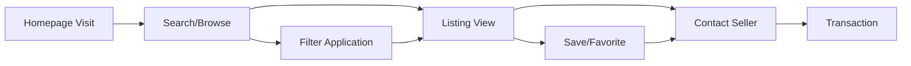

# Analytics & Business Intelligence

## Overview

MarineMarket provides comprehensive analytics and reporting capabilities that enable data-driven decision making for platform optimization, user experience enhancement, and business growth. The analytics system captures real-time metrics across user behavior, listing performance, system health, and business operations.

## Real-Time Dashboard Analytics

### Platform Performance Metrics

#### Core Business Indicators
The admin dashboard provides live monitoring of key performance indicators with automatic refresh capabilities.

```typescript
interface PlatformMetrics {
  totalUsers: number;              // Real-time user count
  activeListings: number;          // Currently published listings
  pendingModeration: number;       // Content awaiting review
  systemHealth: HealthStatus;      // Platform uptime and performance
  revenueToday: number;           // Daily revenue tracking
  newUsersToday: number;          // Daily registration count
  newListingsToday: number;       // Daily listing creation
  activeUsersToday: number;       // Daily active user count
}
```

**Implementation Reference**: [`frontend/src/hooks/useDashboardMetrics.ts`](frontend/../frontend/src/hooks/useDashboardMetrics.ts)

#### System Health Monitoring
```typescript
interface HealthStatus {
  status: 'healthy' | 'warning' | 'critical';
  uptime: number;                 // Percentage uptime (target: 99.9%)
  responseTime: number;           // Average API response time (target: <200ms)
  errorRate: number;              // Platform error rate (target: <0.1%)
}
```

**Key Metrics Tracked**:
- **Uptime Percentage**: Continuous availability monitoring with 99.9% target
- **Response Time**: API performance tracking with sub-200ms targets
- **Error Rate**: Platform stability monitoring with <0.1% error rate goals
- **Active Sessions**: Real-time user session tracking and geographic distribution

### Visual Analytics Dashboard

#### Interactive Charts & Graphs
The dashboard includes dynamic visualizations that update in real-time:

```typescript
interface DashboardChartData {
  userGrowth: ChartData;          // 7-day user registration trends
  listingActivity: ChartData;     // Daily listing creation and updates
  systemPerformance: ChartData;   // System health component status
}
```

**Chart Types Implemented**:
- **Line Charts**: User growth trends over time periods
- **Bar Charts**: Listing activity and category performance
- **Doughnut Charts**: System performance component breakdown
- **Heat Maps**: Geographic distribution of users and listings

**Implementation Reference**: [`frontend/src/components/admin/ChartContainer.tsx`](frontend/../frontend/src/components/admin/ChartContainer.tsx)

## User Analytics & Behavior Tracking

### User Acquisition & Growth Metrics

#### Registration Analytics
```typescript
interface UserMetrics {
  totalUsers: number;
  newUsers: number;
  activeUsers: number;
  userGrowthTrend: TrendData[];
  registrationsByDate: TimeSeriesData[];
  usersByRegion: RegionData[];
}
```

**Tracked Metrics**:
- **Registration Trends**: Daily, weekly, and monthly user acquisition patterns
- **Geographic Distribution**: User registration by state and city
- **Acquisition Sources**: Traffic source analysis and conversion tracking
- **User Retention**: Return visit patterns and engagement longevity

#### User Engagement Analysis
```typescript
interface EngagementMetrics {
  totalSearches: number;
  uniqueSearchers: number;
  averageSearchesPerUser: number;
  topSearchTerms: SearchTermData[];
  searchesByDate: TimeSeriesData[];
  listingViews: number;
  averageViewsPerListing: number;
  viewsByDate: TimeSeriesData[];
  inquiries: number;
  inquiryRate: number;
  inquiriesByDate: TimeSeriesData[];
}
```

**Engagement Tracking**:
- **Search Behavior**: Query patterns, popular search terms, and filter usage
- **Listing Interactions**: View counts, time spent, and engagement depth
- **Communication Patterns**: Inquiry rates and seller-buyer interactions
- **Session Analytics**: Session duration, page views, and user journey mapping

**Implementation Reference**: [`frontend/src/hooks/useAnalytics.ts`](frontend/../frontend/src/hooks/useAnalytics.ts)

### User Segmentation & Personas

#### Behavioral Segmentation
- **Active Browsers**: Users who regularly search and view listings
- **Serious Buyers**: Users with high inquiry rates and detailed searches
- **Casual Visitors**: Users with limited engagement and short sessions
- **Returning Users**: Users with multiple sessions and consistent activity

#### Geographic Analysis
```typescript
interface GeographicMetrics {
  usersByState: StateData[];
  listingsByState: StateData[];
  topCities: CityData[];
  geographicDistribution: GeoDistributionData[];
}
```

**Geographic Insights**:
- **State-Level Distribution**: User and listing concentration by state
- **City-Level Analysis**: Top metropolitan areas for platform activity
- **Market Penetration**: Coverage analysis and expansion opportunities
- **Regional Preferences**: Boat type preferences by geographic region

## Listing Performance Analytics

### Inventory & Content Metrics

#### Listing Volume Analysis
```typescript
interface ListingMetrics {
  totalListings: number;
  newListings: number;
  activeListings: number;
  listingGrowthTrend: TrendData[];
  listingsByDate: TimeSeriesData[];
  listingsByCategory: CategoryData[];
  averageListingPrice: number;
  priceDistribution: PriceRangeData[];
}
```

**Inventory Tracking**:
- **Listing Volume**: Total inventory growth and category distribution
- **Category Performance**: Popular boat types and market demand analysis
- **Price Analysis**: Average pricing trends and market positioning
- **Geographic Coverage**: Listing distribution across states and cities

#### Content Quality Assessment
```typescript
// Quality scoring algorithm
export const calculateListingQualityScore = (listings: any[]): number => {
  const qualityScore = listings.reduce((acc, listing) => {
    let score = 0;
    let maxScore = 0;
    
    // Image quality (0-2 points)
    maxScore += 2;
    if (listing.images && listing.images.length > 0) {
      score += listing.images.length >= 3 ? 2 : 1;
    }
    
    // Description quality (0-2 points)
    maxScore += 2;
    if (listing.description) {
      if (listing.description.length > 200) score += 2;
      else if (listing.description.length > 50) score += 1;
    }
    
    // Features completeness (0-1 point)
    maxScore += 1;
    if (listing.features && listing.features.length > 0) {
      score += 1;
    }
    
    // Boat details completeness (0-2 points)
    maxScore += 2;
    if (listing.boatDetails?.manufacturer) score += 1;
    if (listing.boatDetails?.model) score += 1;
    
    // Price reasonableness (0-1 point)
    maxScore += 1;
    if (listing.price && listing.price > 0) score += 1;
    
    return acc + (score / maxScore);
  }, 0);
  
  return qualityScore / listings.length;
};
```

**Quality Metrics**:
- **Image Quality**: Photo count, resolution, and visual appeal assessment
- **Description Completeness**: Text quality, detail level, and information richness
- **Specification Accuracy**: Boat details completeness and accuracy verification
- **Overall Quality Score**: Composite score based on multiple quality factors

**Implementation Reference**: [`frontend/src/services/ratings.ts`](frontend/../frontend/src/services/ratings.ts) (lines 50-100)

### Market Intelligence

#### Pricing Analytics
- **Price Distribution**: Analysis of pricing patterns across boat categories
- **Market Positioning**: Competitive pricing analysis and recommendations
- **Price Trends**: Historical pricing data and market movement tracking
- **Value Assessment**: Price-to-feature ratio analysis and market value insights

#### Category Performance
```typescript
interface CategoryData {
  category: string;
  count: number;
  percentage: number;
}

interface PriceRangeData {
  range: string;
  count: number;
  percentage: number;
}
```

**Category Insights**:
- **Popular Categories**: Most listed and searched boat types
- **Seasonal Trends**: Category performance variations throughout the year
- **Regional Preferences**: Geographic variations in boat type preferences
- **Market Gaps**: Underserved categories and expansion opportunities

## Search & Discovery Analytics

### Search Behavior Analysis

#### Search Pattern Tracking
```typescript
interface SearchTermData {
  term: string;
  count: number;
  trend: 'up' | 'down' | 'stable';
}
```

**Search Metrics**:
- **Popular Search Terms**: Most frequently used search queries
- **Search Filters**: Most commonly applied filters and combinations
- **Search Success Rate**: Percentage of searches resulting in listing views
- **Search Refinement**: How users modify searches to find relevant results

#### Discovery Optimization
- **Search Result Relevance**: Analysis of search result quality and user satisfaction
- **Filter Effectiveness**: Performance of different search filters and combinations
- **Search Abandonment**: Analysis of unsuccessful search patterns
- **Recommendation Performance**: Effectiveness of suggested listings and categories

### Conversion Funnel Analysis

#### User Journey Tracking


**Conversion Metrics**:
- **Search-to-View Rate**: Percentage of searches resulting in listing views
- **View-to-Inquiry Rate**: Percentage of listing views resulting in seller contact
- **Inquiry-to-Transaction Rate**: Percentage of inquiries resulting in sales
- **Overall Conversion Rate**: End-to-end conversion from visit to transaction

## Business Intelligence & Reporting

### Revenue Analytics (Future Enhancement)

#### Financial Performance Tracking
```typescript
interface FinancialSummary {
  totalRevenue: number;
  totalTransactions: number;
  pendingPayouts: number;
  disputedTransactions: number;
  commissionEarned: number;
  refundsProcessed: number;
}
```

**Revenue Metrics**:
- **Commission Tracking**: Platform commission calculation and optimization
- **Transaction Volume**: Payment processing volume and trends
- **Revenue Forecasting**: Predictive analytics for business planning
- **Cost Analysis**: Platform operational cost tracking and profitability analysis

#### Market Performance
- **Market Share Analysis**: Platform position in the boat marketplace sector
- **Competitive Intelligence**: Performance comparison with industry benchmarks
- **Growth Projections**: Data-driven forecasting for business planning
- **ROI Analysis**: Return on investment for platform features and marketing

### Operational Analytics

#### Content Moderation Metrics
```typescript
interface ModerationStats {
  totalFlagged: number;
  pendingReview: number;
  approvedToday: number;
  rejectedToday: number;
  averageReviewTime: number;
}
```

**Moderation Performance**:
- **Review Efficiency**: Average time from flag to resolution
- **Decision Accuracy**: Quality assurance and consistency monitoring
- **Moderator Performance**: Individual moderator statistics and training needs
- **Content Quality Trends**: Platform content quality improvement over time

#### System Performance Analytics
- **API Performance**: Response time tracking and optimization opportunities
- **Database Performance**: Query performance and optimization needs
- **CDN Effectiveness**: Content delivery performance and global reach
- **Error Tracking**: Error pattern analysis and resolution prioritization

## Custom Reporting & Data Export

### Automated Report Generation

#### Scheduled Reports
```typescript
interface FinancialReport {
  id: string;
  type: 'revenue' | 'commission' | 'payout' | 'dispute';
  title: string;
  description: string;
  dateRange: DateRange;
  generatedAt: string;
  generatedBy: string;
  format: 'csv' | 'pdf' | 'excel';
  downloadUrl?: string;
  status: 'generating' | 'completed' | 'failed';
}
```

**Report Types**:
- **Daily Performance Reports**: Key metrics and performance indicators
- **Weekly Business Reviews**: Comprehensive business performance analysis
- **Monthly Growth Reports**: User acquisition, retention, and growth metrics
- **Quarterly Business Intelligence**: Strategic insights and market analysis

#### Custom Analytics Queries
- **Ad-Hoc Analysis**: Custom date ranges and metric combinations
- **Comparative Analysis**: Period-over-period performance comparisons
- **Cohort Analysis**: User behavior tracking over time periods
- **Segmentation Reports**: Performance analysis by user segments or categories

### Data Export Capabilities

#### Export Formats
```typescript
interface ExportOptions {
  format: 'csv' | 'pdf';
  dateRange: DateRange;
  metrics: string[];
  includeCharts: boolean;
}
```

**Export Features**:
- **CSV Export**: Raw data export for external analysis tools
- **PDF Reports**: Formatted reports for presentation and sharing
- **Excel Integration**: Structured data export for spreadsheet analysis
- **API Access**: Programmatic access to analytics data for custom integrations

#### Data Privacy & Compliance
- **User Privacy Protection**: Anonymized data export with PII protection
- **GDPR Compliance**: Data export controls and user consent management
- **Audit Trail**: Complete tracking of data access and export activities
- **Access Controls**: Role-based permissions for data export capabilities

## Real-Time Monitoring & Alerts

### Performance Monitoring

#### System Health Alerts
```typescript
interface SystemAlert {
  id: string;
  type: 'info' | 'warning' | 'error';
  title: string;
  message: string;
  timestamp: string;
  acknowledged: boolean;
}
```

**Alert Categories**:
- **Performance Alerts**: Response time degradation or system slowdowns
- **Error Rate Alerts**: Unusual error patterns or system failures
- **Capacity Alerts**: Resource utilization and scaling requirements
- **Security Alerts**: Suspicious activity or security incidents

#### Business Metric Alerts
- **User Activity Alerts**: Unusual patterns in user registration or engagement
- **Listing Quality Alerts**: Significant changes in content quality metrics
- **Revenue Alerts**: Unusual transaction patterns or revenue fluctuations
- **Market Alerts**: Significant changes in market conditions or competition

### Predictive Analytics (Future Enhancement)

#### Machine Learning Insights
- **User Behavior Prediction**: Predict user actions and preferences
- **Market Trend Forecasting**: Predict market demand and pricing trends
- **Churn Prediction**: Identify users at risk of platform abandonment
- **Quality Scoring**: Automated content quality assessment and recommendations

#### Recommendation Engine Analytics
- **Recommendation Performance**: Track effectiveness of suggested listings
- **Personalization Metrics**: Measure personalization algorithm performance
- **A/B Testing Results**: Compare different recommendation strategies
- **User Satisfaction**: Measure user satisfaction with recommendations

## Analytics API & Integration

### Analytics API Endpoints

#### Core Analytics Endpoints
```typescript
// User analytics
GET /admin/analytics/users?startDate={date}&endDate={date}
GET /admin/analytics/users/engagement?period={period}
GET /admin/analytics/users/geographic?region={region}

// Listing analytics
GET /admin/analytics/listings?category={category}&period={period}
GET /admin/analytics/listings/performance?metric={metric}
GET /admin/analytics/listings/quality?threshold={threshold}

// Engagement analytics
GET /admin/analytics/engagement/search?terms={terms}
GET /admin/analytics/engagement/conversion?funnel={funnel}
GET /admin/analytics/engagement/trends?period={period}

// System analytics
GET /admin/analytics/system/health?component={component}
GET /admin/analytics/system/performance?metric={metric}
GET /admin/analytics/system/errors?severity={severity}
```

**Implementation Reference**: [`backend/src/admin-service/index.ts`](frontend/../backend/src/admin-service/index.ts) (analytics endpoints)

#### Real-Time Data Streaming
- **WebSocket Connections**: Real-time metric updates for dashboard displays
- **Event Streaming**: Live event tracking for immediate insights
- **Push Notifications**: Instant alerts for critical metric changes
- **Data Synchronization**: Real-time data consistency across multiple clients

### Third-Party Integrations

#### Analytics Platform Integration
- **Google Analytics**: Web analytics and user behavior tracking
- **Mixpanel**: Event tracking and user journey analysis
- **Amplitude**: Product analytics and user engagement insights
- **Custom Analytics**: Integration with proprietary analytics systems

#### Business Intelligence Tools
- **Tableau Integration**: Advanced data visualization and business intelligence
- **Power BI**: Microsoft business analytics and reporting platform
- **Looker**: Modern business intelligence and data platform
- **Custom Dashboards**: API-driven custom dashboard development

## Data Quality & Governance

### Data Accuracy & Validation

#### Data Quality Metrics
- **Completeness**: Percentage of complete data records and required fields
- **Accuracy**: Data validation and error rate tracking
- **Consistency**: Data consistency across different system components
- **Timeliness**: Data freshness and update frequency monitoring

#### Data Validation Processes
- **Real-Time Validation**: Immediate data quality checks during data ingestion
- **Batch Validation**: Periodic comprehensive data quality assessments
- **Anomaly Detection**: Automated detection of unusual data patterns
- **Data Cleansing**: Automated and manual data correction processes

### Privacy & Security

#### Data Protection
- **Anonymization**: User data anonymization for analytics and reporting
- **Encryption**: Data encryption at rest and in transit
- **Access Controls**: Role-based access to sensitive analytics data
- **Audit Logging**: Complete tracking of data access and usage

#### Compliance Management
- **GDPR Compliance**: European data protection regulation compliance
- **CCPA Compliance**: California consumer privacy act compliance
- **Data Retention**: Automated data retention and deletion policies
- **Consent Management**: User consent tracking for data usage and analytics

This comprehensive analytics and reporting system provides MarineMarket with the insights needed to optimize platform performance, enhance user experience, and drive business growth through data-driven decision making.