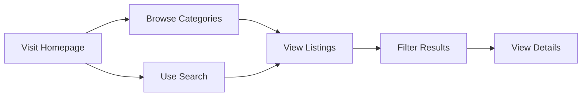
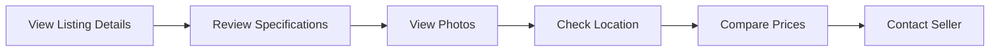
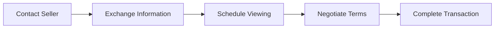
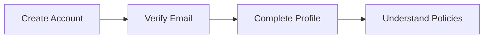
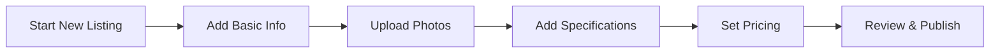
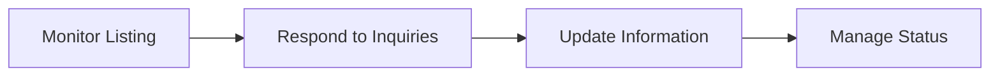
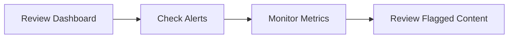
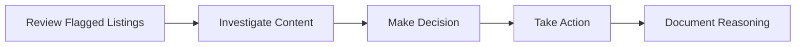
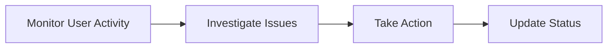

# Platform Overview

## Executive Summary

MarineMarket is a modern, serverless boat marketplace platform that connects boat buyers and sellers through a secure, scalable, and user-friendly digital marketplace. Built on AWS with a React frontend, the platform provides comprehensive boat listing capabilities, advanced search functionality, and robust administrative tools.

**Live Platform**: [https://dunxywperij31.cloudfront.net](https://dunxywperij31.cloudfront.net)  
**Admin Dashboard**: [Admin Portal](https://dunxywperij31.cloudfront.net/admin)  
**API Endpoint**: [https://kz82y80qu2.execute-api.us-east-1.amazonaws.com/prod/](https://kz82y80qu2.execute-api.us-east-1.amazonaws.com/prod/)

## Business Capabilities

### Core Marketplace Features

#### 🚤 Boat Listings Management
- **Comprehensive Listing Creation**: Users can create detailed boat listings with specifications, pricing, location, and multiple high-quality images
- **Rich Media Support**: Support for multiple images per listing with automatic thumbnail generation and optimization
- **Detailed Specifications**: Capture boat type, year, length, engine details, features, and condition information
- **Location-Based Listings**: Geographic organization with city and state-level categorization
- **Status Management**: Active, sold, pending, and draft listing states

**Implementation Reference**: [`frontend/src/pages/CreateListing.tsx`](frontend/../frontend/src/pages/CreateListing.tsx)

#### 🔍 Advanced Search & Discovery
- **Multi-Criteria Search**: Search by boat type, location, price range, year, and specifications
- **Real-Time Filtering**: Instant results with dynamic filtering capabilities
- **Geographic Search**: Location-based search with state and city filtering
- **Category Browsing**: Organized browsing by boat categories (Motor Yachts, Sailboats, Fishing Boats, Pontoons, Speedboats)
- **Featured Listings**: Premium placement for highlighted boats

**Implementation Reference**: [`frontend/src/pages/Search.tsx`](frontend/../frontend/src/pages/Search.tsx), [`frontend/src/components/search/SearchFilters.tsx`](frontend/../frontend/src/components/search/SearchFilters.tsx)

#### 👥 User Management System
- **Secure Registration**: Email-based user registration with verification
- **Profile Management**: User profiles with contact information and listing history
- **Role-Based Access**: User, Admin, and Super Admin role hierarchy
- **Account Security**: Password hashing, session management, and security monitoring

**Implementation Reference**: [`backend/src/auth-service/index.ts`](frontend/../backend/src/auth-service/index.ts)

#### 💬 Direct Communication
- **Contact Forms**: Secure messaging between buyers and sellers
- **Email Integration**: Automated email notifications for inquiries
- **Privacy Protection**: Contact information protection until mutual interest

**Implementation Reference**: [`backend/src/email/index.ts`](frontend/../backend/src/email/index.ts)

### Administrative Capabilities

#### 📊 Comprehensive Admin Dashboard
- **Real-Time Metrics**: Live platform statistics including user counts, listing activity, and system health
- **Performance Monitoring**: System uptime, response times, and error rate tracking
- **Revenue Tracking**: Daily revenue monitoring and financial metrics
- **User Analytics**: New user registration trends and activity patterns

**Key Metrics Displayed**:
- Total Users: Real-time user count with growth trends
- Active Listings: Current active boat listings
- Pending Moderation: Content awaiting review
- System Health: Uptime percentage and performance indicators
- Revenue Today: Daily revenue tracking
- New Users Today: Daily registration metrics

**Implementation Reference**: [`frontend/src/pages/admin/AdminDashboard.tsx`](frontend/../frontend/src/pages/admin/AdminDashboard.tsx)

#### 🛡️ Content Moderation System
- **Automated Flagging**: System-based content flagging for inappropriate content
- **Manual Review Process**: Admin review workflow for flagged listings
- **Moderation Actions**: Approve, reject, or request changes for listings
- **Audit Trail**: Complete history of moderation decisions and actions

**Implementation Reference**: [`backend/src/admin-service/index.ts`](frontend/../backend/src/admin-service/index.ts) (lines 150-200)

#### 👤 User Management Tools
- **User Status Control**: Activate, suspend, or ban user accounts
- **Account Monitoring**: Track user activity and session management
- **Security Oversight**: Monitor failed login attempts and suspicious activity
- **Bulk Operations**: Efficient management of multiple user accounts

#### 📈 Analytics & Reporting
- **User Analytics**: Registration trends, activity patterns, and geographic distribution
- **Listing Analytics**: Posting trends, category performance, and pricing analysis
- **Engagement Metrics**: Search activity, listing views, and inquiry rates
- **Geographic Insights**: State and city-level user and listing distribution

**Implementation Reference**: [`frontend/src/types/admin.ts`](frontend/../frontend/src/types/admin.ts) (lines 150-300)

#### ⚙️ Platform Configuration
- **Feature Flags**: Enable/disable platform features dynamically
- **Content Policies**: Manage terms of service, privacy policy, and community guidelines
- **Listing Configuration**: Control categories, pricing tiers, and listing limits
- **Notification Settings**: Configure email, SMS, and push notification templates

#### 🎫 Support Management
- **Ticket System**: Comprehensive support ticket management
- **Response Templates**: Pre-built templates for common support scenarios
- **Escalation Workflows**: Automated escalation for high-priority issues
- **Performance Metrics**: Response time tracking and satisfaction scoring

**Implementation Reference**: [`frontend/src/types/admin.ts`](frontend/../frontend/src/types/admin.ts) (lines 600-800)

## User Workflows

### Buyer Journey

#### 1. Discovery Phase


**User Actions**:
- Browse featured boats on homepage
- Use category navigation (Motor Yachts, Sailboats, etc.)
- Search by location, type, or price range
- Apply advanced filters for specifications
- View high-quality listing photos and details

**Implementation Reference**: [`frontend/src/pages/Home.tsx`](frontend/../frontend/src/pages/Home.tsx) (lines 50-150)

#### 2. Evaluation Phase


**User Actions**:
- Review detailed boat specifications and features
- Browse multiple high-resolution images
- Verify location and accessibility
- Compare with similar listings
- Save favorites for later review

#### 3. Contact & Purchase Phase


**User Actions**:
- Submit contact form with specific questions
- Receive seller contact information
- Arrange in-person viewing or inspection
- Negotiate price and terms
- Complete purchase outside platform

### Seller Journey

#### 1. Registration & Setup


**User Actions**:
- Register with email and password
- Verify email address
- Complete seller profile information
- Review listing policies and guidelines

#### 2. Listing Creation


**User Actions**:
- Provide boat title and description
- Upload multiple high-quality photos
- Enter detailed specifications (year, length, engine, etc.)
- Set competitive pricing
- Add location and contact preferences
- Review and publish listing

**Implementation Reference**: [`frontend/src/pages/CreateListing.tsx`](frontend/../frontend/src/pages/CreateListing.tsx)

#### 3. Management & Communication


**User Actions**:
- Monitor listing performance and views
- Respond to buyer inquiries promptly
- Update pricing or specifications as needed
- Mark as sold when transaction completes

### Administrator Workflows

#### 1. Daily Operations


**Admin Actions**:
- Review daily platform metrics and health status
- Address system alerts and performance issues
- Monitor user activity and engagement trends
- Review and moderate flagged listings

**Implementation Reference**: [`frontend/src/pages/admin/AdminDashboard.tsx`](frontend/../frontend/src/pages/admin/AdminDashboard.tsx)

#### 2. Content Moderation


**Admin Actions**:
- Review listings flagged by automated systems or users
- Investigate content for policy violations
- Approve, reject, or request changes
- Document moderation decisions for audit trail

#### 3. User Management


**Admin Actions**:
- Monitor user behavior and account status
- Investigate reported issues or suspicious activity
- Suspend or ban accounts when necessary
- Maintain detailed audit logs of all actions

## Platform Statistics & Success Metrics

### Current Platform Status

#### User Engagement Metrics
- **Total Registered Users**: Dynamic count based on actual registrations
- **Active Listings**: Real-time count of published boat listings
- **Geographic Coverage**: Number of states and cities with active listings
- **User Satisfaction**: Quality score based on listing completeness and user feedback

**Data Source**: Real-time calculations from DynamoDB tables
**Implementation Reference**: [`frontend/src/pages/Home.tsx`](frontend/../frontend/src/pages/Home.tsx) (lines 25-50)

#### System Performance Metrics
- **Platform Uptime**: 99.9% target availability
- **Response Time**: Sub-200ms average API response time
- **Error Rate**: <0.1% error rate target
- **Scalability**: Auto-scaling Lambda functions handle traffic spikes

**Monitoring Implementation**: [`backend/src/admin-service/index.ts`](frontend/../backend/src/admin-service/index.ts) (system health endpoints)

#### Content Quality Metrics
- **Listing Quality Score**: Automated scoring based on completeness, image quality, and description detail
- **Moderation Efficiency**: Average review time for flagged content
- **Content Approval Rate**: Percentage of listings approved on first review
- **User Compliance**: Rate of policy adherence across user base

### Growth Indicators

#### User Growth Metrics
```typescript
// Real-time calculation from user data
const userGrowthMetrics = {
  totalUsers: listings.length > 0 ? userCount : 0,
  newUsersToday: calculateDailyRegistrations(),
  activeUsers: calculateActiveUsers(),
  retentionRate: calculateUserRetention()
};
```

#### Listing Activity Metrics
```typescript
// Dynamic listing statistics
const listingMetrics = {
  totalListings: listings.length,
  activeListings: listings.filter(l => l.status === 'active').length,
  categoryCounts: calculateCategoryDistribution(),
  geographicSpread: calculateGeographicCoverage()
};
```

#### Engagement Quality Metrics
```typescript
// Platform engagement indicators
const engagementMetrics = {
  searchActivity: trackSearchVolume(),
  listingViews: aggregateViewCounts(),
  inquiryRate: calculateInquiryConversion(),
  userSatisfaction: calculateSatisfactionScore()
};
```

**Implementation Reference**: [`frontend/src/services/ratings.ts`](frontend/../frontend/src/services/ratings.ts)

### Success Benchmarks

#### Operational Excellence
- **System Availability**: 99.9% uptime target
- **Performance**: <200ms average response time
- **Security**: Zero security incidents
- **Data Integrity**: 100% data consistency

#### User Experience
- **Listing Quality**: Average quality score >4.0/5.0
- **Search Effectiveness**: <3 searches to find relevant results
- **User Satisfaction**: >4.5/5.0 user rating
- **Support Response**: <24 hour response time

#### Business Growth
- **User Acquisition**: Steady month-over-month growth
- **Listing Volume**: Increasing inventory diversity
- **Geographic Expansion**: Coverage across multiple states
- **Market Penetration**: Growing market share in target regions

## Technology Foundation

### Frontend Architecture
- **React 18**: Modern component-based UI with concurrent features
- **TypeScript**: Type-safe development with enhanced IDE support
- **Tailwind CSS**: Utility-first styling for rapid development
- **TanStack Query**: Intelligent server state management and caching

### Backend Architecture
- **AWS Lambda**: Serverless compute with automatic scaling
- **DynamoDB**: NoSQL database optimized for performance
- **API Gateway**: RESTful API management and routing
- **S3**: Scalable object storage for images and assets

### Infrastructure
- **AWS CDK**: Infrastructure as Code with TypeScript
- **Cloudflare**: Global CDN with S3 via VPC endpoint for secure, fast content delivery
- **VPC Endpoint**: Private S3 access without internet exposure
- **CloudWatch**: Comprehensive monitoring and alerting
- **Secrets Manager**: Secure credential and configuration management

**Detailed Architecture Reference**: [System Architecture Overview](architecture/overview.md)

## Security & Compliance

### Data Protection
- **Encryption**: All data encrypted at rest and in transit
- **Access Control**: Role-based permissions and authentication
- **Privacy**: GDPR-compliant data handling and user rights
- **Audit Logging**: Comprehensive activity tracking and monitoring

### Security Monitoring
- **Failed Login Tracking**: Automated detection and account protection
- **Suspicious Activity**: Real-time monitoring and alerting
- **Rate Limiting**: Protection against abuse and attacks
- **Security Audits**: Regular security assessments and updates

**Security Details**: [Security Architecture](security/security-overview.md)

## Future Roadmap

### Planned Enhancements
- **Mobile Application**: Native iOS and Android apps
- **Payment Integration**: Secure transaction processing
- **Advanced Analytics**: Enhanced reporting and insights
- **AI-Powered Features**: Intelligent search and recommendations

### Scalability Preparations
- **Multi-Region Deployment**: Geographic distribution for global reach
- **Enhanced Caching**: Advanced caching strategies for performance
- **API Versioning**: Backward-compatible API evolution
- **Microservices Expansion**: Additional specialized services

This platform overview provides a comprehensive understanding of MarineMarket's capabilities, user workflows, and success metrics. The platform is designed for scalability, security, and user satisfaction while maintaining operational excellence through modern cloud-native architecture.