# Development Workflow Guide

This guide outlines the complete development workflow for the MarineMarket boat listing platform, including Git practices, code review processes, CI/CD pipelines, and collaboration guidelines.

## 🎯 Workflow Overview

Our development workflow follows **GitFlow** principles with modern DevOps practices:

1. **Feature Development** → Feature branches from `main`
2. **Code Review** → Pull requests with automated checks
3. **Testing** → Automated testing at multiple levels
4. **Integration** → Continuous integration with quality gates
5. **Deployment** → Automated deployment to multiple environments
6. **Monitoring** → Post-deployment monitoring and feedback

## 🌳 Git Workflow and Branching Strategy

### Branch Structure

```
main (production)
├── develop (integration)
├── feature/user-authentication
├── feature/search-improvements
├── hotfix/critical-security-fix
└── release/v1.2.0
```

### Branch Types and Naming Conventions

**Main Branches:**
- `main` - Production-ready code, always deployable
- `develop` - Integration branch for features (optional, we use main-based workflow)

**Supporting Branches:**
- `feature/[feature-name]` - New features and enhancements
- `bugfix/[bug-description]` - Bug fixes for development
- `hotfix/[critical-fix]` - Critical fixes for production
- `release/[version]` - Release preparation (optional)

**Naming Examples:**
```bash
✅ Good:
feature/user-authentication
feature/advanced-search-filters
bugfix/listing-image-upload
hotfix/security-vulnerability-fix
release/v1.2.0

❌ Bad:
feature/auth
fix-bug
new-feature
john-dev-branch
```

### Git Commands and Workflow

**1. Starting New Feature Development:**
```bash
# Update main branch
git checkout main
git pull origin main

# Create and switch to feature branch
git checkout -b feature/boat-valuation-calculator

# Verify branch
git branch
```

**2. Development Cycle:**
```bash
# Make changes and stage them
git add .

# Commit with descriptive message
git commit -m "feat: add boat valuation calculator with market data integration

- Implement 4-step valuation wizard
- Add market data API integration
- Include condition assessment logic
- Add responsive design for mobile devices

Closes #123"

# Push to remote branch
git push origin feature/boat-valuation-calculator
```

**3. Keeping Feature Branch Updated:**
```bash
# Fetch latest changes
git fetch origin

# Rebase feature branch on main (preferred)
git rebase origin/main

# Or merge main into feature branch (alternative)
git merge origin/main

# Push updated branch
git push origin feature/boat-valuation-calculator --force-with-lease
```

**4. Creating Pull Request:**
```bash
# Push final changes
git push origin feature/boat-valuation-calculator

# Create PR via GitHub UI or CLI
gh pr create --title "Add boat valuation calculator" \
  --body "Implements comprehensive boat valuation system with market data integration"
```

## 📝 Commit Message Standards

### Conventional Commits Format

```
<type>[optional scope]: <description>

[optional body]

[optional footer(s)]
```

### Commit Types

- `feat`: New feature for the user
- `fix`: Bug fix for the user
- `docs`: Documentation changes
- `style`: Code style changes (formatting, missing semicolons, etc.)
- `refactor`: Code refactoring without changing functionality
- `perf`: Performance improvements
- `test`: Adding or updating tests
- `chore`: Maintenance tasks, dependency updates
- `ci`: CI/CD pipeline changes
- `build`: Build system or external dependency changes

### Examples

**Good Commit Messages:**
```bash
feat(auth): add JWT token refresh mechanism

Implement automatic token refresh to improve user experience
and reduce authentication failures.

- Add refresh token endpoint
- Implement client-side token refresh logic
- Add error handling for expired tokens
- Update authentication middleware

Closes #456

fix(listing): resolve image upload timeout issue

Increase upload timeout and add progress indicator to prevent
user confusion during large file uploads.

Fixes #789

docs(api): update authentication endpoint documentation

Add examples for JWT token usage and refresh flow.
Include error response formats and status codes.

test(search): add integration tests for advanced filters

Ensure search functionality works correctly with multiple
filter combinations and edge cases.

chore(deps): update React to version 18.2.0

Update React and related dependencies to latest stable versions
for security and performance improvements.
```

**Bad Commit Messages:**
```bash
❌ fix bug
❌ update code
❌ changes
❌ WIP
❌ fixed the thing
❌ more updates
```

## 🔄 Pull Request Process

### Pull Request Template

When creating a pull request, include:

```markdown
## Description
Brief description of changes and motivation.

## Type of Change
- [ ] Bug fix (non-breaking change which fixes an issue)
- [ ] New feature (non-breaking change which adds functionality)
- [ ] Breaking change (fix or feature that would cause existing functionality to not work as expected)
- [ ] Documentation update

## Testing
- [ ] Unit tests pass
- [ ] Integration tests pass
- [ ] Manual testing completed
- [ ] Cross-browser testing (if frontend changes)

## Screenshots (if applicable)
Include screenshots for UI changes.

## Checklist
- [ ] Code follows style guidelines
- [ ] Self-review completed
- [ ] Code is commented where necessary
- [ ] Documentation updated
- [ ] No breaking changes without version bump
```

### Review Process

**1. Automated Checks (Required):**
- ✅ All tests pass
- ✅ Code coverage meets threshold (80%+)
- ✅ Linting passes
- ✅ Type checking passes
- ✅ Security scan passes
- ✅ Build succeeds

**2. Manual Review (Required):**
- 👥 At least 1 reviewer approval
- 👥 Code owner approval (for critical areas)
- 🔍 Code quality and maintainability
- 📚 Documentation completeness
- 🧪 Test coverage adequacy

**3. Review Guidelines:**

**For Reviewers:**
```markdown
✅ Check for:
- Code correctness and logic
- Performance implications
- Security considerations
- Error handling
- Code readability and maintainability
- Test coverage
- Documentation updates
- Breaking changes

✅ Provide:
- Constructive feedback
- Specific suggestions
- Code examples when helpful
- Praise for good practices

❌ Avoid:
- Nitpicking style issues (use automated tools)
- Personal preferences over standards
- Blocking on minor issues
- Vague feedback without suggestions
```

**For Authors:**
```markdown
✅ Before requesting review:
- Self-review your changes
- Run all tests locally
- Update documentation
- Add meaningful commit messages
- Respond to all automated check failures

✅ During review:
- Respond promptly to feedback
- Ask questions if feedback is unclear
- Make requested changes or explain why not
- Thank reviewers for their time

❌ Avoid:
- Taking feedback personally
- Arguing without technical justification
- Ignoring automated check failures
- Making unrelated changes in the same PR
```

## 🚀 CI/CD Pipeline

### Pipeline Overview

```mermaid
graph LR
    A[Push to Branch] --> B[Automated Checks]
    B --> C[Build & Test]
    C --> D[Security Scan]
    D --> E[Code Review]
    E --> F[Merge to Main]
    F --> G[Deploy to Dev]
    G --> H[Integration Tests]
    H --> I[Deploy to Staging]
    I --> J[E2E Tests]
    J --> K[Deploy to Production]
```



### Automated Checks

**On Every Push:**
```yaml
# .github/workflows/ci.yml (conceptual)
name: Continuous Integration

on:
  push:
    branches: [ main, develop ]
  pull_request:
    branches: [ main ]

jobs:
  test:
    runs-on: ubuntu-latest
    steps:
      - uses: actions/checkout@v4
      - name: Setup Node.js
        uses: actions/setup-node@v4
        with:
          node-version: '18'
      
      - name: Install dependencies
        run: |
          cd frontend && npm ci
          cd ../backend && npm ci
          cd ../infrastructure && npm ci
      
      - name: Run tests
        run: |
          cd frontend && npm run test:run
          cd ../backend && npm test
          cd ../infrastructure && npm test
      
      - name: Run linting
        run: |
          cd frontend && npm run lint
          cd ../backend && npm run lint
      
      - name: Type checking
        run: |
          cd frontend && npm run type-check
          cd ../backend && npm run build
      
      - name: Security audit
        run: |
          cd frontend && npm audit --audit-level=high
          cd ../backend && npm audit --audit-level=high
```

### Deployment Environments

**1. Development Environment**
- **Trigger**: Merge to `main` branch
- **URL**: `https://dev.boatlistings.com`
- **Purpose**: Integration testing and feature validation
- **Auto-deploy**: Yes
- **Approval**: None required

**2. Staging Environment**
- **Trigger**: Manual deployment or release branch
- **URL**: `https://staging.boatlistings.com`
- **Purpose**: Pre-production testing and client review
- **Auto-deploy**: Optional
- **Approval**: Team lead approval

**3. Production Environment**
- **Trigger**: Manual deployment only
- **URL**: `https://boatlistings.com`
- **Purpose**: Live user-facing application
- **Auto-deploy**: No
- **Approval**: Security team + Management approval

### Deployment Process

**Development Deployment:**
```bash
# Automatic on merge to main
# Manual trigger available:
gh workflow run deploy-dev.yml -f confirm_deployment=deploy
```

**Staging Deployment:**
```bash
# Manual deployment to staging
gh workflow run deploy-staging.yml \
  -f confirm_deployment=deploy \
  -f environment=staging
```

**Production Deployment:**
```bash
# Production deployment (requires approvals)
gh workflow run deploy-production.yml \
  -f confirm_deployment=deploy-production \
  -f deployment_type=standard \
  -f migration_required=false \
  -f maintenance_mode=true
```

### Quality Gates

**Code Quality Gates:**
- ✅ Test coverage ≥ 80%
- ✅ No high/critical security vulnerabilities
- ✅ No TypeScript errors
- ✅ No ESLint errors
- ✅ Build succeeds for all components
- ✅ Bundle size within limits

**Deployment Gates:**
- ✅ All automated tests pass
- ✅ Security scan passes
- ✅ Performance benchmarks met
- ✅ Required approvals obtained
- ✅ Rollback plan documented

## 🧪 Testing Strategy

### Testing Pyramid

```
    /\
   /  \     E2E Tests (Few)
  /____\    
 /      \   Integration Tests (Some)
/__________\ Unit Tests (Many)
```

### Test Types and Commands

**1. Unit Tests**
```bash
# Frontend unit tests
cd frontend
npm run test              # Watch mode
npm run test:run          # Single run
npm run test:coverage     # With coverage

# Backend unit tests
cd backend
npm test                  # Run all tests
npm run test:watch        # Watch mode
npm run test:coverage     # With coverage
```

**2. Integration Tests**
```bash
# API integration tests
cd backend
npm run test:integration

# Component integration tests
cd frontend
npm run test:integration
```

**3. End-to-End Tests**
```bash
# Cypress E2E tests
cd frontend
npm run test:e2e          # Headless mode
npm run test:e2e:open     # Interactive mode
```

**4. Performance Tests**
```bash
# Load testing
npm run test:performance

# Bundle analysis
cd frontend
npm run analyze
```

### Test Writing Guidelines

**Unit Test Example:**
```typescript
// ✅ Good: Descriptive test with clear setup and assertions
describe('BoatValuationCalculator', () => {
  describe('calculateMarketValue', () => {
    it('should return higher value for excellent condition boats', () => {
      // Arrange
      const boatData = {
        year: 2020,
        length: 30,
        manufacturer: 'Sea Ray',
        condition: 'Excellent'
      };

      // Act
      const result = calculateMarketValue(boatData);

      // Assert
      expect(result.estimatedValue).toBeGreaterThan(100000);
      expect(result.confidence).toBeGreaterThan(0.8);
    });

    it('should handle missing manufacturer gracefully', () => {
      // Arrange
      const boatData = {
        year: 2020,
        length: 30,
        condition: 'Good'
        // manufacturer intentionally missing
      };

      // Act & Assert
      expect(() => calculateMarketValue(boatData)).not.toThrow();
    });
  });
});
```

**Integration Test Example:**
```typescript
// ✅ Good: Integration test with real API calls
describe('Listing API Integration', () => {
  beforeEach(async () => {
    await setupTestDatabase();
  });

  afterEach(async () => {
    await cleanupTestDatabase();
  });

  it('should create and retrieve a listing', async () => {
    // Arrange
    const listingData = {
      title: 'Test Boat',
      price: 50000,
      // ... other required fields
    };

    // Act
    const createResponse = await api.createListing(listingData);
    const retrieveResponse = await api.getListing(createResponse.listingId);

    // Assert
    expect(createResponse.success).toBe(true);
    expect(retrieveResponse.listing.title).toBe('Test Boat');
  });
});
```

## 🔒 Security Workflow

### Security Scanning

**Automated Security Checks:**
```bash
# Run security scan workflow
gh workflow run security-scan.yml \
  -f environment=staging \
  -f scan_type=comprehensive \
  -f severity_threshold=moderate \
  -f confirm_scan=scan
```

**Security Scan Types:**
- **Vulnerability Scan**: Dependency vulnerabilities
- **Dependency Audit**: Third-party package security
- **Code Analysis**: Static code security analysis
- **Infrastructure Scan**: CloudFormation/CDK security
- **Penetration Test**: Basic security testing
- **Comprehensive**: All of the above

### Security Review Process

**For Security-Sensitive Changes:**
1. 🔒 Security team review required
2. 🧪 Additional security testing
3. 📋 Security impact assessment
4. ✅ Security team approval

**Security-Sensitive Areas:**
- Authentication and authorization
- Data encryption and storage
- API security and validation
- Infrastructure and networking
- Third-party integrations
- User data handling

## 📊 Monitoring and Feedback

### Development Metrics

**Code Quality Metrics:**
- Test coverage percentage
- Code complexity scores
- Technical debt ratio
- Security vulnerability count
- Performance benchmarks

**Process Metrics:**
- Pull request cycle time
- Code review response time
- Build success rate
- Deployment frequency
- Mean time to recovery

### Monitoring Tools

**Development Environment:**
```bash
# Check build status
gh run list --workflow=ci.yml

# View deployment status
gh run list --workflow=deploy-dev.yml

# Check security scan results
gh run list --workflow=security-scan.yml
```

**Application Monitoring:**
- CloudWatch for AWS resources
- Application performance monitoring
- Error tracking and alerting
- User experience monitoring

## 🚨 Incident Response Workflow

### Hotfix Process

**For Critical Production Issues:**

1. **Immediate Response:**
```bash
# Create hotfix branch from main
git checkout main
git pull origin main
git checkout -b hotfix/critical-security-fix

# Make minimal fix
# ... implement fix ...

# Test thoroughly
npm run test:all

# Commit and push
git commit -m "hotfix: resolve critical security vulnerability

Fix SQL injection vulnerability in search endpoint.
Apply input sanitization and parameterized queries.

Fixes #CRITICAL-001"

git push origin hotfix/critical-security-fix
```

2. **Emergency Deployment:**
```bash
# Create emergency PR
gh pr create --title "HOTFIX: Critical Security Fix" \
  --body "Emergency fix for critical security vulnerability" \
  --label "hotfix,critical"

# After approval, deploy immediately
gh workflow run deploy-production.yml \
  -f confirm_deployment=deploy-production \
  -f deployment_type=hotfix
```

3. **Post-Incident:**
- Document incident and resolution
- Update monitoring and alerting
- Conduct post-mortem review
- Implement preventive measures

### Rollback Process

**If Deployment Issues Occur:**
```bash
# Emergency rollback
gh workflow run deploy-production.yml \
  -f confirm_deployment=deploy-production \
  -f deployment_type=rollback

# Or use rollback script
./scripts/deployment/rollback.sh --environment=production --emergency
```

## 🤝 Collaboration Guidelines

### Communication Channels

**Development Discussions:**
- GitHub Issues for feature requests and bugs
- Pull Request comments for code review
- Team Slack/Discord for quick questions
- Weekly team meetings for planning

**Documentation Updates:**
- Update relevant documentation with code changes
- Keep README files current
- Document breaking changes
- Update API documentation

### Code Ownership

**Code Owners (CODEOWNERS file):**
```
# Global owners
* @team-leads

# Frontend
/frontend/ @frontend-team @ui-ux-team

# Backend
/backend/ @backend-team @security-team

# Infrastructure
/infrastructure/ @devops-team @security-team

# Documentation
/docs/ @tech-writers @team-leads

# Security-sensitive files
/backend/src/auth/ @security-team
/infrastructure/lib/security/ @security-team
```

### Best Practices Summary

**Development Best Practices:**
- ✅ Write descriptive commit messages
- ✅ Keep pull requests focused and small
- ✅ Write tests for new functionality
- ✅ Update documentation with changes
- ✅ Follow coding standards and conventions
- ✅ Respond promptly to code review feedback
- ✅ Test changes thoroughly before pushing

**Collaboration Best Practices:**
- ✅ Be respectful and constructive in reviews
- ✅ Ask questions when requirements are unclear
- ✅ Share knowledge and help team members
- ✅ Document decisions and architectural choices
- ✅ Communicate blockers and dependencies early
- ✅ Participate in team meetings and discussions

## 📚 Workflow Tools and Resources

### Essential Tools

**Command Line Tools:**
```bash
# GitHub CLI
gh --version

# Git aliases for common operations
git config --global alias.co checkout
git config --global alias.br branch
git config --global alias.ci commit
git config --global alias.st status
```

**IDE Extensions:**
- GitLens for Git integration
- GitHub Pull Requests extension
- Conventional Commits extension
- Git Graph for branch visualization

### Useful Scripts

**Development Scripts:**
```bash
# Quick setup for new feature
./scripts/development/start-feature.sh feature-name

# Run all quality checks
./scripts/development/quality-check.sh

# Prepare for deployment
./scripts/deployment/pre-deploy-check.sh
```

### Documentation Links

**Internal Resources:**
- [Getting Started Guide](getting-started.md) - Setup and onboarding
- [Local Development Setup](local-setup.md) - Environment configuration
- [Code Structure Guide](code-structure.md) - Codebase organization

**External Resources:**
- [Conventional Commits](https://www.conventionalcommits.org/)
- [GitFlow Workflow](https://www.atlassian.com/git/tutorials/comparing-workflows/gitflow-workflow)
- [GitHub Flow](https://guides.github.com/introduction/flow/)
- [Semantic Versioning](https://semver.org/)

## 🎯 Workflow Checklist

### Daily Development Checklist

**Before Starting Work:**
- [ ] Pull latest changes from main
- [ ] Create feature branch with descriptive name
- [ ] Understand requirements and acceptance criteria
- [ ] Plan implementation approach

**During Development:**
- [ ] Write tests for new functionality
- [ ] Follow coding standards and conventions
- [ ] Commit changes with descriptive messages
- [ ] Keep commits focused and atomic
- [ ] Update documentation as needed

**Before Creating PR:**
- [ ] Run all tests locally
- [ ] Run linting and type checking
- [ ] Self-review all changes
- [ ] Update documentation
- [ ] Write descriptive PR description

**After PR Approval:**
- [ ] Merge using appropriate strategy
- [ ] Delete feature branch
- [ ] Verify deployment to development
- [ ] Monitor for any issues

### Release Checklist

**Pre-Release:**
- [ ] All features tested and approved
- [ ] Documentation updated
- [ ] Security scan completed
- [ ] Performance testing passed
- [ ] Staging environment validated

**Release:**
- [ ] Create release branch (if using GitFlow)
- [ ] Update version numbers
- [ ] Generate changelog
- [ ] Tag release commit
- [ ] Deploy to production
- [ ] Verify production deployment

**Post-Release:**
- [ ] Monitor application metrics
- [ ] Check error rates and performance
- [ ] Communicate release to stakeholders
- [ ] Document any issues or learnings

---

This workflow ensures consistent, high-quality development practices while maintaining security, reliability, and team collaboration. Adapt these guidelines as the team and project evolve.

Happy coding! 🚤