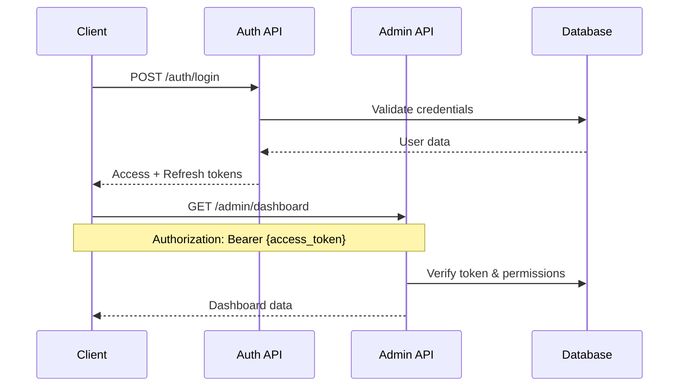

# API Reference

## Overview

The MarineMarket platform provides a comprehensive RESTful API for managing boat listings, user authentication, and administrative operations. The API is built on AWS Lambda with API Gateway and follows OpenAPI 3.0 specifications.

**Base URLs:**
- **Production**: `https://kz82y80qu2.execute-api.us-east-1.amazonaws.com/prod/`
- **Admin API**: `https://kz82y80qu2.execute-api.us-east-1.amazonaws.com/prod/admin/`

**Authentication:** Bearer JWT tokens
**Content-Type:** `application/json`
**Rate Limiting:** Applied per endpoint (see individual endpoint documentation)

## Authentication

### Overview

The platform uses JWT-based authentication with support for:
- Standard user authentication
- Admin authentication with MFA requirement
- Session management with device tracking
- Refresh token rotation

### Authentication Flow



### Authentication Endpoints

#### POST /auth/register
Register a new user account.

**Request Body:**
```json
{
  "name": "John Doe",
  "email": "user@example.com",
  "password": "securePassword123"
}
```

**Response (201):**
```json
{
  "success": true,
  "tokens": {
    "accessToken": "eyJhbGciOiJIUzI1NiIsInR5cCI6IkpXVCJ9...",
    "refreshToken": "eyJhbGciOiJIUzI1NiIsInR5cCI6IkpXVCJ9...",
    "expiresIn": 900,
    "tokenType": "Bearer"
  },
  "user": {
    "id": "user-uuid",
    "email": "user@example.com",
    "name": "John Doe",
    "role": "user",
    "emailVerified": false
  }
}
```

**Validation Rules:**
- `name`: Required, 1-100 characters
- `email`: Required, valid email format, unique
- `password`: Required, minimum 8 characters, must contain uppercase, lowercase, number

**Implementation Reference:** [`backend/src/auth-service/index.ts:30-45`](../../backend/src/auth-service/index.ts#L30-L45)

**Key Implementation Details:**
```typescript
// Authentication handler structure
export const handler = async (event: APIGatewayProxyEvent): Promise<APIGatewayProxyResult> => {
  const requestId = event.requestContext.requestId;
  const clientInfo = getClientInfo(event);
  
  // Route handling based on path and method
  const path = event.path;
  const method = event.httpMethod;
  // ... routing logic
};
```

**Related Files:**
- [`backend/src/shared/auth.ts`](frontend/src/../../backend/src/shared/auth.ts) - Authentication utilities
- [`backend/src/shared/utils.ts`](frontend/src/../../backend/src/shared/utils.ts) - Response helpers
- [`backend/src/types/common.ts`](frontend/src/../../backend/src/types/common.ts) - Type definitions

#### POST /auth/login
Authenticate user and receive access tokens.

**Request Body:**
```json
{
  "email": "user@example.com",
  "password": "securePassword123",
  "deviceId": "optional-device-identifier"
}
```

**Response (200):**
```json
{
  "success": true,
  "tokens": {
    "accessToken": "eyJhbGciOiJIUzI1NiIsInR5cCI6IkpXVCJ9...",
    "refreshToken": "eyJhbGciOiJIUzI1NiIsInR5cCI6IkpXVCJ9...",
    "expiresIn": 900,
    "tokenType": "Bearer"
  },
  "user": {
    "id": "user-uuid",
    "email": "user@example.com",
    "name": "John Doe",
    "role": "user",
    "permissions": [],
    "mfaEnabled": false
  }
}
```

**MFA Required Response (200):**
```json
{
  "requiresMFA": true,
  "mfaToken": "temp-mfa-token",
  "message": "MFA verification required"
}
```

**Implementation Reference:** [`backend/src/auth-service/index.ts:85-140`](../../backend/src/auth-service/index.ts#L85-L140)

#### POST /auth/admin/login
Authenticate admin user with MFA requirement.

**Request Body:**
```json
{
  "email": "admin@example.com",
  "password": "adminPassword123",
  "mfaCode": "123456",
  "deviceId": "admin-device-id"
}
```

**Response (200):**
```json
{
  "success": true,
  "tokens": {
    "accessToken": "eyJhbGciOiJIUzI1NiIsInR5cCI6IkpXVCJ9...",
    "refreshToken": "eyJhbGciOiJIUzI1NiIsInR5cCI6IkpXVCJ9...",
    "expiresIn": 900,
    "tokenType": "Bearer"
  },
  "user": {
    "id": "admin-uuid",
    "email": "admin@example.com",
    "name": "Admin User",
    "role": "admin",
    "permissions": ["user_management", "content_moderation"],
    "mfaEnabled": true
  }
}
```

**Implementation Reference:** [`backend/src/auth-service/index.ts:142-200`](../../backend/src/auth-service/index.ts#L142-L200)

#### POST /auth/refresh
Refresh access token using refresh token.

**Request Body:**
```json
{
  "refreshToken": "eyJhbGciOiJIUzI1NiIsInR5cCI6IkpXVCJ9..."
}
```

**Response (200):**
```json
{
  "accessToken": "eyJhbGciOiJIUzI1NiIsInR5cCI6IkpXVCJ9...",
  "tokenType": "Bearer",
  "expiresIn": 900
}
```

**Implementation Reference:** [`backend/src/auth-service/index.ts:202-240`](../../backend/src/auth-service/index.ts#L202-L240)

## Listings API

### Overview

The Listings API manages boat listings with full CRUD operations, search capabilities, and media handling.

### Endpoints

#### GET /listings
Retrieve paginated list of boat listings.

**Query Parameters:**
- `limit` (integer, 1-100): Number of listings per page (default: 20)
- `nextToken` (string): Pagination token for next page

**Response (200):**
```json
{
  "listings": [
    {
      "listingId": "listing-uuid",
      "ownerId": "user-uuid",
      "title": "Beautiful 30ft Sailboat",
      "description": "Well-maintained sailboat perfect for weekend trips",
      "price": 45000,
      "location": {
        "city": "Miami",
        "state": "FL",
        "zipCode": "33101"
      },
      "boatDetails": {
        "type": "Sailboat",
        "manufacturer": "Catalina",
        "model": "30",
        "year": 2015,
        "length": 30,
        "condition": "Good"
      },
      "features": ["GPS", "Autopilot", "Solar Panels"],
      "images": ["https://s3.amazonaws.com/..."],
      "thumbnails": ["https://s3.amazonaws.com/..."],
      "status": "active",
      "views": 150,
      "createdAt": 1640995200000,
      "updatedAt": 1640995200000
    }
  ],
  "total": 1,
  "nextToken": "base64-encoded-pagination-token"
}
```

**Implementation Reference:** [`backend/src/listing/index.ts:15-25`](../../backend/src/listing/index.ts#L15-L25)

**Key Implementation Details:**
```typescript
// Listing handler with method routing
switch (method) {
  case 'GET':
    if (pathParameters.id) {
      return await getListing(pathParameters.id, requestId);
    } else {
      return await getListings(event, requestId);
    }
  // ... other methods
}
```

**Database Operations:**
- Uses shared database service: [`backend/src/shared/database.ts`](frontend/src/../../backend/src/shared/database.ts)
- Validation utilities: [`backend/src/shared/utils.ts`](frontend/src/../../backend/src/shared/utils.ts)
- Type definitions: [`backend/src/types/common.ts`](frontend/src/../../backend/src/types/common.ts)

#### GET /listings/{id}
Retrieve specific listing by ID.

**Path Parameters:**
- `id` (string): Listing ID

**Response (200):**
```json
{
  "listing": {
    "listingId": "listing-uuid",
    "ownerId": "user-uuid",
    "title": "Beautiful 30ft Sailboat",
    "description": "Well-maintained sailboat perfect for weekend trips",
    "price": 45000,
    "location": {
      "city": "Miami",
      "state": "FL",
      "zipCode": "33101",
      "coordinates": {
        "lat": 25.7617,
        "lon": -80.1918
      }
    },
    "boatDetails": {
      "type": "Sailboat",
      "manufacturer": "Catalina",
      "model": "30",
      "year": 2015,
      "length": 30,
      "beam": 10.5,
      "draft": 4.5,
      "engine": "Yanmar 3GM30F",
      "hours": 1200,
      "condition": "Good"
    },
    "features": ["GPS", "Autopilot", "Solar Panels"],
    "images": ["https://s3.amazonaws.com/..."],
    "videos": ["https://s3.amazonaws.com/..."],
    "thumbnails": ["https://s3.amazonaws.com/..."],
    "status": "active",
    "views": 151,
    "createdAt": 1640995200000,
    "updatedAt": 1640995200000
  }
}
```

**Implementation Reference:** [`backend/src/listing/index.ts:25-43`](../../backend/src/listing/index.ts#L25-L43)

#### POST /listings
Create new boat listing (requires authentication).

**Headers:**
- `Authorization: Bearer {access_token}`

**Request Body:**
```json
{
  "title": "Beautiful 30ft Sailboat",
  "description": "Well-maintained sailboat perfect for weekend trips",
  "price": 45000,
  "location": {
    "city": "Miami",
    "state": "FL",
    "zipCode": "33101",
    "coordinates": {
      "lat": 25.7617,
      "lon": -80.1918
    }
  },
  "boatDetails": {
    "type": "Sailboat",
    "manufacturer": "Catalina",
    "model": "30",
    "year": 2015,
    "length": 30,
    "beam": 10.5,
    "draft": 4.5,
    "engine": "Yanmar 3GM30F",
    "hours": 1200,
    "condition": "Good"
  },
  "features": ["GPS", "Autopilot", "Solar Panels"],
  "images": ["https://s3.amazonaws.com/..."],
  "videos": ["https://s3.amazonaws.com/..."]
}
```

**Response (201):**
```json
{
  "listingId": "new-listing-uuid"
}
```

**Validation Rules:**
- `title`: Required, 1-200 characters
- `description`: Required, 1-5000 characters
- `price`: Required, $1 - $10,000,000
- `location.city`: Required
- `location.state`: Required, valid US state code
- `boatDetails.type`: Required
- `boatDetails.year`: Required, 1900 - current year + 1
- `boatDetails.length`: Required, positive number
- `boatDetails.condition`: Required, one of: "Excellent", "Good", "Fair", "Needs Work"

**Implementation Reference:** [`backend/src/listing/index.ts:77-140`](../../backend/src/listing/index.ts#L77-L140)

#### PUT /listings/{id}
Update existing listing (requires authentication and ownership).

**Headers:**
- `Authorization: Bearer {access_token}`

**Path Parameters:**
- `id` (string): Listing ID

**Request Body:** Same as POST /listings (partial updates supported)

**Response (200):**
```json
{
  "message": "Listing updated successfully"
}
```

**Implementation Reference:** [`backend/src/listing/index.ts:142-190`](../../backend/src/listing/index.ts#L142-L190)

#### DELETE /listings/{id}
Delete listing (requires authentication and ownership).

**Headers:**
- `Authorization: Bearer {access_token}`

**Path Parameters:**
- `id` (string): Listing ID

**Response (200):**
```json
{
  "message": "Listing deleted successfully"
}
```

**Implementation Reference:** [`backend/src/listing/index.ts:192-220`](../../backend/src/listing/index.ts#L192-L220)

## Search API

### POST /search
Advanced search for boat listings with filtering capabilities.

**Request Body:**
```json
{
  "query": "sailboat catalina",
  "priceRange": {
    "min": 20000,
    "max": 100000
  },
  "location": {
    "state": "FL",
    "radius": 50,
    "coordinates": {
      "lat": 25.7617,
      "lon": -80.1918
    }
  },
  "boatType": ["Sailboat", "Catamaran"],
  "yearRange": {
    "min": 2010,
    "max": 2023
  },
  "lengthRange": {
    "min": 25,
    "max": 40
  },
  "features": ["GPS", "Autopilot"],
  "limit": 20,
  "offset": 0
}
```

**Response (200):**
```json
{
  "results": [
    {
      "listingId": "listing-uuid",
      "title": "Beautiful 30ft Sailboat",
      "price": 45000,
      "location": {
        "city": "Miami",
        "state": "FL"
      },
      "boatDetails": {
        "type": "Sailboat",
        "year": 2015,
        "length": 30
      },
      "thumbnails": ["https://s3.amazonaws.com/..."],
      "status": "active"
    }
  ],
  "total": 1,
  "limit": 20,
  "offset": 0
}
```

**Implementation Reference:** [`backend/src/search/index.ts:15-80`](../../backend/src/search/index.ts#L15-L80)

## Media API

### POST /media
Upload media files for listings (requires authentication).

**Headers:**
- `Authorization: Bearer {access_token}`
- `Content-Type: multipart/form-data`

**Request:** Multipart form data with image/video files

**Response (200):**
```json
{
  "uploadId": "upload-uuid",
  "uploadUrl": "https://presigned-s3-url...",
  "url": "https://media-bucket.s3.amazonaws.com/user-id/file-id",
  "thumbnail": "https://thumbnails-bucket.s3.amazonaws.com/user-id/file-id_thumb.jpg",
  "metadata": {
    "size": 2048576,
    "dimensions": {
      "width": 1920,
      "height": 1080
    },
    "format": "JPEG"
  }
}
```

**Supported Formats:**
- Images: JPEG, PNG, WebP
- Videos: MP4, MOV, AVI
- Max file size: 50MB per file
- Max files per upload: 20

**Implementation Reference:** [`backend/src/media/index.ts:15-60`](../../backend/src/media/index.ts#L15-L60)

## Email API

### POST /email
Send contact message to boat owner.

**Request Body:**
```json
{
  "listingId": "listing-uuid",
  "senderName": "Jane Smith",
  "senderEmail": "jane@example.com",
  "message": "I'm interested in your boat. Is it still available?",
  "phone": "+1234567890"
}
```

**Response (200):**
```json
{
  "success": true,
  "messageId": "msg-uuid",
  "message": "Message sent successfully"
}
```

**Validation Rules:**
- `listingId`: Required, valid listing ID
- `senderName`: Required, 1-100 characters
- `senderEmail`: Required, valid email format
- `message`: Required, 1-2000 characters
- `phone`: Optional, valid phone number format

**Rate Limiting:** 5 messages per hour per IP address

**Implementation Reference:** [`backend/src/email/index.ts:15-45`](../../backend/src/email/index.ts#L15-L45)

## Admin API

### Overview

The Admin API provides comprehensive administrative capabilities with role-based access control and audit logging. All admin endpoints require authentication and appropriate permissions.

**Base URL:** `/admin/`
**Authentication:** Bearer JWT with admin role
**Rate Limiting:** Adaptive rate limiting based on user permissions

### Authentication

#### POST /admin/auth/verify
Verify admin authentication status and permissions.

**Headers:**
- `Authorization: Bearer {admin_access_token}`

**Response (200):**
```json
{
  "user": {
    "id": "admin-uuid",
    "email": "admin@example.com",
    "name": "Admin User",
    "role": "admin",
    "status": "active",
    "permissions": ["user_management", "content_moderation"],
    "lastLogin": "2023-12-01T10:00:00Z",
    "mfaEnabled": true
  },
  "permissions": ["user_management", "content_moderation"],
  "sessionInfo": {
    "sessionId": "session-uuid",
    "deviceId": "device-id",
    "expiresAt": "2023-12-01T11:00:00Z"
  }
}
```

**Implementation Reference:** [`backend/src/admin-service/index.ts:120-150`](../backend/src/admin-service/index.ts#L120-L150)

### Dashboard

#### GET /admin/dashboard
Get platform overview and key metrics.

**Required Permissions:** `analytics_view`

**Response (200):**
```json
{
  "metrics": {
    "totalUsers": 1250,
    "activeUsers": 890,
    "newUsersToday": 15,
    "totalListings": 3400,
    "activeListings": 2800,
    "pendingModeration": 25,
    "flaggedListings": 8
  },
  "systemHealth": {
    "status": "healthy",
    "services": [
      {
        "name": "API Gateway",
        "status": "up",
        "responseTime": 45,
        "lastCheck": "2023-12-01T10:00:00Z"
      },
      {
        "name": "DynamoDB",
        "status": "up",
        "responseTime": 12,
        "lastCheck": "2023-12-01T10:00:00Z"
      }
    ]
  },
  "lastUpdated": "2023-12-01T10:00:00Z"
}
```

**Implementation Reference:** [`backend/src/admin-service/index.ts:152-180`](../backend/src/admin-service/index.ts#L152-L180)

### User Management

#### GET /admin/users
Get paginated list of users with filtering.

**Required Permissions:** `user_management`

**Query Parameters:**
- `page` (integer): Page number (default: 1)
- `limit` (integer): Users per page, max 100 (default: 20)
- `search` (string): Search by email or name
- `status` (string): Filter by status (active, suspended, banned, pending_verification)
- `role` (string): Filter by role (user, admin, moderator, support)

**Response (200):**
```json
{
  "users": [
    {
      "id": "user-uuid",
      "email": "user@example.com",
      "name": "John Doe",
      "role": "user",
      "status": "active",
      "emailVerified": true,
      "phoneVerified": false,
      "mfaEnabled": false,
      "lastLogin": "2023-12-01T09:30:00Z",
      "createdAt": "2023-11-01T10:00:00Z"
    }
  ],
  "total": 1250,
  "page": 1,
  "totalPages": 63
}
```

**Implementation Reference:** [`backend/src/admin-service/index.ts:182-210`](../backend/src/admin-service/index.ts#L182-L210)

#### GET /admin/users/{userId}
Get detailed user information including activity and sessions.

**Required Permissions:** `user_management`

**Path Parameters:**
- `userId` (string): User ID

**Response (200):**
```json
{
  "user": {
    "id": "user-uuid",
    "email": "user@example.com",
    "name": "John Doe",
    "phone": "+1234567890",
    "location": "Miami, FL",
    "role": "user",
    "status": "active",
    "emailVerified": true,
    "phoneVerified": true,
    "mfaEnabled": false,
    "lastLogin": "2023-12-01T09:30:00Z",
    "loginAttempts": 0,
    "createdAt": "2023-11-01T10:00:00Z",
    "updatedAt": "2023-12-01T09:30:00Z"
  },
  "activity": [
    {
      "id": "activity-uuid",
      "action": "LOGIN",
      "timestamp": "2023-12-01T09:30:00Z",
      "ipAddress": "192.168.1.1",
      "userAgent": "Mozilla/5.0...",
      "details": {
        "deviceId": "device-id",
        "success": true
      }
    }
  ],
  "sessions": [
    {
      "sessionId": "session-uuid",
      "deviceId": "device-id",
      "ipAddress": "192.168.1.1",
      "userAgent": "Mozilla/5.0...",
      "issuedAt": "2023-12-01T09:30:00Z",
      "expiresAt": "2023-12-01T10:30:00Z",
      "lastActivity": "2023-12-01T09:45:00Z",
      "isActive": true
    }
  ]
}
```

**Implementation Reference:** [`backend/src/admin-service/index.ts:212-250`](../backend/src/admin-service/index.ts#L212-L250)

#### PUT /admin/users/{userId}/status
Update user status (suspend, activate, ban).

**Required Permissions:** `user_management`

**Path Parameters:**
- `userId` (string): User ID

**Request Body:**
```json
{
  "status": "suspended",
  "reason": "Violation of terms of service - inappropriate listing content"
}
```

**Response (200):**
```json
{
  "message": "User status updated successfully",
  "userId": "user-uuid",
  "newStatus": "suspended",
  "reason": "Violation of terms of service - inappropriate listing content"
}
```

**Status Options:**
- `active`: User can access platform normally
- `suspended`: Temporary restriction, user cannot login
- `banned`: Permanent restriction, user cannot login
- `pending_verification`: Account requires email verification

**Implementation Reference:** [`backend/src/admin-service/index.ts:252-300`](../backend/src/admin-service/index.ts#L252-L300)

### Audit Logs

#### GET /admin/audit-logs
Retrieve audit logs with filtering and pagination.

**Required Permissions:** `audit_log_view`

**Query Parameters:**
- `page` (integer): Page number (default: 1)
- `limit` (integer): Logs per page, max 200 (default: 50)
- `userId` (string): Filter by user ID
- `action` (string): Filter by action type
- `resource` (string): Filter by resource type
- `startDate` (string): Start date (ISO 8601)
- `endDate` (string): End date (ISO 8601)
- `sortBy` (string): Sort field (default: timestamp)
- `sortOrder` (string): Sort order (asc, desc, default: desc)

**Response (200):**
```json
{
  "logs": [
    {
      "id": "log-uuid",
      "userId": "user-uuid",
      "userEmail": "user@example.com",
      "action": "USER_LOGIN",
      "resource": "user",
      "resourceId": "user-uuid",
      "details": {
        "deviceId": "device-id",
        "success": true
      },
      "ipAddress": "192.168.1.1",
      "userAgent": "Mozilla/5.0...",
      "timestamp": "2023-12-01T09:30:00Z",
      "sessionId": "session-uuid"
    }
  ],
  "total": 15000,
  "page": 1,
  "totalPages": 300
}
```

**Common Actions:**
- `USER_LOGIN`, `USER_LOGOUT`, `USER_REGISTERED`
- `ADMIN_LOGIN`, `ADMIN_AUTH_VERIFY`
- `LISTING_CREATED`, `LISTING_UPDATED`, `LISTING_DELETED`
- `USER_STATUS_UPDATED`, `LISTING_MODERATED`
- `SESSION_TERMINATED`, `MFA_ENABLED`

**Implementation Reference:** [`backend/src/admin-service/index.ts:350-400`](../backend/src/admin-service/index.ts#L350-L400)

#### POST /admin/audit-logs/search
Advanced search in audit logs with full-text capabilities.

**Required Permissions:** `audit_log_view`

**Request Body:**
```json
{
  "query": "failed login attempt",
  "startDate": "2023-12-01T00:00:00Z",
  "endDate": "2023-12-01T23:59:59Z",
  "filters": {
    "action": "USER_LOGIN",
    "success": false
  },
  "page": 1,
  "limit": 50
}
```

**Response (200):**
```json
{
  "logs": [
    {
      "id": "log-uuid",
      "userId": "user-uuid",
      "userEmail": "user@example.com",
      "action": "FAILED_LOGIN_ATTEMPT",
      "resource": "security",
      "details": {
        "attempts": 3,
        "locked": false,
        "reason": "Invalid password"
      },
      "ipAddress": "192.168.1.1",
      "timestamp": "2023-12-01T09:15:00Z"
    }
  ],
  "total": 25,
  "page": 1,
  "totalPages": 1,
  "searchQuery": "failed login attempt",
  "searchTime": 45
}
```

**Implementation Reference:** [`backend/src/admin-service/index.ts:450-500`](../backend/src/admin-service/index.ts#L450-L500)

### Security Monitoring

#### GET /admin/security/suspicious-activity
Get detected suspicious activities and security events.

**Required Permissions:** `audit_log_view`

**Query Parameters:**
- `timeRange` (string): Time range (1h, 6h, 24h, 7d, 30d, default: 24h)
- `severity` (string): Severity level (low, medium, high, critical, all, default: all)
- `page` (integer): Page number (default: 1)
- `limit` (integer): Activities per page, max 200 (default: 50)

**Response (200):**
```json
{
  "activities": [
    {
      "id": "activity-uuid",
      "type": "multiple_failed_logins",
      "severity": "high",
      "description": "Multiple failed login attempts from same IP",
      "ipAddress": "192.168.1.100",
      "userEmail": "user@example.com",
      "timestamp": "2023-12-01T09:00:00Z",
      "details": {
        "attempts": 5,
        "timeWindow": "5 minutes",
        "blocked": true
      }
    },
    {
      "id": "activity-uuid-2",
      "type": "unusual_location",
      "severity": "medium",
      "description": "Login from unusual geographic location",
      "ipAddress": "203.0.113.1",
      "userEmail": "admin@example.com",
      "timestamp": "2023-12-01T08:30:00Z",
      "details": {
        "previousLocation": "Miami, FL",
        "currentLocation": "Moscow, Russia",
        "timeDifference": "2 hours"
      }
    }
  ],
  "total": 15,
  "page": 1,
  "totalPages": 1
}
```

**Activity Types:**
- `multiple_failed_logins`: Repeated login failures
- `unusual_location`: Login from unexpected location
- `rate_limit_exceeded`: API rate limit violations
- `suspicious_user_agent`: Unusual or automated user agents
- `admin_privilege_escalation`: Unauthorized admin access attempts

**Implementation Reference:** [`backend/src/admin-service/index.ts:600-650`](../backend/src/admin-service/index.ts#L600-L650)

## Error Handling

### Error Response Format

All API errors follow a consistent format:

```json
{
  "error": {
    "code": "ERROR_CODE",
    "message": "Human-readable error message",
    "details": ["Additional error details"],
    "requestId": "unique-request-identifier"
  }
}
```

### Common Error Codes

#### Authentication Errors (401)
- `UNAUTHORIZED`: Missing or invalid authentication token
- `TOKEN_EXPIRED`: Access token has expired
- `INVALID_CREDENTIALS`: Invalid email/password combination
- `INVALID_MFA`: Invalid MFA code provided
- `ACCOUNT_LOCKED`: Account temporarily locked due to failed attempts

#### Authorization Errors (403)
- `FORBIDDEN`: Insufficient permissions for requested operation
- `ACCOUNT_INACTIVE`: User account is suspended or banned
- `MFA_REQUIRED`: MFA verification required for admin operations
- `PERMISSION_DENIED`: Specific permission required not granted

#### Validation Errors (400)
- `VALIDATION_ERROR`: Request data validation failed
- `MISSING_FIELDS`: Required fields not provided
- `INVALID_EMAIL`: Email format validation failed
- `WEAK_PASSWORD`: Password doesn't meet security requirements
- `INVALID_PRICE`: Price outside acceptable range
- `INVALID_YEAR`: Year outside acceptable range

#### Resource Errors (404)
- `NOT_FOUND`: Requested resource doesn't exist
- `USER_NOT_FOUND`: User ID not found
- `LISTING_NOT_FOUND`: Listing ID not found

#### Rate Limiting (429)
- `RATE_LIMIT_EXCEEDED`: Too many requests in time window
- `QUOTA_EXCEEDED`: API quota limit reached

#### Server Errors (500)
- `INTERNAL_ERROR`: Unexpected server error
- `DATABASE_ERROR`: Database operation failed
- `UPLOAD_ERROR`: File upload processing failed

### Rate Limiting

Rate limits are applied per endpoint and user role:

**Standard Users:**
- Authentication: 10 requests/minute
- Listings CRUD: 60 requests/minute
- Search: 100 requests/minute
- Media Upload: 20 requests/minute

**Admin Users:**
- Dashboard: 100 requests/minute
- User Management: 50 requests/minute
- Audit Logs: 30 requests/minute
- Security Monitoring: 20 requests/minute

**Rate Limit Headers:**
```
X-RateLimit-Limit: 60
X-RateLimit-Remaining: 45
X-RateLimit-Reset: 1640995200
```

## Data Models

### User Model
```typescript
interface User {
  id: string;                    // UUID
  email: string;                 // Valid email address
  name: string;                  // Display name
  phone?: string;                // Phone number (optional)
  location?: string;             // User location (optional)
  role: UserRole;                // user | admin | super_admin | moderator | support
  status: UserStatus;            // active | suspended | banned | pending_verification
  permissions?: AdminPermission[]; // Admin permissions array
  emailVerified: boolean;        // Email verification status
  phoneVerified: boolean;        // Phone verification status
  mfaEnabled: boolean;           // MFA enabled flag
  lastLogin?: string;            // ISO 8601 timestamp
  loginAttempts: number;         // Failed login counter
  createdAt: string;             // ISO 8601 timestamp
  updatedAt: string;             // ISO 8601 timestamp
}
```

### Listing Model
```typescript
interface Listing {
  listingId: string;             // UUID
  ownerId: string;               // User ID who owns the listing
  title: string;                 // Listing title (1-200 chars)
  description: string;           // Detailed description (1-5000 chars)
  price: number;                 // Price in USD ($1 - $10,000,000)
  location: Location;            // Geographic location
  boatDetails: BoatDetails;      // Boat specifications
  features: string[];            // Array of feature strings
  images: string[];              // Array of image URLs
  videos?: string[];             // Array of video URLs (optional)
  thumbnails: string[];          // Array of thumbnail URLs
  status: 'active' | 'inactive' | 'sold'; // Listing status
  views?: number;                // View count (optional)
  createdAt: number;             // Unix timestamp
  updatedAt: number;             // Unix timestamp
}
```

### Location Model
```typescript
interface Location {
  city: string;                  // City name
  state: string;                 // US state code (e.g., "FL")
  zipCode?: string;              // ZIP code (optional)
  coordinates?: {                // GPS coordinates (optional)
    lat: number;                 // Latitude
    lon: number;                 // Longitude
  };
}
```

### BoatDetails Model
```typescript
interface BoatDetails {
  type: string;                  // Boat type (e.g., "Sailboat", "Powerboat")
  manufacturer?: string;         // Manufacturer name (optional)
  model?: string;                // Model name (optional)
  year: number;                  // Year built (1900 - current year + 1)
  length: number;                // Length in feet
  beam?: number;                 // Beam width in feet (optional)
  draft?: number;                // Draft depth in feet (optional)
  engine?: string;               // Engine description (optional)
  hours?: number;                // Engine hours (optional)
  condition: 'Excellent' | 'Good' | 'Fair' | 'Needs Work'; // Condition
}
```

## SDK Examples

### JavaScript/TypeScript

```typescript
// Authentication
const authResponse = await fetch('/auth/login', {
  method: 'POST',
  headers: { 'Content-Type': 'application/json' },
  body: JSON.stringify({
    email: 'user@example.com',
    password: 'password123'
  })
});

const { tokens } = await authResponse.json();

// Create listing
const listingResponse = await fetch('/listings', {
  method: 'POST',
  headers: {
    'Content-Type': 'application/json',
    'Authorization': `Bearer ${tokens.accessToken}`
  },
  body: JSON.stringify({
    title: 'Beautiful Sailboat',
    description: 'Well-maintained 30ft sailboat',
    price: 45000,
    location: { city: 'Miami', state: 'FL' },
    boatDetails: {
      type: 'Sailboat',
      year: 2015,
      length: 30,
      condition: 'Good'
    }
  })
});

// Search listings
const searchResponse = await fetch('/search', {
  method: 'POST',
  headers: { 'Content-Type': 'application/json' },
  body: JSON.stringify({
    query: 'sailboat',
    priceRange: { min: 20000, max: 100000 },
    location: { state: 'FL' }
  })
});
```

### Python

```python
import requests

# Authentication
auth_response = requests.post('/auth/login', json={
    'email': 'user@example.com',
    'password': 'password123'
})
tokens = auth_response.json()['tokens']

# Create listing
listing_response = requests.post('/listings', 
    headers={'Authorization': f"Bearer {tokens['accessToken']}"},
    json={
        'title': 'Beautiful Sailboat',
        'description': 'Well-maintained 30ft sailboat',
        'price': 45000,
        'location': {'city': 'Miami', 'state': 'FL'},
        'boatDetails': {
            'type': 'Sailboat',
            'year': 2015,
            'length': 30,
            'condition': 'Good'
        }
    }
)

# Search listings
search_response = requests.post('/search', json={
    'query': 'sailboat',
    'priceRange': {'min': 20000, 'max': 100000},
    'location': {'state': 'FL'}
})
```

## Testing

### Test Credentials

**Development Environment:**
- **User Account**: `test@example.com` / `TestPassword123!`
- **Admin Account**: `admin@example.com` / `AdminPassword123!` (MFA: Contact dev team)

### Postman Collection

A comprehensive Postman collection is available with pre-configured requests for all endpoints:

**Collection URL:** [MarineMarket API Collection](https://api.postman.com/collections/...)

**Environment Variables:**
- `baseUrl`: API base URL
- `accessToken`: JWT access token (auto-updated)
- `refreshToken`: JWT refresh token

### Rate Limit Testing

To test rate limiting behavior:

1. Make rapid requests to any endpoint
2. Observe `X-RateLimit-*` headers in responses
3. Expect `429 Too Many Requests` when limits exceeded
4. Wait for rate limit reset time before retrying

## Changelog

### Version 1.0.0 (Current)
- Initial API release
- User authentication with JWT
- Admin authentication with MFA
- Full CRUD operations for listings
- Advanced search capabilities
- Media upload with automatic processing
- Comprehensive admin panel
- Audit logging and security monitoring
- Rate limiting and error handling

### Upcoming Features
- WebSocket support for real-time updates
- Advanced analytics endpoints
- Bulk operations for admin users
- API versioning support
- GraphQL endpoint (experimental)

## Support

For API support and questions:
- **Documentation Issues**: Create issue in project repository
- **Technical Support**: Contact development team
- **Security Issues**: Report via secure channel

**Response Times:**
- Critical issues: 2-4 hours
- General support: 24-48 hours
- Feature requests: 1-2 weeks