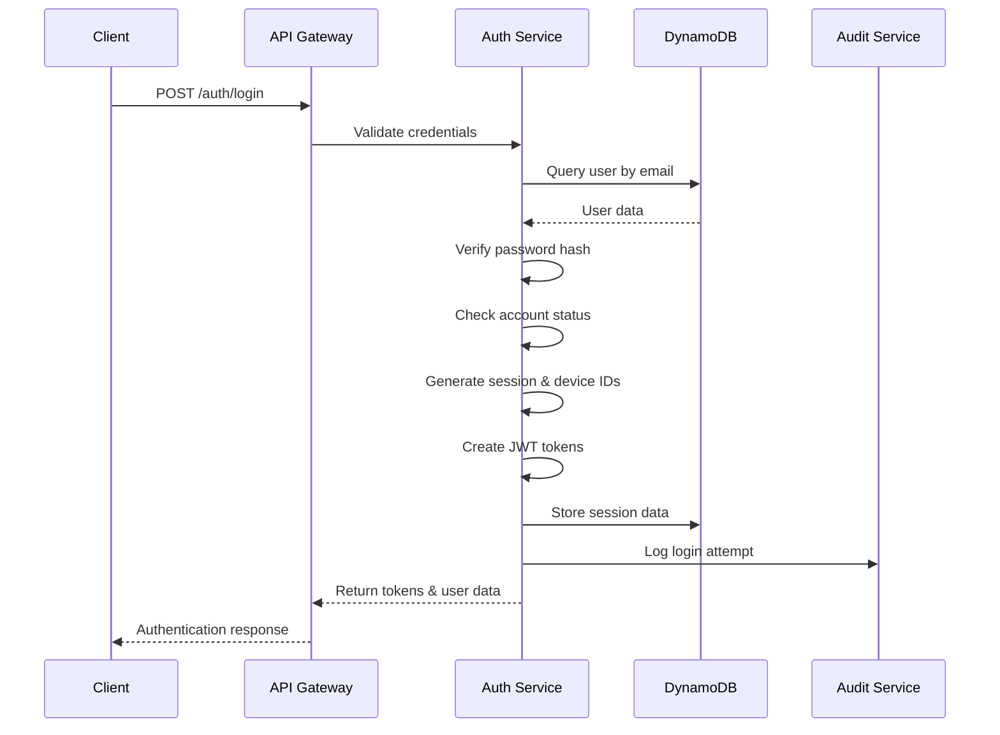

# Authentication and Authorization

## Overview

The MarineMarket platform implements a comprehensive authentication and authorization system using JSON Web Tokens (JWT) with role-based access control (RBAC). This document details the implementation, security measures, and best practices for user authentication and authorization.

## Authentication Architecture

### JWT-Based Authentication

The platform uses JWT tokens for stateless authentication with the following characteristics:

- **Short-lived Access Tokens**: 15-minute expiration for security
- **Long-lived Refresh Tokens**: 7-day expiration for user convenience
- **Secure Token Storage**: HttpOnly cookies and secure local storage
- **Token Rotation**: Automatic refresh token rotation on use

#### JWT Token Structure

**Implementation**: [`backend/src/shared/auth.ts:JWTPayload`](../../backend/src/shared/auth.ts#L8-L19)

```typescript
interface JWTPayload {
  sub: string;        // User ID (subject)
  email: string;      // User email address
  name: string;       // User display name
  role: UserRole;     // User role enumeration
  permissions?: AdminPermission[]; // Granular permissions array
  sessionId: string;  // Unique session identifier
  deviceId: string;   // Device fingerprint
  iat: number;        // Issued at timestamp
  exp: number;        // Expiration timestamp
}
```

#### Token Generation Process

**Implementation**: [`backend/src/shared/auth.ts:createAccessToken`](../../backend/src/shared/auth.ts#L118-L135)

```typescript
export function createAccessToken(user: User, sessionId: string, deviceId: string): string {
  const payload: JWTPayload = {
    sub: user.id,
    email: user.email,
    name: user.name,
    role: user.role,
    permissions: user.permissions,
    sessionId,
    deviceId,
    iat: Math.floor(Date.now() / 1000),
    exp: Math.floor(Date.now() / 1000) + (15 * 60), // 15 minutes
  };

  return jwt.sign(payload, AUTH_CONFIG.JWT_SECRET);
}
```

### Authentication Flow



### Password Security

#### Password Requirements

**Implementation**: [`backend/src/shared/auth.ts:validatePassword`](../../backend/src/shared/auth.ts#L65-L88)

```typescript
export function validatePassword(password: string): { valid: boolean; errors: string[] } {
  const errors: string[] = [];
  
  if (password.length < AUTH_CONFIG.PASSWORD_MIN_LENGTH) {
    errors.push(`Password must be at least ${AUTH_CONFIG.PASSWORD_MIN_LENGTH} characters long`);
  }
  
  if (!/[A-Z]/.test(password)) {
    errors.push('Password must contain at least one uppercase letter');
  }
  
  if (!/[a-z]/.test(password)) {
    errors.push('Password must contain at least one lowercase letter');
  }
  
  if (!/\d/.test(password)) {
    errors.push('Password must contain at least one number');
  }
  
  if (!/[!@#$%^&*(),.?":{}|<>]/.test(password)) {
    errors.push('Password must contain at least one special character');
  }
  
  return {
    valid: errors.length === 0,
    errors
  };
}
```

#### Password Hashing

**Implementation**: [`backend/src/shared/auth.ts:hashPassword`](../../backend/src/shared/auth.ts#L55-L58)

```typescript
export function hashPassword(password: string): Promise<string> {
  const bcrypt = require('bcryptjs');
  return bcrypt.hash(password, 12); // High cost factor for security
}

export function verifyPassword(password: string, hashedPassword: string): Promise<boolean> {
  const bcrypt = require('bcryptjs');
  return bcrypt.compare(password, hashedPassword);
}
```

### Multi-Factor Authentication (MFA)

#### TOTP Implementation

**Implementation**: [`backend/src/shared/auth.ts:generateMFASecret`](../../backend/src/shared/auth.ts#L155-L164)

```typescript
export function generateMFASecret(): { secret: string; qrCode: string } {
  const secret = crypto.randomBytes(20).toString('hex');
  const qrCode = `otpauth://totp/HarborList:admin?secret=${secret}&issuer=HarborList`;

  return {
    secret,
    qrCode,
  };
}
```

#### MFA Verification Process

**Implementation**: [`backend/src/shared/auth.ts:verifyMFAToken`](../../backend/src/shared/auth.ts#L166-L179)

```typescript
export function verifyMFAToken(token: string, secret: string): boolean {
  const timeStep = Math.floor(Date.now() / 30000); // 30-second time steps
  
  // Check current time step and adjacent ones (for clock drift)
  for (let i = -2; i <= 2; i++) {
    const testTimeStep = timeStep + i;
    const expectedToken = generateTOTP(secret, testTimeStep);
    if (expectedToken === token) {
      return true;
    }
  }
  
  return false;
}
```

### Session Management

#### Session Creation

**Implementation**: [`backend/src/shared/auth.ts:createAuthSession`](../../backend/src/shared/auth.ts#L252-L270)

```typescript
export function createAuthSession(
  userId: string, 
  deviceId: string, 
  clientInfo: { ipAddress: string; userAgent: string }
): AuthSession {
  const sessionId = crypto.randomUUID();
  const now = new Date().toISOString();
  const expiresAt = new Date(Date.now() + (7 * 24 * 60 * 60 * 1000)).toISOString(); // 7 days

  return {
    sessionId,
    userId,
    deviceId,
    ipAddress: clientInfo.ipAddress,
    userAgent: clientInfo.userAgent,
    issuedAt: now,
    expiresAt,
    lastActivity: now,
    isActive: true,
  };
}
```

#### Session Security Features

- **Device Fingerprinting**: Unique device identification
- **IP Address Tracking**: Monitor session location changes
- **Concurrent Session Limits**: Prevent session hijacking
- **Automatic Expiration**: Time-based session invalidation
- **Activity Tracking**: Monitor user activity patterns

### Account Security

#### Account Lockout Protection

**Implementation**: [`backend/src/shared/auth.ts:shouldLockAccount`](../../backend/src/shared/auth.ts#L238-L244)

```typescript
export function isAccountLocked(user: User): boolean {
  if (!user.lockedUntil) return false;
  return new Date(user.lockedUntil) > new Date();
}

export function shouldLockAccount(loginAttempts: number): boolean {
  return loginAttempts >= AUTH_CONFIG.MAX_LOGIN_ATTEMPTS;
}

export function calculateLockoutExpiry(): string {
  return new Date(Date.now() + AUTH_CONFIG.LOCKOUT_DURATION).toISOString();
}
```

#### Security Configuration

**Implementation**: [`backend/src/shared/auth.ts:AUTH_CONFIG`](../../backend/src/shared/auth.ts#L25-L37)

```typescript
export const AUTH_CONFIG = {
  JWT_SECRET: process.env.JWT_SECRET || 'your-secret-key-change-in-production',
  JWT_REFRESH_SECRET: process.env.JWT_REFRESH_SECRET || 'your-refresh-secret-key',
  ACCESS_TOKEN_EXPIRY: '15m',        // Short-lived access tokens
  REFRESH_TOKEN_EXPIRY: '7d',        // Long-lived refresh tokens
  MFA_TOKEN_EXPIRY: '5m',            // MFA challenge timeout
  MAX_LOGIN_ATTEMPTS: 5,             // Account lockout threshold
  LOCKOUT_DURATION: 30 * 60 * 1000,  // 30 minutes lockout
  PASSWORD_MIN_LENGTH: 8,            // Minimum password length
  ADMIN_SESSION_TIMEOUT: 60,         // Admin session timeout (minutes)
  USER_SESSION_TIMEOUT: 24 * 60,     // User session timeout (minutes)
};
```

## Authorization Architecture

### Role-Based Access Control (RBAC)

#### User Roles

**Implementation**: [`backend/src/types/common.ts`](frontend/src/../../backend/src/types/common.ts)

```typescript
enum UserRole {
  USER = 'user',              // Regular platform users
  MODERATOR = 'moderator',    // Content moderation capabilities
  ADMIN = 'admin',            // Administrative access
  SUPER_ADMIN = 'super_admin' // Full system access
}
```

#### Permission System

```typescript
enum AdminPermission {
  USER_MANAGEMENT = 'user_management',        // Manage user accounts
  CONTENT_MODERATION = 'content_moderation',  // Moderate listings and content
  ANALYTICS_VIEW = 'analytics_view',          // View analytics and reports
  SYSTEM_CONFIG = 'system_config',            // Configure system settings
  AUDIT_LOG_VIEW = 'audit_log_view',          // View audit logs
  FINANCIAL_ACCESS = 'financial_access'       // Access financial data
}
```

### Authorization Middleware

#### Admin Authorization

**Implementation**: [`backend/src/shared/middleware.ts:withAdminAuth`](frontend/src/../../backend/src/shared/middleware.ts)

```typescript
export const withAdminAuth = (requiredPermissions?: AdminPermission[]) => {
  return (handler: AuthenticatedHandler) => {
    return async (event: APIGatewayProxyEvent, context: any): Promise<APIGatewayProxyResult> => {
      try {
        // Extract and verify JWT token
        const user = getUserFromEvent(event);
        
        // Check admin role requirement
        requireAdminRole(user, requiredPermissions);
        
        // Add user to event context
        const authenticatedEvent = event as AuthenticatedEvent;
        authenticatedEvent.user = user;
        
        return await handler(authenticatedEvent, context);
      } catch (error) {
        return createErrorResponse(401, 'UNAUTHORIZED', error.message, event.requestContext.requestId);
      }
    };
  };
};
```

#### Permission Validation

**Implementation**: [`backend/src/shared/auth.ts:requireAdminRole`](../../backend/src/shared/auth.ts#L207-L220)

```typescript
export function requireAdminRole(payload: JWTPayload, requiredPermissions?: AdminPermission[]): void {
  if (payload.role === UserRole.USER) {
    throw new Error('Admin access required');
  }

  if (requiredPermissions && requiredPermissions.length > 0) {
    const userPermissions = payload.permissions || [];
    const hasRequiredPermissions = requiredPermissions.every(permission => 
      userPermissions.includes(permission)
    );

    if (!hasRequiredPermissions) {
      throw new Error('Insufficient permissions');
    }
  }
}
```

### Frontend Authorization

#### Admin Authentication Hook

**Implementation**: [`frontend/src/hooks/useAdminAuth.ts`](frontend/src/../../frontend/src/hooks/useAdminAuth.ts)

```typescript
interface AdminAuthContextType {
  adminUser: AdminUser | null;
  login: (email: string, password: string) => Promise<void>;
  logout: () => void;
  loading: boolean;
  isAuthenticated: boolean;
  hasPermission: (permission: AdminPermission) => boolean;
  hasRole: (role: UserRole) => boolean;
  refreshSession: () => Promise<void>;
  sessionTimeRemaining: number;
}

export const useAdminAuth = (): AdminAuthContextType => {
  const context = useContext(AdminAuthContext);
  
  if (!context) {
    throw new Error('useAdminAuth must be used within an AdminAuthProvider');
  }
  
  return context;
};
```

#### Protected Route Component

**Implementation**: [`frontend/src/components/admin/AdminProtectedRoute.tsx`](frontend/src/../../frontend/src/components/admin/AdminProtectedRoute.tsx)

```typescript
interface AdminProtectedRouteProps {
  children: React.ReactNode;
  requiredPermissions?: AdminPermission[];
  requiredRole?: UserRole;
}

export const AdminProtectedRoute: React.FC<AdminProtectedRouteProps> = ({
  children,
  requiredPermissions = [],
  requiredRole
}) => {
  const { isAuthenticated, hasPermission, hasRole, loading } = useAdminAuth();

  if (loading) {
    return <LoadingSpinner />;
  }

  if (!isAuthenticated) {
    return <Navigate to="/admin/login" replace />;
  }

  if (requiredRole && !hasRole(requiredRole)) {
    return <AccessDenied message="Insufficient role privileges" />;
  }

  if (requiredPermissions.length > 0) {
    const hasAllPermissions = requiredPermissions.every(permission => 
      hasPermission(permission)
    );
    
    if (!hasAllPermissions) {
      return <AccessDenied message="Insufficient permissions" />;
    }
  }

  return <>{children}</>;
};
```

## API Endpoint Authorization

### Route-Level Authorization

**Implementation**: [`backend/src/admin-service/index.ts`](../../backend/src/admin-service/index.ts#L30-L50)

```typescript
// Example: User management endpoint with specific permissions
if (path.includes('/admin/users') && method === 'GET') {
  return await compose(
    withAdaptiveRateLimit(AdminPermission.USER_MANAGEMENT),
    withAdminAuth([AdminPermission.USER_MANAGEMENT]),
    withAuditLog('VIEW_USERS', 'users')
  )(handleGetUsers)(event as AuthenticatedEvent, {});
}

// Example: Financial data endpoint with restricted access
if (path.includes('/admin/financial') && method === 'GET') {
  return await compose(
    withRateLimit(20, 60000),
    withAdminAuth([AdminPermission.FINANCIAL_ACCESS]),
    withAuditLog('VIEW_FINANCIAL_DATA', 'financial')
  )(handleGetFinancialData)(event as AuthenticatedEvent, {});
}
```

### Permission Matrix

| Endpoint | USER | MODERATOR | ADMIN | SUPER_ADMIN |
|----------|------|-----------|-------|-------------|
| `/listings` (GET) | ✅ | ✅ | ✅ | ✅ |
| `/listings` (POST) | ✅ | ✅ | ✅ | ✅ |
| `/admin/users` | ❌ | ❌ | ✅ | ✅ |
| `/admin/moderation` | ❌ | ✅ | ✅ | ✅ |
| `/admin/analytics` | ❌ | ❌ | ✅ | ✅ |
| `/admin/system` | ❌ | ❌ | ❌ | ✅ |
| `/admin/financial` | ❌ | ❌ | ❌ | ✅ |

## Security Best Practices

### Token Security

1. **Secure Storage**
   - Use HttpOnly cookies for refresh tokens
   - Store access tokens in memory only
   - Implement secure token rotation

2. **Token Validation**
   - Verify token signature on every request
   - Check token expiration
   - Validate token claims and permissions

3. **Token Revocation**
   - Implement token blacklisting
   - Support immediate session termination
   - Handle compromised token scenarios

### Session Security

1. **Session Management**
   - Generate cryptographically secure session IDs
   - Implement session timeout policies
   - Monitor concurrent sessions

2. **Device Tracking**
   - Track device fingerprints
   - Detect suspicious login patterns
   - Implement device-based restrictions

3. **Activity Monitoring**
   - Log all authentication events
   - Monitor failed login attempts
   - Implement anomaly detection

### Rate Limiting

**Implementation**: [`backend/src/shared/middleware.ts:withRateLimit`](frontend/src/../../backend/src/shared/middleware.ts)

```typescript
export const withRateLimit = (maxRequests: number, windowMs: number) => {
  return (handler: AuthenticatedHandler) => {
    return async (event: APIGatewayProxyEvent, context: any): Promise<APIGatewayProxyResult> => {
      const identifier = getClientIdentifier(event);
      const key = createRateLimitKey(identifier, 'api');
      
      // Check rate limit
      const isLimited = await checkRateLimit(key, maxRequests, windowMs);
      
      if (isLimited) {
        return createErrorResponse(429, 'RATE_LIMITED', 'Too many requests', event.requestContext.requestId);
      }
      
      return await handler(event as AuthenticatedEvent, context);
    };
  };
};
```

## Audit and Compliance

### Authentication Audit Logging

**Implementation**: [`backend/src/shared/auth.ts:createAuditLog`](../../backend/src/shared/auth.ts#L272-L289)

```typescript
export function createAuditLog(
  user: JWTPayload,
  action: string,
  resource: string,
  details: Record<string, any>,
  clientInfo: { ipAddress: string; userAgent: string },
  resourceId?: string
): AuditLog {
  return {
    id: crypto.randomUUID(),
    userId: user.sub,
    userEmail: user.email,
    action,
    resource,
    resourceId,
    details,
    ipAddress: clientInfo.ipAddress,
    userAgent: clientInfo.userAgent,
    timestamp: new Date().toISOString(),
    sessionId: user.sessionId,
  };
}
```

### Compliance Requirements

#### GDPR Compliance
- **Data Minimization**: Collect only necessary authentication data
- **Right to Erasure**: Support account deletion and data removal
- **Data Portability**: Export user authentication history
- **Consent Management**: Track and manage user consent

#### SOC 2 Compliance
- **Access Controls**: Implement strong authentication and authorization
- **Monitoring**: Comprehensive audit logging and monitoring
- **Encryption**: Encrypt all authentication data in transit and at rest
- **Incident Response**: Automated detection and response to security events

## Troubleshooting

### Common Authentication Issues

1. **Token Expiration**
   - **Symptom**: 401 Unauthorized errors
   - **Solution**: Implement automatic token refresh
   - **Prevention**: Monitor token expiration times

2. **Session Conflicts**
   - **Symptom**: Unexpected logouts or permission errors
   - **Solution**: Implement proper session management
   - **Prevention**: Limit concurrent sessions per user

3. **Permission Errors**
   - **Symptom**: 403 Forbidden errors
   - **Solution**: Verify user roles and permissions
   - **Prevention**: Implement proper role assignment workflows

### Debugging Authentication

```typescript
// Enable debug logging for authentication
const DEBUG_AUTH = process.env.DEBUG_AUTH === 'true';

export function debugLog(message: string, data?: any) {
  if (DEBUG_AUTH) {
    console.log(`[AUTH DEBUG] ${message}`, data);
  }
}
```

## Related Documentation

- [Security Overview](security/security-overview.md) - Overall security architecture
- [Data Protection](./data-protection.md) - Data security and privacy controls
- [Security Testing](security/security-testing.md) - Security testing procedures
- [Admin User Guide](admin/admin-user-guide.md) - Admin interface documentation
- [API Documentation](development/api-reference.md) - API authentication requirements