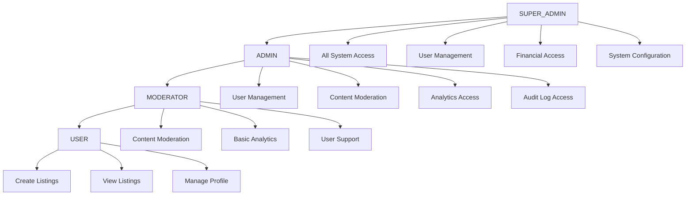

# Authorization and Access Control

## Overview

This document details the authorization and access control mechanisms implemented in the MarineMarket platform. The system uses a combination of Role-Based Access Control (RBAC) and Attribute-Based Access Control (ABAC) to ensure users can only access resources and perform actions appropriate to their role and permissions.

## Authorization Model

### Role-Based Access Control (RBAC)

The platform implements a hierarchical RBAC system with four primary roles:

**Implementation**: [`backend/src/types/common.ts`](frontend/src/../../backend/src/types/common.ts)

```typescript
enum UserRole {
  USER = 'user',              // Regular platform users
  MODERATOR = 'moderator',    // Content moderation capabilities  
  ADMIN = 'admin',            // Administrative access
  SUPER_ADMIN = 'super_admin' // Full system access
}
```

#### Role Hierarchy and Inheritance



### Granular Permissions System

**Implementation**: [`backend/src/types/common.ts`](frontend/src/../../backend/src/types/common.ts)

```typescript
enum AdminPermission {
  // User Management
  USER_MANAGEMENT = 'user_management',
  USER_CREATE = 'user_create',
  USER_UPDATE = 'user_update',
  USER_DELETE = 'user_delete',
  USER_VIEW = 'user_view',
  
  // Content Moderation
  CONTENT_MODERATION = 'content_moderation',
  CONTENT_APPROVE = 'content_approve',
  CONTENT_REJECT = 'content_reject',
  CONTENT_FLAG = 'content_flag',
  
  // Analytics and Reporting
  ANALYTICS_VIEW = 'analytics_view',
  ANALYTICS_EXPORT = 'analytics_export',
  REPORTS_GENERATE = 'reports_generate',
  
  // System Configuration
  SYSTEM_CONFIG = 'system_config',
  SYSTEM_SETTINGS = 'system_settings',
  SYSTEM_MAINTENANCE = 'system_maintenance',
  
  // Audit and Security
  AUDIT_LOG_VIEW = 'audit_log_view',
  AUDIT_LOG_EXPORT = 'audit_log_export',
  SECURITY_MANAGE = 'security_manage',
  
  // Financial Access
  FINANCIAL_ACCESS = 'financial_access',
  FINANCIAL_TRANSACTIONS = 'financial_transactions',
  FINANCIAL_REPORTS = 'financial_reports'
}
```

## Permission Assignment

### Default Role Permissions

```typescript
const DEFAULT_ROLE_PERMISSIONS: Record<UserRole, AdminPermission[]> = {
  [UserRole.USER]: [],
  
  [UserRole.MODERATOR]: [
    AdminPermission.CONTENT_MODERATION,
    AdminPermission.CONTENT_APPROVE,
    AdminPermission.CONTENT_REJECT,
    AdminPermission.CONTENT_FLAG,
    AdminPermission.USER_VIEW,
    AdminPermission.ANALYTICS_VIEW
  ],
  
  [UserRole.ADMIN]: [
    AdminPermission.USER_MANAGEMENT,
    AdminPermission.USER_CREATE,
    AdminPermission.USER_UPDATE,
    AdminPermission.USER_VIEW,
    AdminPermission.CONTENT_MODERATION,
    AdminPermission.CONTENT_APPROVE,
    AdminPermission.CONTENT_REJECT,
    AdminPermission.CONTENT_FLAG,
    AdminPermission.ANALYTICS_VIEW,
    AdminPermission.ANALYTICS_EXPORT,
    AdminPermission.REPORTS_GENERATE,
    AdminPermission.AUDIT_LOG_VIEW,
    AdminPermission.SYSTEM_SETTINGS
  ],
  
  [UserRole.SUPER_ADMIN]: [
    // All permissions
    ...Object.values(AdminPermission)
  ]
};
```

### Custom Permission Assignment

**Implementation**: [`backend/src/admin-service/index.ts`](frontend/src/../../backend/src/admin-service/index.ts)

```typescript
// Custom permission assignment for specific users
interface UserPermissionOverride {
  userId: string;
  additionalPermissions: AdminPermission[];
  removedPermissions: AdminPermission[];
  expiresAt?: string;
  reason: string;
}

// Example: Grant temporary financial access to an admin
const temporaryPermission: UserPermissionOverride = {
  userId: 'admin-123',
  additionalPermissions: [AdminPermission.FINANCIAL_ACCESS],
  removedPermissions: [],
  expiresAt: '2024-12-31T23:59:59Z',
  reason: 'Quarterly financial review'
};
```

## Authorization Enforcement

### Backend Authorization Middleware

**Implementation**: [`backend/src/shared/middleware.ts`](frontend/src/../../backend/src/shared/middleware.ts)

```typescript
export const withAdminAuth = (requiredPermissions?: AdminPermission[]) => {
  return (handler: AuthenticatedHandler) => {
    return async (event: APIGatewayProxyEvent, context: any): Promise<APIGatewayProxyResult> => {
      try {
        // Extract and verify JWT token
        const user = getUserFromEvent(event);
        
        // Validate user is active
        if (user.status !== UserStatus.ACTIVE) {
          throw new Error('Account is not active');
        }
        
        // Check role requirements
        if (user.role === UserRole.USER && requiredPermissions?.length > 0) {
          throw new Error('Admin access required');
        }
        
        // Check specific permissions
        if (requiredPermissions && requiredPermissions.length > 0) {
          const hasPermissions = await validateUserPermissions(user, requiredPermissions);
          if (!hasPermissions) {
            throw new Error('Insufficient permissions');
          }
        }
        
        // Add user to event context
        const authenticatedEvent = event as AuthenticatedEvent;
        authenticatedEvent.user = user;
        
        return await handler(authenticatedEvent, context);
      } catch (error) {
        return createErrorResponse(
          error.message.includes('permissions') ? 403 : 401,
          'AUTHORIZATION_ERROR',
          error.message,
          event.requestContext.requestId
        );
      }
    };
  };
};
```

### Permission Validation Logic

```typescript
async function validateUserPermissions(
  user: JWTPayload, 
  requiredPermissions: AdminPermission[]
): Promise<boolean> {
  // Get base permissions from role
  const rolePermissions = DEFAULT_ROLE_PERMISSIONS[user.role] || [];
  
  // Get user-specific permissions from token
  const userPermissions = user.permissions || [];
  
  // Get any temporary permission overrides
  const overrides = await getUserPermissionOverrides(user.sub);
  
  // Combine all permissions
  const allPermissions = new Set([
    ...rolePermissions,
    ...userPermissions,
    ...overrides.additionalPermissions
  ]);
  
  // Remove any explicitly removed permissions
  overrides.removedPermissions.forEach(permission => {
    allPermissions.delete(permission);
  });
  
  // Check if user has all required permissions
  return requiredPermissions.every(permission => allPermissions.has(permission));
}
```

### Adaptive Rate Limiting by Permission

**Implementation**: [`backend/src/shared/middleware.ts`](frontend/src/../../backend/src/shared/middleware.ts)

```typescript
export const withAdaptiveRateLimit = (permission?: AdminPermission) => {
  return (handler: AuthenticatedHandler) => {
    return async (event: APIGatewayProxyEvent, context: any): Promise<APIGatewayProxyResult> => {
      const user = getUserFromEvent(event);
      
      // Determine rate limit based on user role and permissions
      const rateLimit = calculateRateLimit(user, permission);
      
      const identifier = `${user.sub}:${permission || 'general'}`;
      const isLimited = await checkRateLimit(identifier, rateLimit.maxRequests, rateLimit.windowMs);
      
      if (isLimited) {
        return createErrorResponse(429, 'RATE_LIMITED', 'Too many requests', event.requestContext.requestId);
      }
      
      return await handler(event as AuthenticatedEvent, context);
    };
  };
};

function calculateRateLimit(user: JWTPayload, permission?: AdminPermission): RateLimit {
  const baseLimits = {
    [UserRole.USER]: { maxRequests: 100, windowMs: 60000 },
    [UserRole.MODERATOR]: { maxRequests: 200, windowMs: 60000 },
    [UserRole.ADMIN]: { maxRequests: 500, windowMs: 60000 },
    [UserRole.SUPER_ADMIN]: { maxRequests: 1000, windowMs: 60000 }
  };
  
  const baseLimit = baseLimits[user.role];
  
  // Adjust limits based on specific permissions
  if (permission === AdminPermission.FINANCIAL_ACCESS) {
    return { maxRequests: Math.floor(baseLimit.maxRequests * 0.5), windowMs: baseLimit.windowMs };
  }
  
  if (permission === AdminPermission.AUDIT_LOG_VIEW) {
    return { maxRequests: Math.floor(baseLimit.maxRequests * 0.3), windowMs: baseLimit.windowMs };
  }
  
  return baseLimit;
}
```

## Frontend Authorization

### Permission-Based UI Components

**Implementation**: [`frontend/src/components/admin/AdminProtectedRoute.tsx`](frontend/src/../../frontend/src/components/admin/AdminProtectedRoute.tsx)

```typescript
interface PermissionGateProps {
  permissions: AdminPermission[];
  fallback?: React.ReactNode;
  children: React.ReactNode;
}

export const PermissionGate: React.FC<PermissionGateProps> = ({
  permissions,
  fallback = null,
  children
}) => {
  const { hasPermission } = useAdminAuth();
  
  const hasAllPermissions = permissions.every(permission => hasPermission(permission));
  
  if (!hasAllPermissions) {
    return <>{fallback}</>;
  }
  
  return <>{children}</>;
};

// Usage example
<PermissionGate 
  permissions={[AdminPermission.USER_MANAGEMENT]}
  fallback={<div>Access denied</div>}
>
  <UserManagementPanel />
</PermissionGate>
```

### Role-Based Navigation

```typescript
interface NavigationItem {
  path: string;
  label: string;
  icon: string;
  requiredRole?: UserRole;
  requiredPermissions?: AdminPermission[];
}

const ADMIN_NAVIGATION: NavigationItem[] = [
  {
    path: '/admin/dashboard',
    label: 'Dashboard',
    icon: 'dashboard',
    requiredRole: UserRole.MODERATOR
  },
  {
    path: '/admin/users',
    label: 'User Management',
    icon: 'users',
    requiredPermissions: [AdminPermission.USER_MANAGEMENT]
  },
  {
    path: '/admin/moderation',
    label: 'Content Moderation',
    icon: 'shield',
    requiredPermissions: [AdminPermission.CONTENT_MODERATION]
  },
  {
    path: '/admin/analytics',
    label: 'Analytics',
    icon: 'chart',
    requiredPermissions: [AdminPermission.ANALYTICS_VIEW]
  },
  {
    path: '/admin/financial',
    label: 'Financial',
    icon: 'dollar',
    requiredPermissions: [AdminPermission.FINANCIAL_ACCESS]
  },
  {
    path: '/admin/system',
    label: 'System Settings',
    icon: 'settings',
    requiredRole: UserRole.SUPER_ADMIN
  }
];
```

### Dynamic Permission Checking

```typescript
export const usePermissions = () => {
  const { adminUser } = useAdminAuth();
  
  const hasPermission = useCallback((permission: AdminPermission): boolean => {
    if (!adminUser) return false;
    
    // Check role-based permissions
    const rolePermissions = DEFAULT_ROLE_PERMISSIONS[adminUser.role] || [];
    if (rolePermissions.includes(permission)) return true;
    
    // Check user-specific permissions
    const userPermissions = adminUser.permissions || [];
    return userPermissions.includes(permission);
  }, [adminUser]);
  
  const hasRole = useCallback((role: UserRole): boolean => {
    if (!adminUser) return false;
    
    // Check exact role match or higher privilege
    const roleHierarchy = [UserRole.USER, UserRole.MODERATOR, UserRole.ADMIN, UserRole.SUPER_ADMIN];
    const userRoleIndex = roleHierarchy.indexOf(adminUser.role);
    const requiredRoleIndex = roleHierarchy.indexOf(role);
    
    return userRoleIndex >= requiredRoleIndex;
  }, [adminUser]);
  
  const canAccess = useCallback((
    requiredRole?: UserRole,
    requiredPermissions?: AdminPermission[]
  ): boolean => {
    if (requiredRole && !hasRole(requiredRole)) return false;
    if (requiredPermissions && !requiredPermissions.every(hasPermission)) return false;
    return true;
  }, [hasRole, hasPermission]);
  
  return { hasPermission, hasRole, canAccess };
};
```

## API Endpoint Authorization Matrix

### Public Endpoints (No Authentication Required)

| Endpoint | Method | Description |
|----------|--------|-------------|
| `/listings` | GET | View public listings |
| `/listings/{id}` | GET | View specific listing |
| `/search` | POST | Search listings |
| `/auth/login` | POST | User authentication |
| `/auth/register` | POST | User registration |

### User Endpoints (Authentication Required)

| Endpoint | Method | Role | Description |
|----------|--------|------|-------------|
| `/listings` | POST | USER+ | Create new listing |
| `/listings/{id}` | PUT | USER+ | Update own listing |
| `/listings/{id}` | DELETE | USER+ | Delete own listing |
| `/profile` | GET/PUT | USER+ | Manage user profile |
| `/auth/logout` | POST | USER+ | User logout |

### Admin Endpoints (Role and Permission Based)

| Endpoint | Method | Required Permission | Description |
|----------|--------|-------------------|-------------|
| `/admin/users` | GET | USER_MANAGEMENT | List all users |
| `/admin/users/{id}` | GET | USER_VIEW | View user details |
| `/admin/users/{id}` | PUT | USER_UPDATE | Update user |
| `/admin/users/{id}` | DELETE | USER_DELETE | Delete user |
| `/admin/users/{id}/status` | PUT | USER_MANAGEMENT | Change user status |
| `/admin/listings` | GET | CONTENT_MODERATION | View all listings |
| `/admin/listings/{id}/moderate` | PUT | CONTENT_MODERATION | Moderate listing |
| `/admin/analytics` | GET | ANALYTICS_VIEW | View analytics |
| `/admin/analytics/export` | POST | ANALYTICS_EXPORT | Export analytics |
| `/admin/audit-logs` | GET | AUDIT_LOG_VIEW | View audit logs |
| `/admin/audit-logs/export` | POST | AUDIT_LOG_EXPORT | Export audit logs |
| `/admin/financial` | GET | FINANCIAL_ACCESS | View financial data |
| `/admin/system/settings` | GET/PUT | SYSTEM_CONFIG | System configuration |

## Resource-Level Authorization

### Ownership-Based Access Control

```typescript
// Check if user owns the resource
async function checkResourceOwnership(
  userId: string, 
  resourceType: string, 
  resourceId: string
): Promise<boolean> {
  switch (resourceType) {
    case 'listing':
      const listing = await getListingById(resourceId);
      return listing?.userId === userId;
      
    case 'profile':
      return resourceId === userId;
      
    default:
      return false;
  }
}

// Middleware for ownership-based authorization
export const withOwnershipAuth = (resourceType: string) => {
  return (handler: AuthenticatedHandler) => {
    return async (event: APIGatewayProxyEvent, context: any): Promise<APIGatewayProxyResult> => {
      const user = getUserFromEvent(event);
      const resourceId = event.pathParameters?.id;
      
      if (!resourceId) {
        return createErrorResponse(400, 'BAD_REQUEST', 'Resource ID required', event.requestContext.requestId);
      }
      
      // Admin users can access any resource
      if (user.role !== UserRole.USER) {
        return await handler(event as AuthenticatedEvent, context);
      }
      
      // Check ownership for regular users
      const hasAccess = await checkResourceOwnership(user.sub, resourceType, resourceId);
      
      if (!hasAccess) {
        return createErrorResponse(403, 'FORBIDDEN', 'Access denied to resource', event.requestContext.requestId);
      }
      
      return await handler(event as AuthenticatedEvent, context);
    };
  };
};
```

### Context-Aware Authorization

```typescript
interface AuthorizationContext {
  user: JWTPayload;
  resource: any;
  action: string;
  environment: {
    ipAddress: string;
    userAgent: string;
    timestamp: string;
  };
}

async function evaluateAuthorizationPolicy(context: AuthorizationContext): Promise<boolean> {
  const { user, resource, action, environment } = context;
  
  // Time-based restrictions
  if (action === 'financial_access') {
    const businessHours = isBusinessHours(environment.timestamp);
    if (!businessHours && user.role !== UserRole.SUPER_ADMIN) {
      return false;
    }
  }
  
  // Location-based restrictions
  if (action === 'system_config') {
    const isAllowedLocation = await checkAllowedLocation(environment.ipAddress);
    if (!isAllowedLocation) {
      return false;
    }
  }
  
  // Resource-specific rules
  if (resource?.type === 'sensitive_data') {
    return user.permissions?.includes(AdminPermission.FINANCIAL_ACCESS) || false;
  }
  
  return true;
}
```

## Security Considerations

### Permission Escalation Prevention

1. **Immutable Role Hierarchy**
   - Users cannot grant themselves higher roles
   - Permission changes require admin approval
   - All permission changes are audited

2. **Temporary Permission Management**
   - Time-limited permission grants
   - Automatic expiration of temporary permissions
   - Approval workflow for sensitive permissions

3. **Cross-Service Authorization**
   - Consistent permission checking across all services
   - Centralized authorization decisions
   - Token-based service-to-service authentication

### Audit and Monitoring

**Implementation**: [`backend/src/shared/middleware.ts:withAuditLog`](frontend/src/../../backend/src/shared/middleware.ts)

```typescript
export const withAuditLog = (action: string, resource: string) => {
  return (handler: AuthenticatedHandler) => {
    return async (event: APIGatewayProxyEvent, context: any): Promise<APIGatewayProxyResult> => {
      const user = getUserFromEvent(event);
      const clientInfo = getClientInfo(event);
      
      // Create audit log entry
      const auditLog = createAuditLog(
        user,
        action,
        resource,
        {
          method: event.httpMethod,
          path: event.path,
          queryParams: event.queryStringParameters,
          body: event.body ? JSON.parse(event.body) : null
        },
        clientInfo,
        event.pathParameters?.id
      );
      
      // Store audit log
      await storeAuditLog(auditLog);
      
      // Execute handler
      const result = await handler(event as AuthenticatedEvent, context);
      
      // Log result status
      await updateAuditLog(auditLog.id, {
        statusCode: result.statusCode,
        success: result.statusCode < 400
      });
      
      return result;
    };
  };
};
```

## Testing Authorization

### Unit Tests for Permission Logic

**Implementation**: [`backend/src/admin-service/admin-service.security.test.ts`](../../backend/src/admin-service/admin-service.security.test.ts#L50-L80)

```typescript
describe('Authorization Security', () => {
  it('should enforce role-based access control', async () => {
    const moderatorToken = createTestToken({
      role: UserRole.MODERATOR,
      permissions: [AdminPermission.CONTENT_MODERATION]
    });
    
    const event = createMockEvent({
      httpMethod: 'GET',
      path: '/admin/financial/transactions',
      headers: { 'Authorization': `Bearer ${moderatorToken}` }
    });

    const result = await handler(event, mockContext);

    expect(result.statusCode).toBe(403);
    expect(JSON.parse(result.body)).toEqual({
      error: 'Insufficient permissions'
    });
  });

  it('should validate permissions for each endpoint', async () => {
    const supportToken = createTestToken({
      role: UserRole.ADMIN,
      permissions: [AdminPermission.USER_VIEW] // Missing USER_DELETE
    });
    
    const event = createMockEvent({
      httpMethod: 'DELETE',
      path: '/admin/users/user-123',
      headers: { 'Authorization': `Bearer ${supportToken}` }
    });

    const result = await handler(event, mockContext);

    expect(result.statusCode).toBe(403);
    expect(JSON.parse(result.body)).toEqual({
      error: 'Permission denied: user_delete required'
    });
  });
});
```

### Integration Tests for Authorization Flows

**Implementation**: [`frontend/cypress/e2e/admin/security-tests.cy.ts`](../../frontend/cypress/e2e/admin/security-tests.cy.ts#L80-L120)

```typescript
describe('Authorization Security', () => {
  it('should enforce role-based access control', () => {
    cy.loginAsRole('moderator', [AdminPermission.CONTENT_MODERATION]);
    
    // Should have access to moderation
    cy.visit('/admin/moderation');
    cy.url().should('include', '/admin/moderation');
    
    // Should NOT have access to user management
    cy.visit('/admin/users');
    cy.get('[data-testid="access-denied"]').should('be.visible');
    
    // Should NOT have access to financial management
    cy.visit('/admin/financial');
    cy.get('[data-testid="access-denied"]').should('be.visible');
  });
});
```

## Related Documentation

- [Authentication](security/authentication.md) - User authentication implementation
- [Security Overview](security/security-overview.md) - Overall security architecture
- [Security Testing](security/security-testing.md) - Security testing procedures
- [Admin User Guide](admin/admin-user-guide.md) - Admin interface usage
- [API Reference](development/api-reference.md) - API endpoint documentation