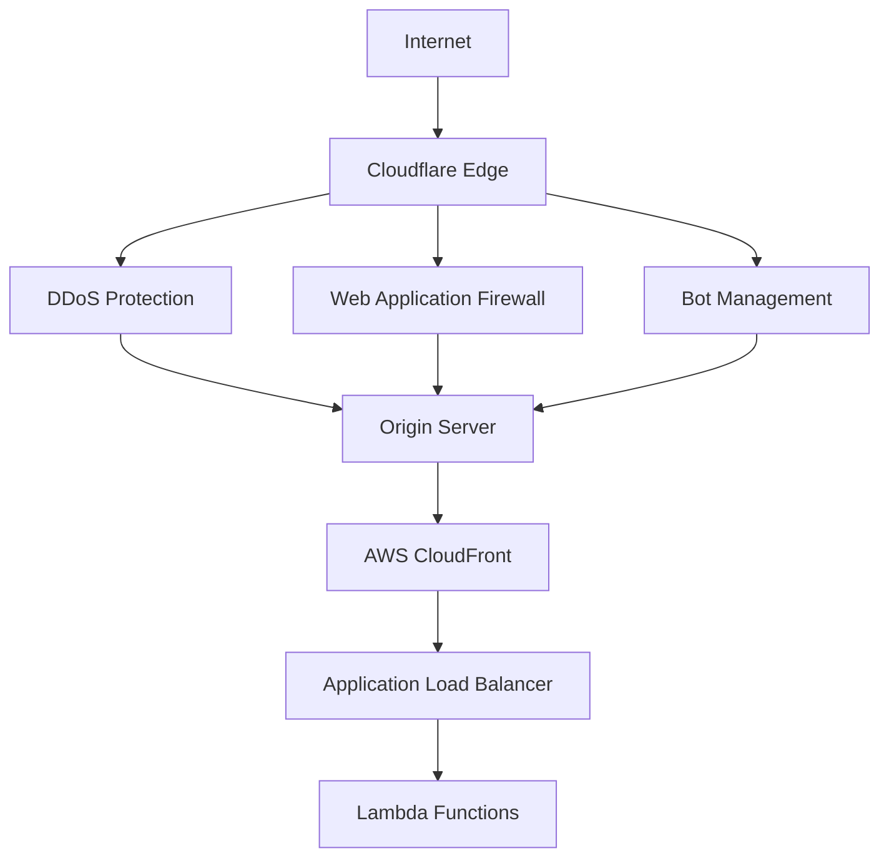
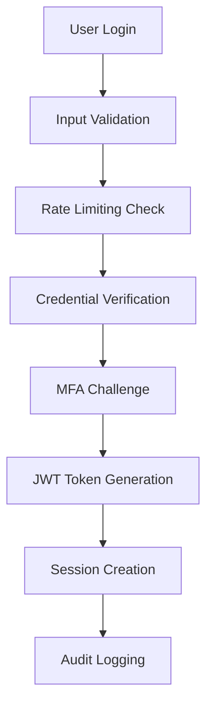

# Security Architecture Overview

## Introduction

The MarineMarket platform implements a comprehensive security architecture designed to protect user data, prevent unauthorized access, and maintain system integrity. This document outlines the security principles, threat model, and implementation strategies that form the foundation of our security posture.

## Security Principles

### 1. Defense in Depth
Multiple layers of security controls protect against various attack vectors:
- **Network Security**: Cloudflare protection, VPC isolation, and secure tunneling
- **Application Security**: Input validation, output encoding, and secure coding practices
- **Data Security**: Encryption at rest and in transit, data classification, and access controls
- **Identity Security**: Multi-factor authentication, role-based access control, and session management

### 2. Principle of Least Privilege
Every user, service, and system component operates with the minimum permissions necessary:
- **User Permissions**: Role-based access with granular permission sets
- **Service Permissions**: Lambda functions have specific IAM policies for required resources only
- **Database Access**: Table-level and operation-specific permissions
- **API Access**: Endpoint-level authorization with permission validation

### 3. Zero Trust Architecture
No implicit trust is granted based on network location or user identity:
- **Continuous Verification**: Every request is authenticated and authorized
- **Micro-segmentation**: Services are isolated with specific communication paths
- **Encrypted Communication**: All data transmission uses TLS/SSL encryption
- **Audit Logging**: Comprehensive logging of all security-relevant events

### 4. Security by Design
Security considerations are integrated throughout the development lifecycle:
- **Secure Defaults**: All configurations default to secure settings
- **Input Validation**: All user inputs are validated and sanitized
- **Error Handling**: Secure error messages that don't leak sensitive information
- **Regular Updates**: Automated dependency updates and security patches

## Threat Model

### Threat Actors

#### External Attackers
- **Opportunistic Attackers**: Automated bots scanning for common vulnerabilities
- **Targeted Attackers**: Sophisticated actors targeting specific data or functionality
- **Competitors**: Attempting to access business intelligence or disrupt operations
- **Nation-State Actors**: Advanced persistent threats with significant resources

#### Internal Threats
- **Malicious Insiders**: Employees or contractors with legitimate access
- **Compromised Accounts**: Legitimate accounts that have been compromised
- **Negligent Users**: Unintentional security violations due to lack of awareness

### Attack Vectors

#### Web Application Attacks
- **Injection Attacks**: SQL injection, NoSQL injection, command injection
- **Cross-Site Scripting (XSS)**: Stored, reflected, and DOM-based XSS
- **Cross-Site Request Forgery (CSRF)**: Unauthorized actions on behalf of users
- **Authentication Bypass**: Weak passwords, session hijacking, credential stuffing

#### Infrastructure Attacks
- **DDoS Attacks**: Volumetric, protocol, and application-layer attacks
- **Man-in-the-Middle**: Interception of communications
- **Privilege Escalation**: Vertical and horizontal privilege escalation
- **Data Exfiltration**: Unauthorized access and extraction of sensitive data

#### Social Engineering
- **Phishing**: Email and web-based credential harvesting
- **Pretexting**: Impersonation to gain unauthorized access
- **Business Email Compromise**: Targeted email attacks on executives

### Assets and Risk Assessment

#### Critical Assets
1. **User Personal Data** (Risk: High)
   - Email addresses, names, contact information
   - Authentication credentials and session tokens
   - Financial information and transaction history

2. **Business Data** (Risk: High)
   - Boat listing information and pricing data
   - User behavior analytics and business intelligence
   - Financial transactions and revenue data

3. **System Infrastructure** (Risk: Medium)
   - AWS resources and configurations
   - Application source code and deployment artifacts
   - Administrative access credentials and API keys

## Security Architecture Components

### Network Security

#### Cloudflare Protection


**Implementation**: [`infrastructure/lib/cloudflare-tunnel-construct.ts`](frontend/src/../../infrastructure/lib/cloudflare-tunnel-construct.ts)

- **DDoS Protection**: Automatic mitigation of volumetric attacks
- **Web Application Firewall**: Custom rules for application-specific threats
- **Bot Management**: Intelligent bot detection and mitigation
- **SSL/TLS Termination**: End-to-end encryption with origin certificates

#### AWS Network Security
- **VPC Isolation**: Private subnets for sensitive resources
- **Security Groups**: Stateful firewall rules for EC2 instances
- **NACLs**: Network-level access control lists
- **VPC Endpoints**: Private connectivity to AWS services

### Identity and Access Management

#### Authentication Architecture


**Implementation**: [`backend/src/shared/auth.ts`](frontend/src/../../backend/src/shared/auth.ts)

#### JWT Token Structure
```typescript
interface JWTPayload {
  sub: string;        // User ID
  email: string;      // User email
  name: string;       // User name
  role: UserRole;     // User role (USER, MODERATOR, ADMIN, SUPER_ADMIN)
  permissions?: AdminPermission[];  // Granular permissions
  sessionId: string;  // Session identifier
  deviceId: string;   // Device identifier
  iat: number;        // Issued at timestamp
  exp: number;        // Expiration timestamp
}
```

#### Role-Based Access Control (RBAC)
```typescript
enum UserRole {
  USER = 'user',
  MODERATOR = 'moderator', 
  ADMIN = 'admin',
  SUPER_ADMIN = 'super_admin'
}

enum AdminPermission {
  USER_MANAGEMENT = 'user_management',
  CONTENT_MODERATION = 'content_moderation',
  ANALYTICS_VIEW = 'analytics_view',
  SYSTEM_CONFIG = 'system_config',
  AUDIT_LOG_VIEW = 'audit_log_view',
  FINANCIAL_ACCESS = 'financial_access'
}
```

### Application Security

#### Input Validation and Sanitization
**Implementation**: [`backend/src/shared/middleware.ts`](frontend/src/../../backend/src/shared/middleware.ts)

```typescript
// Example validation middleware
export const createValidator = (rules: ValidationRules) => {
  return (data: any): ValidationResult => {
    const errors: string[] = [];
    
    for (const [field, validators] of Object.entries(rules)) {
      const value = data[field];
      
      for (const validator of validators) {
        const result = validator(value);
        if (result !== true) {
          errors.push(`${field}: ${result}`);
        }
      }
    }
    
    return {
      valid: errors.length === 0,
      errors
    };
  };
};
```

#### Rate Limiting
**Implementation**: [`backend/src/shared/middleware.ts`](frontend/src/../../backend/src/shared/middleware.ts)

- **Adaptive Rate Limiting**: Dynamic limits based on user behavior and permissions
- **IP-based Limiting**: Protection against distributed attacks
- **User-based Limiting**: Per-user rate limits for authenticated requests
- **Endpoint-specific Limits**: Different limits for different API endpoints

#### CORS Configuration
```typescript
const corsOptions = {
  allowOrigins: [
    'https://dunxywperij31.cloudfront.net',  // Production frontend
    'https://admin.harbotlist.com',          // Admin interface
    'http://localhost:3000'                  // Development
  ],
  allowMethods: ['GET', 'POST', 'PUT', 'DELETE', 'OPTIONS'],
  allowHeaders: [
    'Content-Type',
    'Authorization', 
    'X-Amz-Date',
    'X-Api-Key',
    'X-Amz-Security-Token',
    'X-Amz-User-Agent',
    'X-CSRF-Token'
  ],
  allowCredentials: true,
  maxAge: 86400 // 24 hours
};
```

### Data Security

#### Encryption at Rest
- **DynamoDB**: Server-side encryption with AWS managed keys
- **S3**: AES-256 encryption for all stored objects
- **Secrets Manager**: Encrypted storage of sensitive configuration
- **CloudWatch Logs**: Encrypted log storage

#### Encryption in Transit
- **TLS 1.3**: All API communications use TLS 1.3
- **Certificate Pinning**: Frontend validates server certificates
- **HSTS**: HTTP Strict Transport Security headers
- **Secure Cookies**: All cookies marked as Secure and HttpOnly

#### Data Classification
```typescript
enum DataClassification {
  PUBLIC = 'public',           // Publicly available information
  INTERNAL = 'internal',       // Internal business information
  CONFIDENTIAL = 'confidential', // Sensitive user data
  RESTRICTED = 'restricted'    // Highly sensitive data (PII, financial)
}
```

### Monitoring and Incident Response

#### Security Monitoring
**Implementation**: [`infrastructure/lib/monitoring-construct.ts`](frontend/src/../../infrastructure/lib/monitoring-construct.ts)

- **Real-time Alerting**: CloudWatch alarms for security events
- **Log Aggregation**: Centralized logging with structured data
- **Anomaly Detection**: Machine learning-based threat detection
- **Compliance Monitoring**: Automated compliance checking

#### Audit Logging
**Implementation**: [`backend/src/shared/auth.ts:createAuditLog`](../../backend/src/shared/auth.ts#L234-L250)

```typescript
interface AuditLog {
  id: string;
  userId: string;
  userEmail: string;
  action: string;           // Action performed
  resource: string;         // Resource affected
  resourceId?: string;      // Specific resource ID
  details: Record<string, any>; // Additional context
  ipAddress: string;        // Source IP address
  userAgent: string;        // User agent string
  timestamp: string;        // ISO timestamp
  sessionId: string;        // Session identifier
}
```

## Compliance Framework Mapping

### SOC 2 Type II
- **Security**: Access controls, encryption, monitoring
- **Availability**: High availability architecture, disaster recovery
- **Processing Integrity**: Input validation, error handling
- **Confidentiality**: Data classification, access controls
- **Privacy**: Data minimization, consent management

### GDPR Compliance
- **Data Minimization**: Collect only necessary data
- **Purpose Limitation**: Use data only for stated purposes
- **Data Subject Rights**: Right to access, rectify, erase, and port data
- **Privacy by Design**: Built-in privacy protections
- **Breach Notification**: Automated incident response procedures

### PCI DSS (Future Consideration)
- **Secure Network**: Firewall configuration, secure protocols
- **Protect Cardholder Data**: Encryption, access controls
- **Vulnerability Management**: Regular security testing, updates
- **Access Control**: Strong authentication, role-based access
- **Monitor Networks**: Logging, monitoring, incident response
- **Information Security Policy**: Documented security procedures

## Security Testing and Validation

### Automated Security Testing
**Implementation**: [`backend/src/admin-service/admin-service.security.test.ts`](frontend/src/../../backend/src/admin-service/admin-service.security.test.ts)

- **Unit Tests**: Security function validation
- **Integration Tests**: End-to-end security workflows
- **Penetration Testing**: Automated vulnerability scanning
- **Dependency Scanning**: Third-party library vulnerability checks

### Manual Security Testing
**Implementation**: [`frontend/cypress/e2e/admin/security-tests.cy.ts`](frontend/src/../../frontend/cypress/e2e/admin/security-tests.cy.ts)

- **Code Reviews**: Security-focused code review process
- **Penetration Testing**: Regular third-party security assessments
- **Red Team Exercises**: Simulated attack scenarios
- **Compliance Audits**: Regular compliance verification

## Security Metrics and KPIs

### Security Metrics
- **Authentication Success Rate**: Percentage of successful logins
- **Failed Login Attempts**: Number of failed authentication attempts
- **Session Duration**: Average and maximum session lengths
- **API Error Rate**: Percentage of API requests resulting in errors
- **Vulnerability Remediation Time**: Time to fix identified vulnerabilities

### Incident Response Metrics
- **Mean Time to Detection (MTTD)**: Time to identify security incidents
- **Mean Time to Response (MTTR)**: Time to respond to security incidents
- **Mean Time to Recovery (MTTR)**: Time to recover from security incidents
- **False Positive Rate**: Percentage of false security alerts

## Security Roadmap

### Short-term (Next 3 months)
- [ ] Implement Web Application Firewall (WAF) rules
- [ ] Deploy automated vulnerability scanning
- [ ] Enhance audit logging with additional context
- [ ] Implement security headers (CSP, HSTS, etc.)

### Medium-term (3-6 months)
- [ ] Deploy Security Information and Event Management (SIEM)
- [ ] Implement advanced threat detection
- [ ] Conduct third-party penetration testing
- [ ] Implement data loss prevention (DLP) controls

### Long-term (6-12 months)
- [ ] Achieve SOC 2 Type II certification
- [ ] Implement zero-trust network architecture
- [ ] Deploy advanced behavioral analytics
- [ ] Implement automated incident response

## Related Documentation

- [Authentication and Authorization](security/authentication.md) - Detailed authentication implementation
- [Data Protection](./data-protection.md) - Data security and privacy controls
- [Security Testing](security/security-testing.md) - Security testing procedures and guidelines
- [Compliance](./compliance.md) - Regulatory compliance and audit procedures
- [Architecture Overview](architecture/overview.md) - System architecture documentation
- [Monitoring](deployment/monitoring.md) - System monitoring and alerting