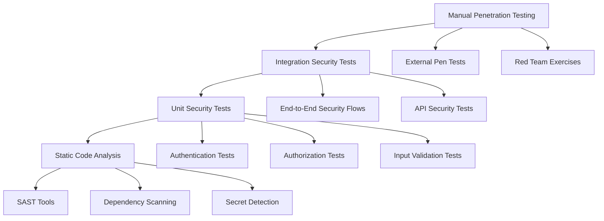

# Security Testing Procedures

## Overview

This document outlines comprehensive security testing procedures for the MarineMarket platform. It covers automated security testing, manual penetration testing, vulnerability assessments, and compliance validation to ensure the platform maintains a strong security posture.

## Security Testing Framework

### Testing Pyramid



### Security Testing Categories

1. **Authentication Security Testing**
2. **Authorization and Access Control Testing**
3. **Input Validation and Injection Testing**
4. **Session Management Testing**
5. **Cryptography and Data Protection Testing**
6. **Infrastructure Security Testing**
7. **Application Logic Security Testing**

## Automated Security Testing

### Unit Security Tests

**Implementation**: [`backend/src/admin-service/admin-service.security.test.ts`](frontend/src/../../backend/src/admin-service/admin-service.security.test.ts)

#### Authentication Security Tests

```typescript
describe('Authentication Security Tests', () => {
  it('should reject requests without authorization header', async () => {
    const mockEvent = createMockEvent({
      httpMethod: 'GET',
      path: '/admin/users',
      headers: {}
    });

    const result = await handler(mockEvent, mockContext);

    expect(result.statusCode).toBe(401);
    expect(JSON.parse(result.body)).toEqual({
      error: 'Authorization header required'
    });
  });

  it('should reject requests with invalid token format', async () => {
    const mockEvent = createMockEvent({
      httpMethod: 'GET',
      path: '/admin/users',
      headers: { 'Authorization': 'InvalidToken' }
    });

    const result = await handler(mockEvent, mockContext);

    expect(result.statusCode).toBe(401);
    expect(JSON.parse(result.body)).toEqual({
      error: 'Invalid authorization format'
    });
  });

  it('should reject requests with expired tokens', async () => {
    const expiredToken = createExpiredToken();
    
    const mockEvent = createMockEvent({
      httpMethod: 'GET',
      path: '/admin/users',
      headers: { 'Authorization': `Bearer ${expiredToken}` }
    });

    const result = await handler(mockEvent, mockContext);

    expect(result.statusCode).toBe(401);
    expect(JSON.parse(result.body)).toEqual({
      error: 'Token expired'
    });
  });
});
```

#### Authorization Security Tests

```typescript
describe('Authorization Security Tests', () => {
  it('should enforce role-based access control', async () => {
    const moderatorToken = createTestToken({
      role: UserRole.MODERATOR,
      permissions: [AdminPermission.CONTENT_MODERATION]
    });
    
    const mockEvent = createMockEvent({
      httpMethod: 'GET',
      path: '/admin/financial/transactions',
      headers: { 'Authorization': `Bearer ${moderatorToken}` }
    });

    const result = await handler(mockEvent, mockContext);

    expect(result.statusCode).toBe(403);
    expect(JSON.parse(result.body)).toEqual({
      error: 'Insufficient permissions'
    });
  });

  it('should validate permissions for each endpoint', async () => {
    const limitedAdminToken = createTestToken({
      role: UserRole.ADMIN,
      permissions: [AdminPermission.USER_VIEW] // Missing USER_DELETE
    });
    
    const mockEvent = createMockEvent({
      httpMethod: 'DELETE',
      path: '/admin/users/user-123',
      headers: { 'Authorization': `Bearer ${limitedAdminToken}` }
    });

    const result = await handler(mockEvent, mockContext);

    expect(result.statusCode).toBe(403);
    expect(JSON.parse(result.body)).toEqual({
      error: 'Permission denied: user_management_delete required'
    });
  });
});
```

#### Input Validation Security Tests

```typescript
describe('Input Validation Security Tests', () => {
  it('should sanitize and validate user search queries', async () => {
    const validToken = createValidAdminToken();
    
    const mockEvent = createMockEvent({
      httpMethod: 'GET',
      path: '/admin/users',
      queryStringParameters: {
        search: '<script>alert("xss")</script>'
      },
      headers: { 'Authorization': `Bearer ${validToken}` }
    });

    const result = await handler(mockEvent, mockContext);

    expect(result.statusCode).toBe(400);
    expect(JSON.parse(result.body)).toEqual({
      error: 'Invalid search query'
    });
  });

  it('should prevent SQL injection in database queries', async () => {
    const validToken = createValidAdminToken();
    
    const mockEvent = createMockEvent({
      httpMethod: 'GET',
      path: '/admin/users',
      queryStringParameters: {
        search: "'; DROP TABLE users; --"
      },
      headers: { 'Authorization': `Bearer ${validToken}` }
    });

    const result = await handler(mockEvent, mockContext);

    expect(result.statusCode).toBe(400);
    expect(JSON.parse(result.body)).toEqual({
      error: 'Invalid search query'
    });
  });

  it('should validate email formats in user operations', async () => {
    const validToken = createValidAdminToken();
    
    const mockEvent = createMockEvent({
      httpMethod: 'POST',
      path: '/admin/users',
      body: JSON.stringify({
        email: 'invalid-email',
        name: 'Test User',
        role: 'user'
      }),
      headers: {
        'Authorization': `Bearer ${validToken}`,
        'Content-Type': 'application/json'
      }
    });

    const result = await handler(mockEvent, mockContext);

    expect(result.statusCode).toBe(400);
    expect(JSON.parse(result.body)).toEqual({
      error: 'Invalid email format'
    });
  });
});
```

#### Rate Limiting Security Tests

```typescript
describe('Rate Limiting Security Tests', () => {
  it('should implement rate limiting for login attempts', async () => {
    const loginEvents = Array(6).fill(null).map(() => createMockEvent({
      httpMethod: 'POST',
      path: '/admin/auth/login',
      body: JSON.stringify({
        email: 'admin@harbotlist.com',
        password: 'wrongpassword'
      }),
      headers: { 'Content-Type': 'application/json' },
      requestContext: {
        identity: { sourceIp: '192.168.1.100' }
      }
    }));

    const results = [];
    for (const event of loginEvents) {
      const result = await handler(event, mockContext);
      results.push(result);
    }

    const lastResult = results[results.length - 1];
    expect(lastResult.statusCode).toBe(429);
    expect(JSON.parse(lastResult.body)).toEqual({
      error: 'Too many login attempts',
      retryAfter: 300
    });
  });

  it('should implement rate limiting for API requests', async () => {
    const validToken = createValidAdminToken();
    
    const requests = Array(101).fill(null).map(() => createMockEvent({
      httpMethod: 'GET',
      path: '/admin/users',
      headers: { 'Authorization': `Bearer ${validToken}` },
      requestContext: {
        identity: { sourceIp: '192.168.1.100' }
      }
    }));

    const results = [];
    for (const event of requests) {
      const result = await handler(event, mockContext);
      results.push(result);
    }

    const rateLimitedResults = results.filter(r => r.statusCode === 429);
    expect(rateLimitedResults.length).toBeGreaterThan(0);
  });
});
```

### Integration Security Tests

**Implementation**: [`frontend/cypress/e2e/admin/security-tests.cy.ts`](frontend/src/../../frontend/cypress/e2e/admin/security-tests.cy.ts)

#### End-to-End Authentication Tests

```typescript
describe('Authentication Security', () => {
  it('should prevent access to admin routes without authentication', () => {
    cy.clearLocalStorage();
    
    const protectedRoutes = [
      '/admin/dashboard',
      '/admin/users',
      '/admin/moderation',
      '/admin/analytics',
      '/admin/settings'
    ];
    
    protectedRoutes.forEach(route => {
      cy.visit(route);
      cy.url().should('include', '/admin/login');
    });
  });

  it('should prevent access with invalid token', () => {
    cy.window().then((win) => {
      win.localStorage.setItem('admin-token', 'invalid-token');
    });
    
    cy.intercept('GET', '/api/admin/auth/verify', {
      statusCode: 401,
      body: { error: 'Invalid token' }
    }).as('verifyToken');
    
    cy.visit('/admin/dashboard');
    cy.wait('@verifyToken');
    cy.url().should('include', '/admin/login');
  });

  it('should enforce password complexity requirements', () => {
    cy.visit('/admin/login');
    
    const weakPasswords = [
      '123456',
      'password',
      'admin',
      'abc123',
      '12345678'
    ];
    
    weakPasswords.forEach(password => {
      cy.get('[data-testid="admin-email-input"]').clear().type('admin@harbotlist.com');
      cy.get('[data-testid="admin-password-input"]').clear().type(password);
      cy.get('[data-testid="admin-login-button"]').click();
      
      cy.get('[data-testid="password-error"]')
        .should('contain', 'Password must be at least 8 characters')
        .or('contain', 'Password must contain uppercase, lowercase, number and special character');
    });
  });
});
```

#### Cross-Site Scripting (XSS) Tests

```typescript
describe('XSS Protection Tests', () => {
  it('should prevent XSS attacks in user inputs', () => {
    cy.loginAsAdmin();
    cy.visit('/admin/users');
    
    const xssPayloads = [
      '<script>alert("xss")</script>',
      'javascript:alert("xss")',
      ''
    ];
    
    xssPayloads.forEach(payload => {
      cy.get('[data-testid="user-search-input"]').clear().type(payload);
      cy.get('[data-testid="search-button"]').click();
      
      // Verify XSS payload is escaped/sanitized
      cy.get('body').should('not.contain', '<script>');
      cy.get('body').should('not.contain', 'javascript:');
    });
  });
});
```

#### SQL Injection Tests

```typescript
describe('SQL Injection Protection Tests', () => {
  it('should prevent SQL injection in search queries', () => {
    cy.loginAsAdmin();
    cy.visit('/admin/users');
    
    const sqlInjectionPayloads = [
      "'; DROP TABLE users; --",
      "' OR '1'='1",
      "' UNION SELECT * FROM admin_users --"
    ];
    
    sqlInjectionPayloads.forEach(payload => {
      cy.intercept('GET', `/api/admin/users*search=${encodeURIComponent(payload)}*`, {
        statusCode: 400,
        body: { error: 'Invalid search query' }
      }).as('sqlInjectionAttempt');
      
      cy.get('[data-testid="user-search-input"]').clear().type(payload);
      cy.get('[data-testid="search-button"]').click();
      
      cy.wait('@sqlInjectionAttempt');
      cy.get('[data-testid="search-error"]').should('contain', 'Invalid search query');
    });
  });
});
```

#### CSRF Protection Tests

```typescript
describe('CSRF Protection Tests', () => {
  it('should include CSRF tokens in state-changing requests', () => {
    cy.loginAsAdmin();
    cy.visit('/admin/users');
    
    cy.intercept('PUT', '/api/admin/users/*/status', (req) => {
      if (!req.headers['x-csrf-token']) {
        req.reply({
          statusCode: 403,
          body: { error: 'CSRF token missing' }
        });
      } else {
        req.reply({
          statusCode: 200,
          body: { success: true }
        });
      }
    }).as('csrfProtectedRequest');
    
    cy.get('[data-testid="user-actions-user-1"]').click();
    cy.get('[data-testid="suspend-user-user-1"]').click();
    cy.get('[data-testid="suspension-reason"]').select('terms_violation');
    cy.get('[data-testid="confirm-suspension"]').click();
    
    cy.wait('@csrfProtectedRequest');
  });
});
```

## Static Application Security Testing (SAST)

### Code Analysis Tools

#### ESLint Security Rules

**Configuration**: [`backend/.eslintrc.js`](../../backend/.eslintrc.js)

```javascript
module.exports = {
  extends: [
    '@eslint/recommended',
    '@typescript-eslint/recommended',
    'plugin:security/recommended'
  ],
  plugins: ['security'],
  rules: {
    // Security-specific rules
    'security/detect-object-injection': 'error',
    'security/detect-non-literal-regexp': 'error',
    'security/detect-unsafe-regex': 'error',
    'security/detect-buffer-noassert': 'error',
    'security/detect-child-process': 'error',
    'security/detect-disable-mustache-escape': 'error',
    'security/detect-eval-with-expression': 'error',
    'security/detect-no-csrf-before-method-override': 'error',
    'security/detect-non-literal-fs-filename': 'error',
    'security/detect-non-literal-require': 'error',
    'security/detect-possible-timing-attacks': 'error',
    'security/detect-pseudoRandomBytes': 'error'
  }
};
```

#### SonarQube Security Analysis

**Configuration**: [`sonar-project.properties`](../../sonar-project.properties)

```properties
sonar.projectKey=marinemarketplace
sonar.projectName=Marine Marketplace
sonar.projectVersion=1.0

# Source directories
sonar.sources=backend/src,frontend/src
sonar.tests=backend/src/**/*.test.ts,frontend/cypress

# Security hotspots and vulnerabilities
sonar.security.hotspots.enabled=true
sonar.security.review.enabled=true

# Coverage reports
sonar.javascript.lcov.reportPaths=coverage/lcov.info
sonar.typescript.lcov.reportPaths=coverage/lcov.info
```

### Dependency Vulnerability Scanning

#### npm audit Integration

```bash
#!/bin/bash
# scripts/security/dependency-scan.sh

echo "Running dependency vulnerability scan..."

# Backend dependencies
cd backend
npm audit --audit-level=moderate
if [ $? -ne 0 ]; then
    echo "Backend dependencies have vulnerabilities"
    exit 1
fi

# Frontend dependencies  
cd ../frontend
npm audit --audit-level=moderate
if [ $? -ne 0 ]; then
    echo "Frontend dependencies have vulnerabilities"
    exit 1
fi

echo "Dependency scan completed successfully"
```

#### Snyk Security Scanning

```yaml
# .github/workflows/security-scan.yml
name: Security Scan

on:
  push:
    branches: [ main, develop ]
  pull_request:
    branches: [ main ]
  schedule:
    - cron: '0 2 * * 1' # Weekly scan

jobs:
  security-scan:
    runs-on: ubuntu-latest
    steps:
      - uses: actions/checkout@v3
      
      - name: Run Snyk to check for vulnerabilities
        uses: snyk/actions/node@master
        env:
          SNYK_TOKEN: ${{ secrets.SNYK_TOKEN }}
        with:
          args: --severity-threshold=high
          
      - name: Upload Snyk results to GitHub Code Scanning
        uses: github/codeql-action/upload-sarif@v2
        with:
          sarif_file: snyk.sarif
```

## Dynamic Application Security Testing (DAST)

### OWASP ZAP Integration

#### Automated Security Scanning

```bash
#!/bin/bash
# scripts/security/dast-scan.sh

echo "Starting OWASP ZAP security scan..."

# Start the application
docker-compose up -d

# Wait for application to be ready
sleep 30

# Run ZAP baseline scan
docker run -v $(pwd):/zap/wrk/:rw \
  -t owasp/zap2docker-stable zap-baseline.py \
  -t https://dunxywperij31.cloudfront.net \
  -g gen.conf \
  -r zap-report.html

# Run ZAP full scan for admin interface
docker run -v $(pwd):/zap/wrk/:rw \
  -t owasp/zap2docker-stable zap-full-scan.py \
  -t https://admin.harbotlist.com \
  -g gen.conf \
  -r zap-admin-report.html

echo "DAST scan completed"
```

#### ZAP Configuration

```properties
# zap.conf
# Authentication configuration
auth.loginurl=https://admin.harbotlist.com/login
auth.username=test-admin@harbotlist.com
auth.password=TestPassword123!

# Session management
session.token=admin-token
session.cookie=session-id

# Scan policies
scanner.strength=HIGH
scanner.threshold=MEDIUM

# Exclusions
exclude.urls=logout,/api/health
```

### Burp Suite Professional Integration

#### Automated API Security Testing

```python
# scripts/security/burp-api-scan.py
import requests
import json
from burp_api import BurpApi

def run_burp_scan():
    burp = BurpApi('http://localhost:1337')
    
    # Configure scan settings
    scan_config = {
        'urls': [
            'https://api.harborlist.com/'
        ],
        'scan_type': 'active',
        'crawl_and_audit': True,
        'application_logins': [{
            'username': 'admin@harbotlist.com',
            'password': 'TestPassword123!',
            'login_url': '/auth/admin/login'
        }]
    }
    
    # Start scan
    scan_id = burp.start_scan(scan_config)
    
    # Wait for completion
    while not burp.scan_completed(scan_id):
        time.sleep(30)
    
    # Generate report
    report = burp.generate_report(scan_id, 'json')
    
    with open('burp-scan-report.json', 'w') as f:
        json.dump(report, f, indent=2)
    
    return report

if __name__ == '__main__':
    run_burp_scan()
```

## Penetration Testing Procedures

### Manual Penetration Testing Checklist

#### Authentication Testing

- [ ] **Password Policy Enforcement**
  - Test weak password acceptance
  - Verify password complexity requirements
  - Check password history enforcement
  - Test account lockout mechanisms

- [ ] **Session Management**
  - Test session timeout functionality
  - Verify session invalidation on logout
  - Check concurrent session handling
  - Test session fixation vulnerabilities

- [ ] **Multi-Factor Authentication**
  - Test MFA bypass attempts
  - Verify TOTP implementation security
  - Check backup code functionality
  - Test MFA enrollment process

#### Authorization Testing

- [ ] **Role-Based Access Control**
  - Test privilege escalation attempts
  - Verify role inheritance logic
  - Check permission boundary enforcement
  - Test cross-user data access

- [ ] **API Authorization**
  - Test endpoint-level permissions
  - Verify parameter-level authorization
  - Check resource ownership validation
  - Test administrative function access

#### Input Validation Testing

- [ ] **Injection Attacks**
  - SQL injection testing
  - NoSQL injection testing
  - Command injection testing
  - LDAP injection testing

- [ ] **Cross-Site Scripting**
  - Stored XSS testing
  - Reflected XSS testing
  - DOM-based XSS testing
  - CSP bypass attempts

- [ ] **File Upload Security**
  - Malicious file upload testing
  - File type validation bypass
  - Path traversal attempts
  - Executable file upload prevention

### Automated Penetration Testing

#### Nuclei Security Scanner

```yaml
# nuclei-config.yaml
templates:
  - cves/
  - vulnerabilities/
  - exposures/
  - misconfiguration/
  - default-logins/

targets:
  - https://dunxywperij31.cloudfront.net
  - https://api.harborlist.com/

rate-limit: 150
timeout: 10
retries: 3

output: nuclei-results.json
```

```bash
#!/bin/bash
# scripts/security/nuclei-scan.sh

echo "Running Nuclei security scan..."

nuclei -config nuclei-config.yaml \
  -severity critical,high,medium \
  -exclude-tags dos \
  -stats \
  -json-export nuclei-results.json

echo "Nuclei scan completed"
```

#### Custom Security Test Scripts

```python
# scripts/security/custom-security-tests.py
import requests
import json
import time
from concurrent.futures import ThreadPoolExecutor

class SecurityTester:
    def __init__(self, base_url, admin_token=None):
        self.base_url = base_url
        self.admin_token = admin_token
        self.session = requests.Session()
        
    def test_rate_limiting(self):
        """Test API rate limiting"""
        print("Testing rate limiting...")
        
        def make_request():
            return self.session.get(f"{self.base_url}/admin/users", 
                                  headers={'Authorization': f'Bearer {self.admin_token}'})
        
        # Send 100 concurrent requests
        with ThreadPoolExecutor(max_workers=50) as executor:
            futures = [executor.submit(make_request) for _ in range(100)]
            responses = [f.result() for f in futures]
        
        rate_limited = sum(1 for r in responses if r.status_code == 429)
        print(f"Rate limited responses: {rate_limited}/100")
        
        return rate_limited > 0
    
    def test_sql_injection(self):
        """Test SQL injection vulnerabilities"""
        print("Testing SQL injection...")
        
        payloads = [
            "'; DROP TABLE users; --",
            "' OR '1'='1",
            "' UNION SELECT * FROM users --",
            "'; INSERT INTO users VALUES ('hacker', 'password'); --"
        ]
        
        vulnerabilities = []
        
        for payload in payloads:
            response = self.session.get(
                f"{self.base_url}/admin/users",
                params={'search': payload},
                headers={'Authorization': f'Bearer {self.admin_token}'}
            )
            
            if response.status_code == 200:
                # Check if payload was executed (should be blocked)
                if 'error' not in response.text.lower():
                    vulnerabilities.append(payload)
        
        return vulnerabilities
    
    def test_xss_protection(self):
        """Test XSS protection"""
        print("Testing XSS protection...")
        
        payloads = [
            "<script>alert('xss')</script>",
            "javascript:alert('xss')",
            "",
            "';alert('xss');//"
        ]
        
        vulnerabilities = []
        
        for payload in payloads:
            response = self.session.post(
                f"{self.base_url}/admin/users",
                json={'name': payload, 'email': 'test@example.com'},
                headers={'Authorization': f'Bearer {self.admin_token}'}
            )
            
            # Check if payload is reflected without encoding
            if payload in response.text:
                vulnerabilities.append(payload)
        
        return vulnerabilities

def run_security_tests():
    tester = SecurityTester(
        base_url='https://api.harborlist.com',
        admin_token='your-test-admin-token'
    )
    
    results = {
        'rate_limiting': tester.test_rate_limiting(),
        'sql_injection': tester.test_sql_injection(),
        'xss_protection': tester.test_xss_protection()
    }
    
    with open('security-test-results.json', 'w') as f:
        json.dump(results, f, indent=2)
    
    return results

if __name__ == '__main__':
    run_security_tests()
```

## Infrastructure Security Testing

### AWS Security Assessment

#### CloudFormation Security Analysis

```bash
#!/bin/bash
# scripts/security/cfn-security-scan.sh

echo "Running CloudFormation security analysis..."

# Install cfn-nag if not present
if ! command -v cfn_nag &> /dev/null; then
    gem install cfn-nag
fi

# Scan CDK generated templates
cd infrastructure/cdk.out
cfn_nag_scan --input-path . --output-format json > cfn-security-report.json

# Check for critical security issues
critical_issues=$(jq '.[] | select(.file_results[].violations[] | select(.type == "FAIL"))' cfn-security-report.json | wc -l)

if [ $critical_issues -gt 0 ]; then
    echo "Critical security issues found in CloudFormation templates"
    exit 1
fi

echo "CloudFormation security scan completed"
```

#### AWS Config Rules Validation

```python
# scripts/security/aws-config-validation.py
import boto3
import json

def validate_aws_config_compliance():
    config_client = boto3.client('config')
    
    # Security-related Config rules
    security_rules = [
        'root-access-key-check',
        'iam-password-policy',
        'cloudtrail-enabled',
        's3-bucket-public-access-prohibited',
        'encrypted-volumes',
        'rds-encryption-enabled',
        'lambda-function-public-access-prohibited'
    ]
    
    compliance_results = {}
    
    for rule in security_rules:
        try:
            response = config_client.get_compliance_details_by_config_rule(
                ConfigRuleName=rule
            )
            
            compliance_results[rule] = {
                'compliant_resources': len([r for r in response['EvaluationResults'] 
                                          if r['ComplianceType'] == 'COMPLIANT']),
                'non_compliant_resources': len([r for r in response['EvaluationResults'] 
                                              if r['ComplianceType'] == 'NON_COMPLIANT'])
            }
        except Exception as e:
            compliance_results[rule] = {'error': str(e)}
    
    return compliance_results

if __name__ == '__main__':
    results = validate_aws_config_compliance()
    print(json.dumps(results, indent=2))
```

### Container Security Testing

#### Docker Image Vulnerability Scanning

```bash
#!/bin/bash
# scripts/security/container-scan.sh

echo "Running container security scan..."

# Scan Docker images with Trivy
trivy image --severity HIGH,CRITICAL \
  --format json \
  --output trivy-report.json \
  marinemarketplace:latest

# Check for critical vulnerabilities
critical_vulns=$(jq '.Results[].Vulnerabilities[] | select(.Severity == "CRITICAL")' trivy-report.json | wc -l)

if [ $critical_vulns -gt 0 ]; then
    echo "Critical vulnerabilities found in container images"
    exit 1
fi

echo "Container security scan completed"
```

## Security Test Automation

### CI/CD Security Pipeline

```yaml
# .github/workflows/security-pipeline.yml
name: Security Pipeline

on:
  push:
    branches: [ main, develop ]
  pull_request:
    branches: [ main ]

jobs:
  sast:
    name: Static Application Security Testing
    runs-on: ubuntu-latest
    steps:
      - uses: actions/checkout@v3
      
      - name: Setup Node.js
        uses: actions/setup-node@v3
        with:
          node-version: '18'
          
      - name: Install dependencies
        run: |
          cd backend && npm ci
          cd ../frontend && npm ci
          
      - name: Run ESLint Security
        run: |
          cd backend && npm run lint:security
          cd ../frontend && npm run lint:security
          
      - name: Run Semgrep SAST
        uses: returntocorp/semgrep-action@v1
        with:
          config: >-
            p/security-audit
            p/secrets
            p/owasp-top-ten
            
  dependency-scan:
    name: Dependency Vulnerability Scan
    runs-on: ubuntu-latest
    steps:
      - uses: actions/checkout@v3
      
      - name: Run Snyk Security Scan
        uses: snyk/actions/node@master
        env:
          SNYK_TOKEN: ${{ secrets.SNYK_TOKEN }}
        with:
          args: --severity-threshold=high
          
  unit-security-tests:
    name: Unit Security Tests
    runs-on: ubuntu-latest
    steps:
      - uses: actions/checkout@v3
      
      - name: Setup Node.js
        uses: actions/setup-node@v3
        with:
          node-version: '18'
          
      - name: Install dependencies
        run: cd backend && npm ci
        
      - name: Run security unit tests
        run: cd backend && npm run test:security
        
  integration-security-tests:
    name: Integration Security Tests
    runs-on: ubuntu-latest
    steps:
      - uses: actions/checkout@v3
      
      - name: Setup Node.js
        uses: actions/setup-node@v3
        with:
          node-version: '18'
          
      - name: Install dependencies
        run: cd frontend && npm ci
        
      - name: Run Cypress security tests
        run: cd frontend && npm run cypress:security
        
  dast:
    name: Dynamic Application Security Testing
    runs-on: ubuntu-latest
    needs: [sast, dependency-scan]
    if: github.ref == 'refs/heads/main'
    steps:
      - uses: actions/checkout@v3
      
      - name: Run OWASP ZAP Scan
        uses: zaproxy/action-baseline@v0.7.0
        with:
          target: 'https://dunxywperij31.cloudfront.net'
          
  infrastructure-scan:
    name: Infrastructure Security Scan
    runs-on: ubuntu-latest
    steps:
      - uses: actions/checkout@v3
      
      - name: Run Checkov IaC Scan
        uses: bridgecrewio/checkov-action@master
        with:
          directory: infrastructure/
          framework: cloudformation
```

### Security Test Reporting

```typescript
// scripts/security/security-report-generator.ts
import fs from 'fs';
import path from 'path';

interface SecurityTestResult {
  testType: string;
  status: 'PASS' | 'FAIL' | 'WARNING';
  findings: SecurityFinding[];
  timestamp: string;
}

interface SecurityFinding {
  severity: 'CRITICAL' | 'HIGH' | 'MEDIUM' | 'LOW' | 'INFO';
  title: string;
  description: string;
  location?: string;
  recommendation: string;
}

class SecurityReportGenerator {
  private results: SecurityTestResult[] = [];
  
  addResult(result: SecurityTestResult) {
    this.results.push(result);
  }
  
  generateReport(): string {
    const summary = this.generateSummary();
    const details = this.generateDetails();
    
    return `
# Security Test Report

Generated: ${new Date().toISOString()}

## Executive Summary

${summary}

## Detailed Findings

${details}

## Recommendations

${this.generateRecommendations()}
    `;
  }
  
  private generateSummary(): string {
    const totalTests = this.results.length;
    const passedTests = this.results.filter(r => r.status === 'PASS').length;
    const failedTests = this.results.filter(r => r.status === 'FAIL').length;
    const warningTests = this.results.filter(r => r.status === 'WARNING').length;
    
    const allFindings = this.results.flatMap(r => r.findings);
    const criticalFindings = allFindings.filter(f => f.severity === 'CRITICAL').length;
    const highFindings = allFindings.filter(f => f.severity === 'HIGH').length;
    
    return `
- **Total Tests**: ${totalTests}
- **Passed**: ${passedTests}
- **Failed**: ${failedTests}
- **Warnings**: ${warningTests}
- **Critical Findings**: ${criticalFindings}
- **High Severity Findings**: ${highFindings}
    `;
  }
  
  private generateDetails(): string {
    return this.results.map(result => `
### ${result.testType}

**Status**: ${result.status}
**Timestamp**: ${result.timestamp}

${result.findings.map(finding => `
#### ${finding.title} (${finding.severity})

${finding.description}

${finding.location ? `**Location**: ${finding.location}` : ''}

**Recommendation**: ${finding.recommendation}
`).join('\n')}
    `).join('\n');
  }
  
  private generateRecommendations(): string {
    const criticalFindings = this.results
      .flatMap(r => r.findings)
      .filter(f => f.severity === 'CRITICAL');
    
    if (criticalFindings.length === 0) {
      return 'No critical security issues found.';
    }
    
    return `
**Immediate Actions Required:**

${criticalFindings.map((finding, index) => `
${index + 1}. **${finding.title}**: ${finding.recommendation}
`).join('')}
    `;
  }
}

export { SecurityReportGenerator, SecurityTestResult, SecurityFinding };
```

## Compliance Testing

### OWASP Top 10 Validation

```typescript
// scripts/security/owasp-top10-tests.ts
import { SecurityTester } from './security-tester';

class OWASPTop10Tester extends SecurityTester {
  async runOWASPTop10Tests(): Promise<SecurityTestResult[]> {
    const results: SecurityTestResult[] = [];
    
    // A01:2021 – Broken Access Control
    results.push(await this.testBrokenAccessControl());
    
    // A02:2021 – Cryptographic Failures
    results.push(await this.testCryptographicFailures());
    
    // A03:2021 – Injection
    results.push(await this.testInjection());
    
    // A04:2021 – Insecure Design
    results.push(await this.testInsecureDesign());
    
    // A05:2021 – Security Misconfiguration
    results.push(await this.testSecurityMisconfiguration());
    
    // A06:2021 – Vulnerable and Outdated Components
    results.push(await this.testVulnerableComponents());
    
    // A07:2021 – Identification and Authentication Failures
    results.push(await this.testAuthenticationFailures());
    
    // A08:2021 – Software and Data Integrity Failures
    results.push(await this.testIntegrityFailures());
    
    // A09:2021 – Security Logging and Monitoring Failures
    results.push(await this.testLoggingFailures());
    
    // A10:2021 – Server-Side Request Forgery (SSRF)
    results.push(await this.testSSRF());
    
    return results;
  }
  
  private async testBrokenAccessControl(): Promise<SecurityTestResult> {
    // Test horizontal privilege escalation
    // Test vertical privilege escalation
    // Test direct object references
    // Test missing access controls
    
    return {
      testType: 'A01:2021 – Broken Access Control',
      status: 'PASS',
      findings: [],
      timestamp: new Date().toISOString()
    };
  }
  
  // Additional OWASP Top 10 test implementations...
}
```

### SOC 2 Security Controls Testing

```typescript
// scripts/security/soc2-controls-tests.ts
interface SOC2Control {
  id: string;
  description: string;
  testProcedure: () => Promise<boolean>;
}

const SOC2_SECURITY_CONTROLS: SOC2Control[] = [
  {
    id: 'CC6.1',
    description: 'Logical and physical access controls',
    testProcedure: async () => {
      // Test access control implementation
      return true;
    }
  },
  {
    id: 'CC6.2', 
    description: 'Authentication and authorization',
    testProcedure: async () => {
      // Test authentication mechanisms
      return true;
    }
  },
  {
    id: 'CC6.3',
    description: 'System access management',
    testProcedure: async () => {
      // Test system access controls
      return true;
    }
  }
  // Additional SOC 2 controls...
];
```

## Security Testing Best Practices

### Test Data Management

1. **Synthetic Test Data**
   - Use realistic but non-sensitive test data
   - Implement data masking for production-like testing
   - Ensure test data doesn't contain real PII

2. **Test Environment Security**
   - Isolate test environments from production
   - Use separate credentials for testing
   - Implement proper test data cleanup

3. **Credential Management**
   - Use dedicated test accounts
   - Rotate test credentials regularly
   - Store test credentials securely

### Continuous Security Testing

1. **Shift-Left Security**
   - Integrate security tests in development workflow
   - Run security tests on every commit
   - Provide immediate feedback to developers

2. **Security Test Maintenance**
   - Regularly update security test cases
   - Review and update test data
   - Maintain test environment security

3. **False Positive Management**
   - Implement baseline security scans
   - Tune security tools to reduce noise
   - Document and track false positives

## Related Documentation

- [Security Overview](security/security-overview.md) - Overall security architecture
- [Authentication](security/authentication.md) - Authentication implementation
- [Authorization](security/authorization.md) - Authorization and access control
- [Testing Guide](development/testing-guide.md) - General testing procedures
- [Deployment Guide](deployment/infrastructure-setup.md) - Secure deployment practices