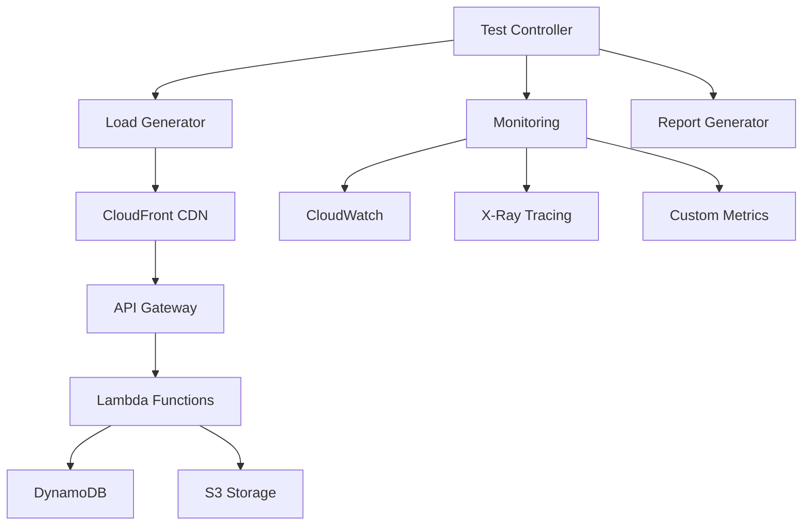

# Performance Testing Guide

## Overview

This guide provides comprehensive instructions for performance testing the MarineMarket boat listing platform. Our performance testing strategy ensures the system meets performance requirements under various load conditions and identifies bottlenecks before they impact users.

## Performance Testing Strategy

### Testing Objectives

1. **Validate Performance Requirements**: Ensure the system meets defined performance benchmarks
2. **Identify Bottlenecks**: Find performance limitations in the architecture
3. **Capacity Planning**: Determine system limits and scaling requirements
4. **Regression Prevention**: Detect performance degradation in new releases
5. **User Experience Optimization**: Ensure fast, responsive user interactions

### Performance Benchmarks

#### Response Time Targets
- **API Endpoints**: 95th percentile < 200ms
- **Database Queries**: Average < 50ms, 95th percentile < 100ms
- **Page Load Time**: First Contentful Paint < 1.5s, Largest Contentful Paint < 2.5s
- **Lambda Cold Start**: < 1 second
- **Search Operations**: < 300ms for basic queries

#### Throughput Requirements
- **Concurrent Users**: 1,000 simultaneous users
- **API Requests**: 10,000 requests/minute
- **Database Operations**: 5,000 operations/minute
- **File Uploads**: 100 concurrent uploads

#### Resource Utilization
- **Lambda Memory**: < 80% of allocated memory
- **DynamoDB Capacity**: < 70% of provisioned capacity
- **CloudFront Cache Hit Ratio**: > 85%

## Performance Testing Types

### 1. Load Testing

**Purpose**: Test system behavior under expected normal load

**Scenarios**:
- Normal user traffic patterns
- Typical API usage
- Standard database operations
- Regular file upload/download activities

**Tools**: Custom Node.js scripts, Artillery.io, AWS Load Testing Solution

### 2. Stress Testing

**Purpose**: Determine system breaking point and behavior under extreme load

**Scenarios**:
- Peak traffic conditions (Black Friday, boat show events)
- Maximum concurrent user sessions
- High-volume data operations
- Resource exhaustion scenarios

### 3. Spike Testing

**Purpose**: Test system response to sudden traffic increases

**Scenarios**:
- Viral content or media coverage
- Marketing campaign launches
- Social media traffic spikes
- Seasonal demand increases

### 4. Volume Testing

**Purpose**: Test system performance with large amounts of data

**Scenarios**:
- Large database queries
- Bulk data imports/exports
- High-resolution image processing
- Search operations on large datasets

### 5. Endurance Testing

**Purpose**: Test system stability over extended periods

**Scenarios**:
- 24-hour continuous operation
- Memory leak detection
- Resource cleanup validation
- Long-running transaction handling

## Performance Testing Infrastructure

### Testing Architecture



### Test Environment Setup

**Staging Environment**:
- Production-like AWS infrastructure
- Scaled-down capacity for cost optimization
- Real AWS services (not mocks)
- Isolated from production data

**Configuration**:
```bash
# Environment variables for performance testing
export PERF_TEST_ENV=staging
export API_BASE_URL=https://api-staging.harborlist.com
export FRONTEND_URL=https://staging.harborlist.com
export TEST_DURATION=300  # 5 minutes
export CONCURRENT_USERS=100
export RAMP_UP_TIME=60    # 1 minute
```

## Performance Testing Tools and Scripts

### 1. Custom Performance Testing Framework

**Location**: `infrastructure/scripts/performance-testing.js`

**Features**:
- Page load time measurement
- API response time testing
- DNS resolution performance
- Caching effectiveness validation
- Concurrent request handling

**Usage**:
```bash
# Run comprehensive performance tests
cd infrastructure/scripts
node performance-testing.js

# Run specific test types
node performance-testing.js --pages-only
node performance-testing.js --api-only
node performance-testing.js --dns-only
```

**Example Test Implementation**:
```javascript
class PerformanceTester {
  async measurePageLoadTime(url) {
    return new Promise((resolve, reject) => {
      const startTime = performance.now();
      const urlObj = new URL(url);
      
      const options = {
        hostname: urlObj.hostname,
        port: urlObj.port || 443,
        path: urlObj.pathname,
        method: 'GET',
        timeout: CONFIG.timeout
      };

      const req = https.request(options, (res) => {
        let data = '';
        const firstByteTime = performance.now();
        
        res.on('data', (chunk) => {
          if (data === '') {
            res.ttfb = firstByteTime - startTime;
          }
          data += chunk;
        });

        res.on('end', () => {
          const endTime = performance.now();
          resolve({
            url,
            statusCode: res.statusCode,
            loadTime: endTime - startTime,
            ttfb: res.ttfb,
            contentLength: data.length,
            headers: res.headers
          });
        });
      });

      req.on('error', reject);
      req.end();
    });
  }
}
```

### 2. Backend Performance Testing

**Location**: `backend/src/admin-service/performance.test.ts`

**Features**:
- Lambda function performance validation
- Database query optimization testing
- Memory usage monitoring
- Concurrent request handling

**Example Performance Test**:
```typescript
describe('Admin Service Performance Tests', () => {
  describe('Response Time Performance', () => {
    it('should respond to dashboard requests within 200ms', async () => {
      const mockEvent = createMockEvent({
        httpMethod: 'GET',
        path: '/admin/dashboard'
      });

      const startTime = performance.now();
      const result = await handler(mockEvent, mockContext);
      const endTime = performance.now();
      const responseTime = endTime - startTime;

      expect(result.statusCode).toBe(200);
      expect(responseTime).toBeLessThan(200);
    });
  });

  describe('Concurrent Request Handling', () => {
    it('should handle 50 concurrent requests efficiently', async () => {
      const requests = Array(50).fill(null).map(() => 
        createMockEvent({
          httpMethod: 'GET',
          path: '/admin/users'
        })
      );

      const startTime = performance.now();
      const results = await Promise.all(
        requests.map(event => handler(event, mockContext))
      );
      const endTime = performance.now();
      const totalTime = endTime - startTime;

      results.forEach(result => {
        expect(result.statusCode).toBe(200);
      });

      const averageTime = totalTime / 50;
      expect(averageTime).toBeLessThan(100);
    });
  });
});
```

### 3. Load Testing with Artillery.io

**Configuration**: `performance/artillery-config.yml`

```yaml
config:
  target: 'https://api-staging.harborlist.com'
  phases:
    - duration: 60
      arrivalRate: 10
      name: "Warm up"
    - duration: 300
      arrivalRate: 50
      name: "Sustained load"
    - duration: 60
      arrivalRate: 100
      name: "Peak load"
  defaults:
    headers:
      Authorization: 'Bearer {{ $randomString() }}'
      Content-Type: 'application/json'

scenarios:
  - name: "API Load Test"
    weight: 70
    flow:
      - get:
          url: "/api/listings"
          capture:
            - json: "$.listings[0].id"
              as: "listingId"
      - get:
          url: "/api/listings/{{ listingId }}"
      - post:
          url: "/api/search"
          json:
            query: "sailboat"
            location: "Miami, FL"

  - name: "Admin Operations"
    weight: 30
    flow:
      - post:
          url: "/admin/auth/login"
          json:
            email: "admin@test.com"
            password: "testpass123"
          capture:
            - json: "$.token"
              as: "adminToken"
      - get:
          url: "/admin/dashboard"
          headers:
            Authorization: "Bearer {{ adminToken }}"
      - get:
          url: "/admin/users"
          headers:
            Authorization: "Bearer {{ adminToken }}"
```

**Running Artillery Tests**:
```bash
# Install Artillery
npm install -g artillery

# Run load test
artillery run performance/artillery-config.yml

# Generate HTML report
artillery run --output report.json performance/artillery-config.yml
artillery report report.json
```

### 4. AWS Load Testing Solution

**CloudFormation Template**: `performance/aws-load-testing.yml`

```yaml
AWSTemplateFormatVersion: '2010-09-09'
Description: 'Load testing infrastructure for MarineMarket'

Resources:
  LoadTestingTaskDefinition:
    Type: AWS::ECS::TaskDefinition
    Properties:
      Family: marine-market-load-test
      Cpu: 2048
      Memory: 4096
      NetworkMode: awsvpc
      RequiresCompatibilities:
        - FARGATE
      ContainerDefinitions:
        - Name: load-test-container
          Image: artilleryio/artillery:latest
          Essential: true
          LogConfiguration:
            LogDriver: awslogs
            Options:
              awslogs-group: !Ref LoadTestLogGroup
              awslogs-region: !Ref AWS::Region
              awslogs-stream-prefix: load-test

  LoadTestLogGroup:
    Type: AWS::Logs::LogGroup
    Properties:
      LogGroupName: /aws/ecs/marine-market-load-test
      RetentionInDays: 7
```

## Performance Monitoring and Metrics

### 1. CloudWatch Metrics

**Custom Metrics Collection**:
```javascript
// Lambda function performance metrics
const AWS = require('aws-sdk');
const cloudwatch = new AWS.CloudWatch();

async function publishMetrics(metricName, value, unit = 'Count') {
  const params = {
    Namespace: 'MarineMarket/Performance',
    MetricData: [{
      MetricName: metricName,
      Value: value,
      Unit: unit,
      Timestamp: new Date()
    }]
  };
  
  await cloudwatch.putMetricData(params).promise();
}

// Usage in Lambda functions
const startTime = Date.now();
// ... function logic ...
const duration = Date.now() - startTime;
await publishMetrics('FunctionDuration', duration, 'Milliseconds');
```

**Key Metrics to Monitor**:
- Lambda function duration and memory usage
- DynamoDB read/write capacity utilization
- API Gateway request count and latency
- CloudFront cache hit ratio and origin latency
- Custom business metrics (listings created, searches performed)

### 2. X-Ray Tracing

**Enable X-Ray in Lambda Functions**:
```typescript
import AWSXRay from 'aws-xray-sdk-core';
const AWS = AWSXRay.captureAWS(require('aws-sdk'));

export const handler = async (event: APIGatewayProxyEvent) => {
  const segment = AWSXRay.getSegment();
  const subsegment = segment.addNewSubsegment('business-logic');
  
  try {
    // Your function logic here
    const result = await processRequest(event);
    subsegment.close();
    return result;
  } catch (error) {
    subsegment.addError(error);
    subsegment.close();
    throw error;
  }
};
```

### 3. Real User Monitoring (RUM)

**Frontend Performance Monitoring**:
```typescript
// Web Vitals monitoring
import { getCLS, getFID, getFCP, getLCP, getTTFB } from 'web-vitals';

function sendToAnalytics(metric) {
  // Send to CloudWatch or custom analytics
  fetch('/api/metrics', {
    method: 'POST',
    body: JSON.stringify(metric)
  });
}

getCLS(sendToAnalytics);
getFID(sendToAnalytics);
getFCP(sendToAnalytics);
getLCP(sendToAnalytics);
getTTFB(sendToAnalytics);
```

## Performance Testing Procedures

### 1. Pre-Test Setup

**Environment Preparation**:
```bash
#!/bin/bash
# Pre-test setup script

# 1. Deploy latest code to staging
aws cloudformation deploy \
  --template-file infrastructure/boat-listing-stack.ts \
  --stack-name marine-market-staging \
  --parameter-overrides Environment=staging

# 2. Warm up Lambda functions
curl -X GET https://api-staging.harborlist.com/health
curl -X GET https://api-staging.harborlist.com/api/listings

# 3. Clear CloudFront cache
aws cloudfront create-invalidation \
  --distribution-id E1234567890123 \
  --paths "/*"

# 4. Reset DynamoDB metrics
aws logs delete-log-group --log-group-name /aws/lambda/marine-market-staging
```

### 2. Test Execution

**Comprehensive Test Suite**:
```bash
#!/bin/bash
# Run comprehensive performance test suite

cd infrastructure/scripts

# Run performance tests
echo "Starting performance test suite..."
./run-performance-tests.sh

# Check results
if [ $? -eq 0 ]; then
  echo "Performance tests passed"
else
  echo "Performance tests failed"
  exit 1
fi
```

### 3. Results Analysis

**Performance Report Generation**:
```javascript
class PerformanceAnalyzer {
  analyzeResults(testResults) {
    const analysis = {
      summary: this.generateSummary(testResults),
      bottlenecks: this.identifyBottlenecks(testResults),
      recommendations: this.generateRecommendations(testResults),
      trends: this.analyzeTrends(testResults)
    };
    
    return analysis;
  }

  identifyBottlenecks(results) {
    const bottlenecks = [];
    
    // Check response times
    if (results.averageResponseTime > 200) {
      bottlenecks.push({
        type: 'response_time',
        severity: 'high',
        description: `Average response time ${results.averageResponseTime}ms exceeds 200ms target`,
        recommendation: 'Optimize database queries and add caching'
      });
    }
    
    // Check error rates
    if (results.errorRate > 0.01) {
      bottlenecks.push({
        type: 'error_rate',
        severity: 'critical',
        description: `Error rate ${(results.errorRate * 100).toFixed(2)}% exceeds 1% threshold`,
        recommendation: 'Investigate error causes and improve error handling'
      });
    }
    
    return bottlenecks;
  }
}
```

## Performance Optimization Techniques

### 1. Lambda Function Optimization

**Memory and Timeout Tuning**:
```typescript
// Optimal Lambda configuration
export const lambdaConfig = {
  memorySize: 1024, // Adjust based on profiling
  timeout: 30,      // Set appropriate timeout
  reservedConcurrency: 100, // Prevent throttling
  environment: {
    NODE_OPTIONS: '--enable-source-maps --max-old-space-size=900'
  }
};

// Connection pooling for DynamoDB
const dynamoClient = new DynamoDBClient({
  maxAttempts: 3,
  retryMode: 'adaptive',
  httpOptions: {
    connectTimeout: 1000,
    timeout: 5000
  }
});
```

### 2. Database Optimization

**DynamoDB Performance Tuning**:
```typescript
// Efficient query patterns
const queryParams = {
  TableName: 'Listings',
  IndexName: 'LocationIndex',
  KeyConditionExpression: 'location = :location',
  FilterExpression: 'price BETWEEN :minPrice AND :maxPrice',
  ExpressionAttributeValues: {
    ':location': 'Miami-FL',
    ':minPrice': 10000,
    ':maxPrice': 100000
  },
  Limit: 20, // Pagination
  ScanIndexForward: false // Sort order
};

// Batch operations for efficiency
const batchWriteParams = {
  RequestItems: {
    'Listings': items.map(item => ({
      PutRequest: { Item: item }
    }))
  }
};
```

### 3. Caching Strategies

**Multi-Level Caching**:
```typescript
// CloudFront caching headers
export const setCacheHeaders = (response: APIGatewayProxyResult, maxAge: number) => {
  response.headers = {
    ...response.headers,
    'Cache-Control': `public, max-age=${maxAge}`,
    'ETag': generateETag(response.body),
    'Last-Modified': new Date().toUTCString()
  };
  return response;
};

// Application-level caching
const cache = new Map();
const CACHE_TTL = 5 * 60 * 1000; // 5 minutes

export const getCachedData = async (key: string, fetchFn: () => Promise<any>) => {
  const cached = cache.get(key);
  if (cached && Date.now() - cached.timestamp < CACHE_TTL) {
    return cached.data;
  }
  
  const data = await fetchFn();
  cache.set(key, { data, timestamp: Date.now() });
  return data;
};
```

### 4. Frontend Optimization

**React Performance Optimization**:
```typescript
// Component memoization
const ListingCard = React.memo(({ listing }: { listing: Listing }) => {
  return (
    <div className="listing-card">
      
      <h3>{listing.title}</h3>
      <p>${listing.price.toLocaleString()}</p>
    </div>
  );
});

// Virtual scrolling for large lists
import { FixedSizeList as List } from 'react-window';

const VirtualizedListings = ({ listings }: { listings: Listing[] }) => (
  <List
    height={600}
    itemCount={listings.length}
    itemSize={200}
    itemData={listings}
  >
    {({ index, style, data }) => (
      <div style={style}>
        <ListingCard listing={data[index]} />
      </div>
    )}
  </List>
);
```

## Continuous Performance Testing

### 1. CI/CD Integration

**GitHub Actions Workflow**:
```yaml
name: Performance Testing

on:
  push:
    branches: [main]
  pull_request:
    branches: [main]
  schedule:
    - cron: '0 2 * * *' # Daily at 2 AM

jobs:
  performance-test:
    runs-on: ubuntu-latest
    steps:
      - uses: actions/checkout@v3
      
      - name: Setup Node.js
        uses: actions/setup-node@v3
        with:
          node-version: '18'
          
      - name: Install dependencies
        run: |
          cd infrastructure
          npm ci
          
      - name: Run performance tests
        run: |
          cd infrastructure/scripts
          ./run-performance-tests.sh
          
      - name: Upload performance reports
        uses: actions/upload-artifact@v3
        with:
          name: performance-reports
          path: infrastructure/reports/
          
      - name: Comment PR with results
        if: github.event_name == 'pull_request'
        uses: actions/github-script@v6
        with:
          script: |
            const fs = require('fs');
            const report = JSON.parse(fs.readFileSync('infrastructure/reports/performance-test-suite-latest.json'));
            
            const comment = `## Performance Test Results
            
            - **Average Response Time**: ${report.summary.averageResponseTime}ms
            - **95th Percentile**: ${report.summary.p95ResponseTime}ms
            - **Error Rate**: ${(report.summary.errorRate * 100).toFixed(2)}%
            - **Throughput**: ${report.summary.requestsPerSecond} req/s
            
            ${report.summary.status === 'passed' ? '✅ All performance benchmarks met' : '❌ Performance issues detected'}
            `;
            
            github.rest.issues.createComment({
              issue_number: context.issue.number,
              owner: context.repo.owner,
              repo: context.repo.repo,
              body: comment
            });
```

### 2. Performance Regression Detection

**Automated Performance Comparison**:
```javascript
class PerformanceRegression {
  detectRegression(currentResults, baselineResults) {
    const regressions = [];
    
    // Response time regression
    const responseTimeIncrease = 
      (currentResults.averageResponseTime - baselineResults.averageResponseTime) / 
      baselineResults.averageResponseTime;
    
    if (responseTimeIncrease > 0.1) { // 10% increase
      regressions.push({
        metric: 'response_time',
        increase: `${(responseTimeIncrease * 100).toFixed(1)}%`,
        severity: responseTimeIncrease > 0.25 ? 'critical' : 'warning'
      });
    }
    
    // Throughput regression
    const throughputDecrease = 
      (baselineResults.requestsPerSecond - currentResults.requestsPerSecond) / 
      baselineResults.requestsPerSecond;
    
    if (throughputDecrease > 0.1) { // 10% decrease
      regressions.push({
        metric: 'throughput',
        decrease: `${(throughputDecrease * 100).toFixed(1)}%`,
        severity: throughputDecrease > 0.25 ? 'critical' : 'warning'
      });
    }
    
    return regressions;
  }
}
```

## Performance Testing Best Practices

### 1. Test Design Principles

**Realistic Test Scenarios**:
- Use production-like data volumes
- Simulate realistic user behavior patterns
- Include think time between requests
- Test with actual network conditions

**Gradual Load Increase**:
- Start with baseline load
- Gradually increase to target load
- Monitor system behavior at each level
- Identify breaking points

### 2. Data Management

**Test Data Strategy**:
```javascript
// Generate realistic test data
class TestDataGenerator {
  generateListings(count) {
    return Array(count).fill(null).map((_, index) => ({
      id: `listing-${index}`,
      title: `Test Boat ${index}`,
      price: Math.floor(Math.random() * 500000) + 10000,
      location: this.getRandomLocation(),
      images: this.generateImageUrls(3),
      createdAt: new Date(Date.now() - Math.random() * 365 * 24 * 60 * 60 * 1000)
    }));
  }
  
  getRandomLocation() {
    const locations = ['Miami, FL', 'San Diego, CA', 'Boston, MA', 'Seattle, WA'];
    return locations[Math.floor(Math.random() * locations.length)];
  }
}
```

### 3. Environment Management

**Isolated Test Environment**:
- Separate staging environment for performance testing
- Production-like configuration and data
- Isolated from development and user acceptance testing
- Automated environment provisioning and teardown

### 4. Results Interpretation

**Performance Metrics Analysis**:
- Focus on percentiles, not just averages
- Consider business impact of performance issues
- Correlate performance with resource utilization
- Identify patterns and trends over time

## Troubleshooting Performance Issues

### 1. Common Performance Problems

**Lambda Cold Starts**:
```typescript
// Minimize cold start impact
export const handler = async (event: APIGatewayProxyEvent) => {
  // Initialize connections outside handler
  if (!dynamoClient) {
    dynamoClient = new DynamoDBClient({});
  }
  
  // Use provisioned concurrency for critical functions
  // Set in CDK: reservedConcurrency: 10, provisionedConcurrencyConfig: { provisionedConcurrentExecutions: 5 }
};
```

**Database Performance Issues**:
```typescript
// Optimize DynamoDB queries
const optimizedQuery = {
  TableName: 'Listings',
  IndexName: 'GSI1', // Use appropriate GSI
  KeyConditionExpression: 'GSI1PK = :pk AND begins_with(GSI1SK, :sk)',
  ProjectionExpression: 'id, title, price, thumbnail', // Only fetch needed attributes
  Limit: 20,
  ExpressionAttributeValues: {
    ':pk': 'LISTING',
    ':sk': 'ACTIVE#'
  }
};
```

### 2. Performance Debugging Tools

**Lambda Performance Profiling**:
```typescript
import { performance } from 'perf_hooks';

export const profiledHandler = async (event: APIGatewayProxyEvent) => {
  const marks = new Map();
  
  marks.set('start', performance.now());
  
  // Database operation
  marks.set('db-start', performance.now());
  const data = await fetchFromDatabase();
  marks.set('db-end', performance.now());
  
  // Business logic
  marks.set('logic-start', performance.now());
  const result = processData(data);
  marks.set('logic-end', performance.now());
  
  marks.set('end', performance.now());
  
  // Log performance metrics
  console.log('Performance Profile:', {
    total: marks.get('end') - marks.get('start'),
    database: marks.get('db-end') - marks.get('db-start'),
    logic: marks.get('logic-end') - marks.get('logic-start')
  });
  
  return result;
};
```

## Conclusion

This comprehensive performance testing guide provides the framework for ensuring the MarineMarket platform delivers optimal performance under all conditions. By following these procedures and continuously monitoring performance metrics, we can maintain a fast, reliable, and scalable boat listing platform.

Key takeaways:
- Implement comprehensive performance testing at multiple levels
- Use realistic test scenarios and data
- Monitor performance continuously in production
- Optimize based on actual performance data
- Maintain performance benchmarks and detect regressions early

Regular performance testing and optimization ensure the platform can handle growth and provide an excellent user experience for boat buyers and sellers.